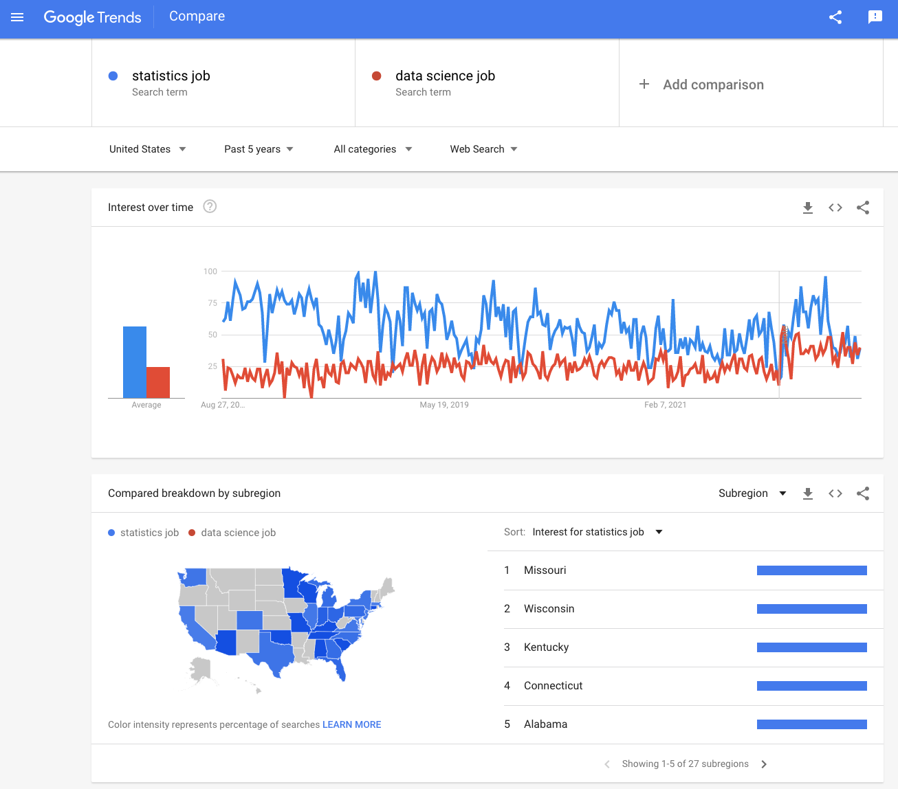
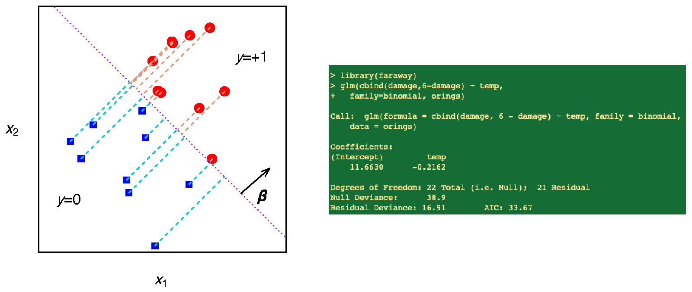
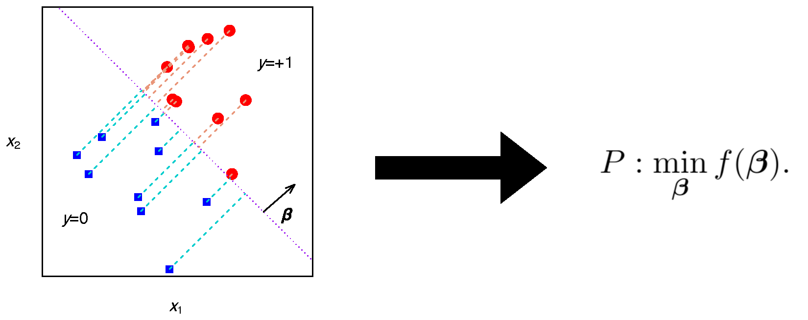
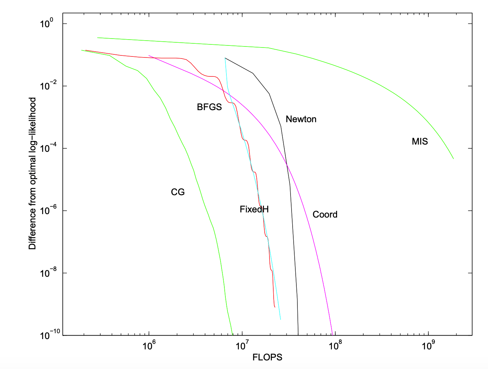
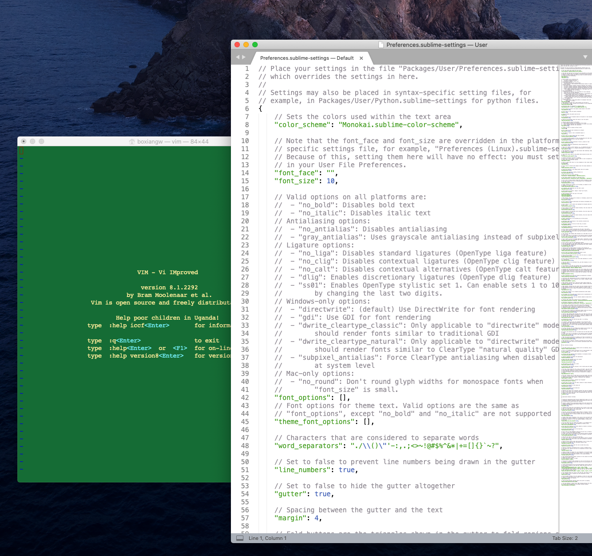
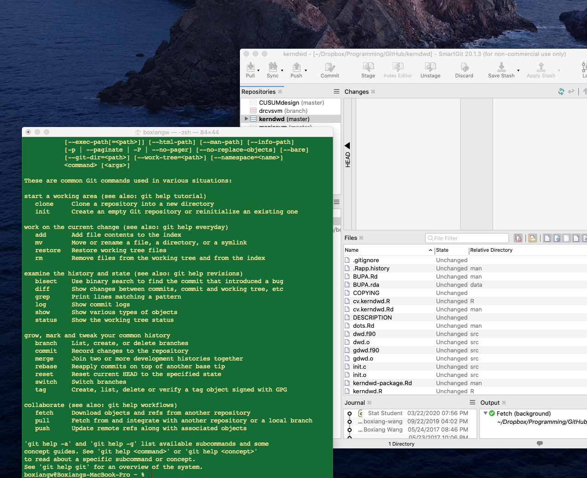
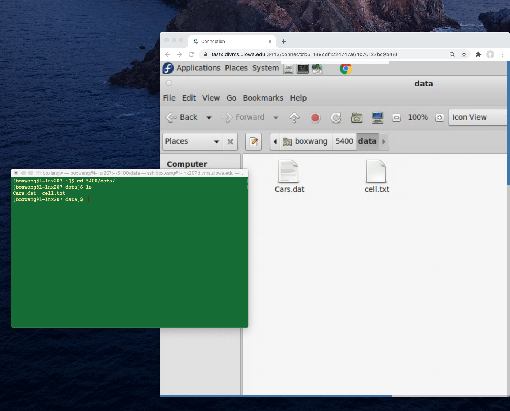
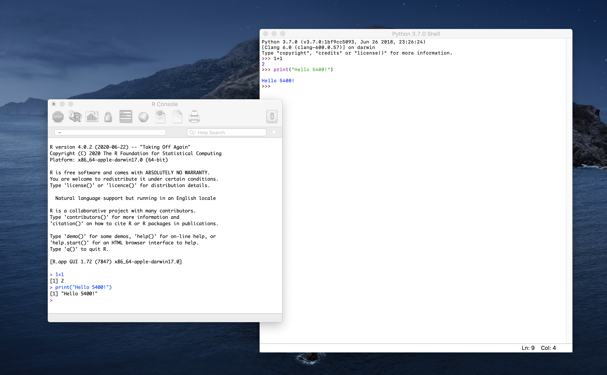
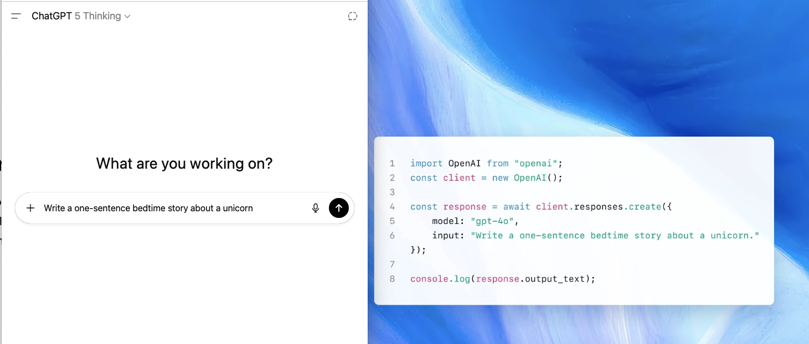



::: {.content-visible when-format="html"}
::: {.page-buttons}
[ PDF](s1p1.pdf){.btn .btn-sm .btn-outline-dark}


<div class="page-codefiles">All code on this page, in one file: </div>
:::
:::

## Why statistics & data science?

-   2009: "*I keep saying that the [sexy]{style="color:#0072B2"} job in the next 10 years will be statisticians. And I'm not kidding.*"

    [Hal Varian](http://www.nytimes.com/2009/08/06/technology/06stats.html){.more note="Varian was Google's chief economist when he said this; the interview was about the coming flood of free, abundant data and the scarcity of people who could make sense of it."}, Chief Economist at Google

-   2012: ["Data Scientist: The [Sexiest]{style="color:#0072B2"} Job of the 21st Century"](https://hbr.org/2012/10/data-scientist-the-sexiest-job-of-the-21st-century), Harvard Business Review.

-   2022: ["Is Data Scientist Still the Sexiest Job of the 21st Century?"](https://hbr.org/2022/07/is-data-scientist-still-the-sexiest-job-of-the-21st-century), Harvard Business Review.

    -   The U.S. Bureau of Labor Statistics predicts data science will see more growth than almost any other field between now and 2029. Data scientist jobs are projected to grow **+36%** (2023--2033), with over 20,000 openings per year.
    -   In 2024, the [median pay was \$112,590](https://www.bls.gov/ooh/math/data-scientists.htm). The median salary for an experienced data scientist in California is approaching \$200,000.
    -   Data Scientist is [#6 *Best STEM Job*](https://money.usnews.com/careers/best-jobs/rankings/best-stem-jobs) and [#4 *Best Technology Job*](https://money.usnews.com/careers/best-jobs/data-scientist).

-   2023--2025: the question changes. Nobody has written the next "sexiest job" piece; the discussion is now whether AI changes the job. [A 2023 essay](https://www.linkedin.com/pulse/do-data-scientists-still-hold-worlds-sexiest-stephen-deangelis){.more note="Stephen DeAngelis, 'Do Data Scientists Still Hold the World's Sexiest Positions?', LinkedIn, Oct 2023: AI lets business specialists do analysis without code; data scientists stay essential for model accuracy and new methods."} argued the title is "being challenged by AI"; [a 2025 essay](https://medium.com/data-science-collective/data-science-the-rise-fall-and-evolution-of-the-sexiest-job-of-the-21st-century-ad03d2a86fb9){.more note="'Data Science: The Rise, Fall, and Evolution of the Sexiest Job of the 21st Century', Medium, 2025: the hype cooled from its early-2010s peak, and the role split into analyst, engineer, and scientist tracks."} called it "the rise, fall, and evolution" of the job.

-   2026: the numbers say the job kept growing. [BLS projects](https://www.bls.gov/ooh/math/data-scientists.htm) data-scientist employment **+34%** over 2024--2034, about 23,400 openings a year; [for statisticians](https://www.bls.gov/ooh/math/mathematicians-and-statisticians.htm), growth "much faster than average" as well. 



## Data Science

-   The science of data science focuses on the [computation]{style="color:#b8860b"} and [inference]{style="color:#b8860b"} for the [**data-driven analysis**]{style="color:black"} from the [interdisciplinary perspectives]{style="color:#b8860b"}.
-   The term **data science** is believed to be credited to [Jeff Wu](https://www.isye.gatech.edu/users/jeff-wu){.more note="C. F. Jeff Wu, now Professor Emeritus at Georgia Tech. His 1997 inaugural lecture at the University of Michigan was titled 'Statistics = Data Science?' and argued that statistics should be renamed data science."}, Georgia Tech.
-   Statistical endeavors:
    -   Applied statistics and data analysis
    -   Development of statistical methods and software
    -   Research in statistical theory
-   Computing essential to all of statistical endeavors.
    -   Computational intensive methods.
    -   Efficiency facilitate modern statistical research.
    -   Large-scale data pipelines; GPU/TPU-accelerated algorithms.

## Data science: skills and jobs {#sec-ai-data-science}

-   **Core skill set.**
    -   *Statistics:* modeling, inference, experimental design, uncertainty quantification
    -   *Computing:* Python/R, data engineering, GPU-accelerated methods, versioning
    -   *Communication:* domain knowledge, visualization, storytelling, ethics

**What employers ask for** (checked Aug 2026):

-   **Statistician** --- [O\*NET, U.S. Department of Labor, 15-2041](https://www.onetonline.org/link/summary/15-2041.00){.more note="O*NET is the Department of Labor's occupation database, built from surveys of people in the job. Statisticians: median pay $105,650 (2025), 32,200 employed (2024), growth 'much faster than average' through 2034."}: top skills *mathematics, critical thinking, reading, listening, speaking*; tools employers list: **Python, R**, SAS, SPSS, Tableau, Excel.
-   **Data scientist** --- [O\*NET, 15-2051](https://www.onetonline.org/link/summary/15-2051.00){.more note="Data scientists: median pay $120,230 (2025), 245,900 employed (2024), growth 'much faster than average' through 2034."}: top skills *mathematics, critical thinking, active learning, speaking*; tools: **Python, SQL**, Git, Spark, TensorFlow/PyTorch, AWS, Tableau.
-   **Data-scientist job postings** --- [827 U.S. postings, 2025--26](https://365datascience.com/career-advice/data-scientist-job-market/){.more note="365 Data Science, 'Data Scientist Job Market 2026': 1,000 postings collected from Monster, 827 kept after cleaning. Percent of postings that name the skill."}: machine learning 69%, **Python 57%, R 33%, SQL 30%**, NLP 19% (5% a year earlier); a graduate degree in 54% (PhD 24%, master's 30%).
-   **What is rising** --- [LinkedIn *Skills on the Rise 2026*](https://news.linkedin.com/2026/Skills-on-the-rise-2026){.more note="LinkedIn, Feb 2026, from members adding skills and getting hired, Dec 2024 to Nov 2025. Postings asking for AI literacy grew more than 70% in a year."}: AI literacy, data-driven decision making, data storytelling, data governance and responsible AI. [Indeed](https://hiringlab.indeed.com/2026/01/22/january-labor-market-update-jobs-mentioning-ai-are-growing-amid-broader-hiring-weakness/){.more note="Indeed Hiring Lab, Jan 2026: 45% of data & analytics postings mention AI, the highest share of any field; 4.2% of all U.S. postings."}: 45% of data & analytics postings now mention AI.
-   **What people use** --- [Stack Overflow Developer Survey 2025](https://survey.stackoverflow.co/2025/technology){.more note="About 49,000 developers, all fields, not only data science; R is small there because most respondents are software developers."}: Python 58%, SQL 59%, R 5%; 84% use or plan to use AI tools, 33% trust the answers.
-   Live listings: [Glassdoor, data scientist](https://www.glassdoor.com/Job/us-data-scientist-jobs-SRCH_IL.0,2_IN1_KO3,17.htm) · [BLS, data scientists](https://www.bls.gov/ooh/math/data-scientists.htm) · [BLS, statisticians](https://www.bls.gov/ooh/math/mathematicians-and-statisticians.htm).

Read the two O\*NET lists again: both start with **mathematics and critical thinking**; the tools come after. Your degree is the first part. This course is the second: **Python, R, SQL, Git**, and the habit of checking.





::: {.content-visible when-format="html"}
```{=html}
<!-- Live Google Trends charts, one per <div class="trends">. Click a title to open its chart (it loads only then).
     data-keywords: search terms or Google topic IDs (/m/...), separated by "|"   data-geo: "US", "" (worldwide), "US-IA", ...
     data-time: "all", "today 5-y", "today 12-m", "2020-01-01 2026-08-01" -->
<div class="trends" data-title="Job titles: statistician vs data scientist vs machine learning engineer (US, since 2004)"
     data-keywords="statistician|data scientist|machine learning engineer" data-geo="US" data-time="all"></div>
<div class="trends" data-title="Python vs R (programming-language topics, US, since 2004)"
     data-keywords="/m/05z1_|/m/0212jm" data-geo="US" data-time="all"></div>
<div class="trends" data-title="ChatGPT vs Gemini vs Claude (US, past 5 years)"
     data-keywords="/g/11khcfz0y2|/g/11vclq3pb3|/g/11w3cb3168" data-geo="US" data-time="today 5-y"></div>
<script>
(function () {
  document.querySelectorAll("div.trends").forEach(function (el) {
    var kws = el.dataset.keywords.split("|").map(function (k) { return k.trim(); });
    var geo = el.dataset.geo || "", time = el.dataset.time || "today 5-y";
    var req = { comparisonItem: kws.map(function (k) { return { keyword: k, geo: geo, time: time }; }),
                category: 0, property: "" };
    var eq = "date=" + encodeURIComponent(time) + "&geo=" + encodeURIComponent(geo) +
             "&q=" + encodeURIComponent(kws.join(","));
    var src = "https://trends.google.com/trends/embed/explore/TIMESERIES?req=" +
              encodeURIComponent(JSON.stringify(req)) + "&tz=300&eq=" + encodeURIComponent(eq);
    var d = document.createElement("details"), sm = document.createElement("summary");
    sm.textContent = el.dataset.title || kws.join(" vs "); d.appendChild(sm);
    var body = document.createElement("div"); body.className = "trends-body"; d.appendChild(body);
    d.addEventListener("toggle", function () {           // build the chart the first time it is opened
      if (d.open && !body.firstChild) {
        var f = document.createElement("iframe");
        f.src = src; f.width = "100%"; f.height = 420; f.frameBorder = 0; f.scrolling = "no"; f.style.border = "0";
        body.appendChild(f);
        var a = document.createElement("a");
        a.href = "https://trends.google.com/trends/explore?" + eq; a.target = "_blank"; a.rel = "noopener";
        a.className = "trends-open"; a.textContent = "Open in Google Trends"; body.appendChild(a);
      }
    });
    el.appendChild(d);
  });
})();
</script>
```
:::

::: {.content-visible unless-format="html"}
{width="55%" fig-align="center"}
:::

### A short history of generative AI

-   2017: the [transformer]{.more note="'Attention Is All You Need', Vaswani et al., Google, 2017. Every model below is built on it."}.
-   2018--2020: GPT-1, BERT, GPT-2, then GPT-3 with 175 billion parameters. Trained on text; it saw little code.
-   2021: [Codex](https://arxiv.org/abs/2502.19411){.more note="Chen et al., 2021, 'Evaluating Large Language Models Trained on Code'. GitHub Copilot is built on it. Models trained on code turned out better at step-by-step reasoning in general, not only at coding; see the survey arXiv 2502.19411."} and GitHub Copilot. Adding code to training data made models better at reasoning, not just at code. That is one reason "AI can code" arrived before "AI can reason".
-   November 30, 2022: ChatGPT. 100 million users in two months.
-   2023: GPT-4 (March), Llama with open weights, Claude, Gemini (December).
-   2024: GPT-4o, Claude 3, Gemini 1.5 with a million-token context, the first "reasoning" models (o1, September). Also the year [ChatGPT said 9.11 is larger than 9.9](https://mindyourdecisions.com/blog/2024/08/07/9-11-is-larger-than-9-9-according-to-ai/){.more note="July 2024. Asked 'which is larger, 9.11 or 9.9?', ChatGPT and Meta AI answered 9.11, treating the digits after the point as whole numbers. Gemini got it right. The error was inconsistent: about half the time."}.
-   2025: DeepSeek-R1 (January): open weights, a fraction of the cost. Agents and tool use everywhere. GPT-5 (August).
-   2026: GPT-5.6, Claude 5, Gemini 3.6, DeepSeek V4, and [hundreds more]{.more note="Release trackers count more than 360 model releases so far in 2026."}. The model you use this semester will be replaced before you graduate; the statistics will not.

The short version, for this course. For the long one, IBM has a good [history of AI](https://www.ibm.com/think/topics/history-of-artificial-intelligence).

## AI for statistics, statistics for AI

Two directions, and this course runs both ways.

-   **AI for statistics** --- the model as a tool in the statistician's workflow.
    -   Writing and translating code: R ↔ Python, a loop → a vectorized version, a formula → a function (Section 2).
    -   Cleaning and extracting: messy text → a tidy table; [structured output]{.more note="You tell the model the exact shape of the answer you want (fields, types), and it returns data your code can use instead of prose."} instead of prose (Section 6).
    -   Designing and explaining: draft a simulation study, explain an error message, summarize a paper --- then *you* verify.
    -   Learning: the *Ask AI* buttons in these notes, and the course tutor.
    -   Agents: an AI that runs a small analysis end to end, from data to report, while you watch each step. In class we replay [one on MorphMind](https://agentlab.morphmind.ai/en/share/replay/bp7e9jff) (free tier, no payment required).

    Statistical agents you can try today:

    -   [ChatGPT](https://help.openai.com/en/articles/8437071-data-analysis-with-chatgpt){.more note="Upload a CSV or Excel file; ChatGPT writes and runs Python in a sandbox and returns the code, tables, and charts."}: upload a file, it writes and runs Python and shows you the code.
    -   [Claude](https://claude.com/blog/analysis-tool){.more note="Claude's analysis tool ran JavaScript in the chat; since November 2025 it is code execution: files, charts, multi-step workflows. Claude Code does the same in a terminal."}: code execution in the chat, or Claude Code in a terminal.
    -   [Gemini's Data Science Agent in Colab](https://developers.googleblog.com/en/data-science-agent-in-colab-with-gemini/){.more note="Free in Google Colab: describe the goal in plain English and it writes a full notebook, from loading the data to plots and a model."}: describe the goal, get a whole notebook.
    -   [MorphMind AgentLab](https://morphmind.ai){.more note="A team of specialist agents with a project-manager agent; every step shows its sources and can be corrected; sessions can be shared and replayed, like the one above."}: a team of agents with receipts for every step.
    -   Open source: [MetaGPT's Data Interpreter](https://github.com/geekan/MetaGPT/blob/main/examples/di/README.md){.more note="Plans, writes, and runs code for a data task; arXiv 2402.18679."}, [PandasAI](https://docs.kanaries.net/articles/pandas-ai){.more note="Chat with a data frame in plain English; it writes the pandas or SQL."}, and agent frameworks such as LangGraph, CrewAI, and the OpenAI Agents SDK.
    -   From R: `ellmer` with tool calling (Section 6) lets you build a small one yourself.
-   **Statistics for AI** --- the model as an object of statistical study.
    -   An LLM is a [sampler]{.more note="Each word is drawn from a probability distribution over the vocabulary; temperature and top-p are knobs on that distribution."}: temperature and top-p are the same ideas as random-variate generation (Section 3).
    -   Evaluating a model is a simulation study: accuracy is an estimate, needs a confidence interval, and "how many test prompts?" is a sample-size question (Section 3).
    -   Bootstrap a benchmark score; test whether model A really beats model B (Section 4).
    -   Calibration, hallucination rates, and uncertainty for a black box (conformal prediction) --- the statistician's contribution to trustworthy AI (Section 6).

-   **Statistics has an edge here.** An LLM is a probability model: it generates text from a distribution and predicts the next word. Generating from a distribution, prediction, inference: these are the questions statistics has worked on for a century.
-   **Then why are statisticians not playing a larger role in AI?** Not for lack of ideas. What is missing is often the skills: large-scale computation, modern coding practice, text as data. This course is about closing that gap.

[Reference: *An Overview of Large Language Models for Statisticians*, The American Statistician (2025), arXiv:2502.17814.]{.source}



## Why learn to code when AI can code?

-   **Interviews have no AI in them.**
    -   [Anthropic bans it in live interviews](https://fortune.com/2025/07/21/billion-dollar-giant-anthropic-ai-ban-hiring-policy-change-job-seekers-interview-process){.more note="Anthropic, the company behind Claude, allows no AI tools in live interviews and has dropped candidates who used them. In 2025 it banned AI in written applications too, then allowed it for the essay parts only."} and has dropped candidates who used it.
    -   [Google is moving interviews back in person](https://fabrichq.ai/blogs/state-of-cheating-in-interviews-in-2026-tools-trends-and-prevention){.more note="Sundar Pichai, internal town hall, February 2025: some roles will interview in person again because of AI use in remote interviews."}.
    -   The by-hand blocks and the midterm here are the same test.
-   **Many employers do not allow it.**
    -   [The big banks](https://cbsnews.com/news/chatgpt-jpmorgan-chase-bars-workers-from-using-ai-tool){.more note="JPMorgan, Bank of America, Citi, Goldman Sachs, and Wells Fargo restricted ChatGPT in 2023; banks cannot send client data to an outside service."}, [Samsung](https://tech.co/news/tech-companies-banning-generative-ai){.more note="May 2023, after engineers pasted internal source code into ChatGPT. Apple restricted it the same month."}, and Apple restricted ChatGPT.
    -   Patient records, clinical trials, government work: the data cannot leave the building.
    -   [At Iowa](https://its.uiowa.edu/ai-guidelines-and-use-cases){.more note="ITS guidelines: Copilot Chat with your HawkID for university data, never a public chatbot; restricted data and student records never; a person checks every AI output before it is used."}: university data goes only into Copilot Chat with your HawkID, and a person checks every output.
-   **AI code is often almost right. Almost is your job.**
    -   [66% of developers](https://survey.stackoverflow.co/2025/ai){.more note="Stack Overflow Developer Survey 2025: the top frustration is AI answers that are almost right; 45% say debugging AI code takes longer than writing it."} say their biggest problem is code that is almost right.
    -   [A randomized trial](https://metr.org/blog/2025-07-10-early-2025-ai-experienced-os-dev-study/){.more note="METR, July 2025: 16 experienced open-source developers, 246 real tasks, randomly assigned AI or no AI. 19% slower with AI, while believing they were 20% faster. One trial, small sample."} found experienced developers 19% slower with AI, while they believed they were faster.
    -   [AI-written code picked the insecure option 45% of the time](https://www.veracode.com/resources/analyst-reports/2025-genai-code-security-report/){.more note="Veracode 2025: 80 tasks, more than 100 models; newer and larger models were no better."}.
    -   A wrong variance formula or an unset seed still runs. Only someone who can read the code will catch it.
-   **Big models are expensive.**
    -   [Uber's engineers](https://zylo.com/blog/openai-api-pricing){.more note="Reported 2026: 84% of Uber's 5,000 engineers on an AI coding tool at $500-2,000 per engineer per month. Zylo, April 2026: the average organization spends $384,500 a year on the OpenAI API."} ran up $500 to $2,000 a month each on AI coding tools.
    -   [Klarna](https://www.forbes.com/sites/quickerbettertech/2025/05/18/business-tech-news-klarna-reverses-on-ai-says-customers-like-talking-to-people/){.more note="Klarna cut about 700 customer-service jobs for AI in 2024. May 2025: 'we focused too much on efficiency and cost'; hiring people again."} replaced 700 support staff with AI, then hired people back.
    -   By 2026 the headline was ["AI can cost more than the human workers"](https://fortune.com/2026/05/22/microsoft-ai-cost-problem-tokens-agents/){.more note="Axios, April 2026; Fortune, May 2026, on Microsoft's token costs; Forbes, July 2026: 'AI costs more than the people it replaced'."}.
    -   [NVIDIA](https://arxiv.org/abs/2506.02153){.more note="'Small Language Models are the Future of Agentic AI', 2025: agents mostly do narrow, repetitive tasks; small models are cheaper and good enough, with a large model called only for the hard step."} argues agents should run on small, specialized models. Someone has to build them. That is programming plus statistics.
-   **You cannot supervise what you do not understand.**
    -   The job is moving from writing code to checking it.
    -   [Deloitte refunded the Australian government](https://fortune.com/2025/10/07/deloitte-ai-australia-government-report-hallucinations-technology-290000-refund){.more note="October 2025: a AU$440,000 report cited papers that do not exist and quoted a judge who never said it. Deloitte admitted using Azure OpenAI and refunded part of the fee."} for a report with invented citations.
    -   [Courts keep fining lawyers](https://thedailyrecord.com/2025/10/13/california-lawyer-ai-fake-citations-fine/){.more note="2025: $10,000 in California for 21 fake cases from ChatGPT; $31,100 in a federal case in Los Angeles; $6,000 in Indiana; a habeas filing with quotes invented by Claude."} for citing cases that do not exist.
    -   Statistics is the discipline of knowing when to trust an estimate. An AI answer is an estimate.



## Goals of this course are to develop

-   Intelligent use of appropriate computing tools.
    -   R and Python; SAS, C, Fortran when needed.
    -   AI as a tool: chatbots, APIs, agents, and knowing when not to trust them.
-   Use of software engineering techniques for scaling projects.
    -   Version control: git and GitHub.
    -   Parallel computing.
-   Understanding of important statistical computing algorithms.
    -   Bisection search, Newton's method, gradient descent.
    -   Bootstrap, cross-validation.
-   Experience of computational intensive methods.
    -   High-dimensional statistics.
    -   Machine learning methods.
-   Ability to design and implement simulation studies.
-   Communication of statistical ideas.
    -   LaTeX, R Markdown, Quarto.
    -   Writing R packages.

## Set up your accounts

[ Run]{.mode} — first, click *Run Code*. This runs in your browser; nothing to install.

```{webr}
x <- rnorm(100)
mean(x)
```

Do these this week; the notes assume them from Section 2 on.

1.  **GitHub account** --- <https://github.com/signup>. Add and verify your `@uiowa.edu` email under Settings → Emails.
2.  **GitHub Education** (free Copilot and Pro-level Codespaces) --- <https://github.com/settings/education/benefits> → *Start an application*. Proof: a current student ID, class schedule, or enrollment letter; using the `@uiowa.edu` email speeds review. When approved, GitHub Copilot Student and Codespaces are activated on your account.
3.  **Test the Codespace** --- click *Open in Codespace* at the top of this page. The first start builds the course environment (a few minutes); later starts take about 30 seconds. Open `notes/run/s1p1_sumC.R`, put the cursor on line 3, press Cmd/Ctrl+Enter.
4.  **One chatbot login** --- ChatGPT, Claude, or Gemini; the free tier is enough. The *Ask AI* buttons in these notes open one of them with the question filled in.
5.  **A Gemini API key** (free) --- <https://aistudio.google.com/apikey>. Used by the first API call in @sec-first-llm-call. Details in the box below.
6.  **OpenAI and Anthropic keys** (optional, paid; $5 is enough for the course). Details below.
7.  **University systems** --- the department's Linux servers `l-lnx2xy.stat.uiowa.edu` (HawkID, `ssh`; VPN from off campus; Tech Guide in Section 2); [IDAS](https://uiowa.atlassian.net/wiki/spaces/hpcdocs/pages/76514939/Requesting+An+IDAS+Account) for the midterm; [Argon](https://research.its.uiowa.edu/our-services/computing-services/argon-high-performance-computing-hpc), the campus cluster, if you want it (I request class access; for research ask your advisor).

8.  **MorphMind account** (free) --- <https://morphmind.ai>. The course tutor and the agent demos run there.

[Never paste an API key into a script, a notebook, or these notes. A key in a public repository is found and abused within minutes.]{.more note="Keys leak most often through git commits and screenshots. If one leaks, delete it on the provider's page and create a new one."}

::: {.callout-note collapse="true" title="Gemini API key, step by step (free)"}
1.  Go to <https://aistudio.google.com/apikey> and sign in with a Google account (your personal one is fine).
2.  Click **Create API key**. If it asks for a project, accept the default. Copy the key; it looks like `AIza...`.
3.  Store it on GitHub: profile picture → **Settings** → **Codespaces** → **New secret**. Name `GEMINI_API_KEY`, paste the key as the value, under **Repository access** pick the course repo, **Add secret**.
4.  Restart your Codespace (it only reads secrets at start). Check in R: `Sys.getenv("GEMINI_API_KEY")` should not be empty.
5.  Free tier: a few requests per minute and a daily cap, plenty for this course. If you hit the limit, wait a minute.
6.  `HTTP 503 Service Unavailable` means Google's servers are busy, not that your key is wrong. Retry, or pick another model: `models_google_gemini()` lists what your key can use; `chat_google_gemini(model = "gemini-3.7-flash")` chooses one. The Ollama models below never have this problem.
:::

::: {.callout-note collapse="true" title="OpenAI API key (paid)"}
1.  <https://platform.openai.com> → sign up (this is separate from a ChatGPT subscription).
2.  **Settings** → **Billing** → add a payment method and buy \$5 of credit. Nothing runs without credit.
3.  **API keys** → **Create new secret key** → copy it now; it is shown once.
4.  Codespaces secret named `OPENAI_API_KEY`, same steps as above. Restart the Codespace.
5.  In R: `library(ellmer); chat_openai()$chat("Say hi.")`. A one-line answer costs a fraction of a cent.
:::

::: {.callout-note collapse="true" title="Anthropic (Claude) API key (paid)"}
1.  <https://console.anthropic.com> → sign up (separate from a Claude.ai subscription).
2.  **Billing** → buy \$5 of credit.
3.  **API Keys** → **Create Key** → copy it now.
4.  Codespaces secret named `ANTHROPIC_API_KEY`. Restart the Codespace.
5.  In R: `library(ellmer); chat_anthropic()$chat("Say hi.")`.
:::

::: {.callout-note collapse="true" title="Small models with no key: Ollama"}
No key, no cost, works offline. The course Codespace already has Ollama with two models: `qwen2.5:0.5b` (Alibaba, 0.5 billion parameters, 0.4 GB) and `llama3.2:1b` (Meta, 1 billion, 1.3 GB). On your own computer, Ollama is one download.

1.  On your laptop: install from <https://ollama.com> (Mac, Windows, Linux), then `ollama pull qwen2.5:0.5b` and `ollama pull llama3.2:1b` in a terminal. In the Codespace, skip this.
2.  From R, `ellmer` talks to a local model the same way it talks to Gemini. Only the function name changes; Ollama is a small server on your own machine.

    ```r
    library(ellmer)
    small  <- chat_ollama(model = "qwen2.5:0.5b")
    bigger <- chat_ollama(model = "llama3.2:1b")
    small$chat("Which is larger, 9.11 or 9.9? Answer in one line.")
    bigger$chat("Which is larger, 9.11 or 9.9? Answer in one line.")
    ```

    

    Ask the small one five times. It still gets this wrong some of the time; that is the 2024 story in @sec-ai-data-science, on a machine you control. The 1B model is slower and more often right. Bigger models need more memory than a Codespace has; on your laptop try `llama3.2` (3B).
3.  From Python: `import ollama; ollama.chat(model="qwen2.5:0.5b", messages=[{"role": "user", "content": "..."}])`.
4.  Also worth knowing: the R package `localLLM` loads a model inside R with no server at all. We will use it in the Tech Guide.
:::

### Where does code run?

-   **On this page.** Most examples run in your browser. Click *Run Code*.
-   **In a Codespace.** Examples that need a compiler, an API key, or more memory have a *Run in Codespace* button. Same code, real machine.

### Optional: install on your own laptop

Not required for this course. If you want a local setup, use this one so we all match. Each item has a folded box with the steps, and an *Ask AI* button whose prompt asks for today's instructions for your machine.

::: {.callout-note collapse="true" title="R and RStudio (or Positron)"}
1.  R: <https://cran.r-project.org> → your operating system → the latest release. Mac: pick the Apple silicon build if your Mac is M1 or newer.
2.  RStudio: <https://posit.co/download/rstudio-desktop/>. Or Positron, Posit's newer editor for R and Python: <https://positron.posit.co>.
3.  Check: open RStudio, run `R.version.string`.
4.  Packages we use early: `install.packages(c("microbenchmark", "Rcpp", "ellmer"))`. Rcpp needs a compiler: Mac, `xcode-select --install`; Windows, Rtools from CRAN.


:::

::: {.callout-note collapse="true" title="Python with uv"}
1.  Install uv: <https://docs.astral.sh/uv/getting-started/installation/> (one command for Mac, Linux, or Windows).
2.  `uv python install 3.12`
3.  In a project folder: `uv init`, then `uv add numpy pandas matplotlib jupyter google-genai`.
4.  Check: `uv run python -c "import numpy; print(numpy.__version__)"`.


:::

::: {.callout-note collapse="true" title="VS Code, Quarto, and Copilot"}
1.  VS Code: <https://code.visualstudio.com>.
2.  Extensions (View → Extensions): Quarto, R, Python, Jupyter, GitHub Copilot.
3.  Quarto: <https://quarto.org/docs/get-started/>. Check: `quarto check` in a terminal.
4.  Sign in to GitHub inside VS Code so Copilot works (free with GitHub Education).


:::

::: {.callout-note collapse="true" title="git"}
1.  Mac: `xcode-select --install` in Terminal gives you git and a C compiler. Windows: <https://git-scm.com/download/win>. Linux: `sudo apt install git`.
2.  Tell git who you are: `git config --global user.name "Your Name"` and `git config --global user.email "you@uiowa.edu"`.
3.  Check: `git --version`.


:::

## Applied Statistics

Application of some statistical tools to analyze a practical problem.

Data collection $\to$ modeling $\to$ decision making.

{width="70%" fig-align="center"}

## Optimization

Translate a conceptual problem into a computational problem.

{width="70%" fig-align="center"}

Logistic regression:
$$
P: \underset{\boldsymbol{\beta}}{\operatorname{min}}\left[-\sum_{i=1}^{n} y_{i} \mathbf{x}_{i}^{\prime} \boldsymbol{\beta}+\sum_{i=1}^{n} \log \left(1+e^{\mathbf{x}_{i}^{\prime} \boldsymbol{\beta}}\right)\right].
$$

1.  In this class, we may learn to call some general routines to solve Problem $P$ directly.
2.  We also want to develop and implement some algorithms specifically for solving Problem $P$, in order to obtain
    -   knowledge of the performance of different algorithms.
    -   deeper understanding of the statistical problem.

{width="50%" fig-align="center"}

**An application.** On January 28, 1986, the space shuttle Challenger broke apart 73 seconds after launch. The night before, engineers argued about the O-ring seals and the forecast of 31°F. Here are the 23 earlier launches: temperature at launch and how many of the six O-rings showed damage. Problem $P$ with one predictor.

[ Run]{.mode}

```{webr}
temp   <- c(53, 57, 58, 63, 66, 67, 67, 67, 68, 69, 70, 70, 70, 70, 72, 73, 75, 75, 76, 76, 78, 79, 81)
damage <- c( 5,  1,  1,  1,  0,  0,  0,  0,  0,  0,  1,  0,  1,  0,  0,  0,  0,  1,  0,  0,  0,  0,  0)
fit <- glm(cbind(damage, 6 - damage) ~ temp, family = binomial)
coef(fit)
predict(fit, data.frame(temp = c(31, 53, 70)), type = "response")   # P(an O-ring fails)
```

[Source: Dalal, Fowlkes, and Hoadley (1989), *Journal of the American Statistical Association*; data as in the R package `faraway`.]{.source}

## Demonstration of better implementation

Two kinds of code block appear below. Blocks with a **Run Code** button run in your browser. Blocks that need a C++ compiler or a precise clock cannot run in a browser; a **Run in Codespace** button opens the same code in a real R.

 — as on the slide:

```{r}
#| eval: false
library(microbenchmark)

x <- runif(100)
microbenchmark(
  sqrt(x),
  x ^ 0.5
)
```



-   By default, each expression was run 100 times.
-   Unit: ns -- 1 billionth of a second, which says 1 billion calls take a second.\
    microseconds ($\mu$s): 1 millionth of a second;\
    milliseconds (ms): 1 thousandth of a second.

The same comparison in your browser. The browser has no nanosecond clock, so the helper `timeit()` repeats each expression on a longer vector and reports the median wall-clock time in milliseconds: same ranking, different units.

```{webr}
#| autorun: true
#| edit: false
timeit <- function(..., times = 10) {
  exprs <- as.list(substitute(list(...)))[-1]
  env <- parent.frame()
  out <- t(sapply(exprs, function(e) {
    el <- replicate(times, system.time(eval(e, env))[["elapsed"]])
    c(median_ms = 1000 * median(el), min_ms = 1000 * min(el))
  }))
  rownames(out) <- sapply(exprs, function(e) paste(deparse(e), collapse = ""))
  round(out, 2)
}
```

[ Run]{.mode}

```{webr}
x <- runif(1e6)
timeit(
  sqrt(x),
  x ^ 0.5
)
```

[ Edit]{.mode} — change the vector length or add your own pair of expressions, then rerun.

```{webr}
x <- runif(1e6)
timeit(
  x * x * x,
  x ^ 3,
  x * 0.1,
  x / 10
)

x <- matrix(2, 1000, 1000)
timeit(
  colMeans(x),
  rowMeans(x)
)
```

[ Run]{.mode} — the same product, two ways to put the parentheses.

```{webr}
A1 <- matrix(2, 1000, 1000)
A2 <- matrix(2, 1000, 1000)
A3 <- rep(2, 1000)

system.time(A1 %*% A2 %*% A3)
system.time(A1 %*% (A2 %*% A3))
```

**One more: `mean(x)` vs `sum(x) / length(x)`.** Two ways to compute an average. Guess which is faster, then run it.

```{pyodide}
#| autorun: true
#| edit: false
import numpy as np, timeit
def tm(times=5, **fns):
    """tm(): the Python twin of timeit(); median wall-clock time in ms"""
    for name, f in fns.items():
        t = timeit.repeat(f, number=1, repeat=times)
        print(f"{name:>16s}: {1000*np.median(t):9.2f} ms")
```

[ Edit]{.mode}

::: {.panel-tabset}

### R

```{webr}
x <- runif(1e6)
timeit(mean(x), sum(x) / length(x))
```

### Python

```{pyodide}
x = np.random.rand(1_000_000)
tm(mean=lambda: x.mean(), sum_over_n=lambda: x.sum() / len(x))
```

:::

`mean()` is about twice as slow. It is not lazy; it makes two passes: a first average, then a correction using the deviations from it. The slower one is the more accurate one. Add up a million copies of 0.1 and see:

[ Run]{.mode}

```{webr}
x <- rep(0.1, 1e6)
s <- 0
for (v in x)
  s <- s + v
c(loop = s / length(x) - 0.1, sum_over_n = sum(x) / length(x) - 0.1, mean = mean(x) - 0.1)
```

The loop adds in plain double precision and drifts by about 1e-12; on some machines `sum()` does too. `mean()` comes back with exactly 0. More on floating point in Section 2; more speed tricks as we need them.

 — a plain R loop vs C++ (through Rcpp) vs the built-in `sum()`. A browser cannot compile C++.

```{r}
#| eval: false
library(Rcpp)
library(microbenchmark)
sumR <- function(x) {
  total <- 0
  for (i in seq_along(x)) 
    total <- total + x[i]
  total
}
cppFunction('double sumC(NumericVector x){
  int n = x.size();
  double total = 0;
  for (int i=0; i < n; i++) {
    total += x[i];
  }
  return total;
}')
x = runif(1e3)
microbenchmark(sum(x), sumC(x), sumR(x))
```



[Source: *Advanced R*.]{.source}

[ By hand]{.mode} — write `sumR()` yourself (a `for` loop that adds up the elements of `x`), then time it against the built-in `sum()`. Done when `all.equal()` returns `TRUE` and the timing table appears. No AI for this block.

```{webr}
sumR <- function(x) {
  # your code here

}

x <- runif(1e5)
all.equal(sumR(x), sum(x))
timeit(sum(x), sumR(x))
```

::: {.callout-note collapse="true" title="Solution"}
```r
sumR <- function(x) {
  total <- 0
  for (i in seq_along(x)) total <- total + x[i]
  total
}
```
:::

[ Vibe]{.mode} — AI-assisted extension: turn the timing into a function of `n` and plot how the `x^0.5` vs `sqrt(x)` ratio changes with `n`. Starter file for Copilot: [`notes/vibe/s1p1_benchmark.R`](https://github.com/boxiang-wang/stat5400/blob/main/notes/vibe/s1p1_benchmark.R) (open it in the Codespace). Prefer no AI? Write it here.

```{webr}
bench_pow <- function(n) {
  # return: median time of x^0.5
  #         / median time of sqrt(x)

}
# n_grid <- 10^(4:6); ratios <- sapply(n_grid, bench_pow)
# plot(n_grid, ratios, log = "x", type = "b")
```

## Types of computer products

-   **Operating systems: make the computer itself work.**\
    e.g. Linux, Windows, Unix, MacOS...
-   **Applications: perform specific tasks.**\
    e.g. Microsoft Word, Excel, S-Plus, R, SAS ...
-   **Commercial Systems.**
    -   code and lists of bugs are secret
    -   expensive
    -   require upgrading and relicensing
    -   Microsoft products, S-Plus, SAS, SPSS, Unix, etc.
-   **Free Open Source systems.**
    -   revolution in software availability and function from the open source movement
    -   can see all code, change it, learn from it
    -   quality generally quite good
    -   more rapid updates
    -   most products have an active and helpful user news group
    -   generally lack some fancy features like extensive GUI
    -   Linux, LaTeX, R

[Source: Frank Harrell (University of Virginia) lecture note.]{.source}

## User interfaces: graphical vs command line

-   **graphical (GUI, mouse, menus)**
    -   easier to learn
    -   less flexible
    -   repetitive when the same tasks have to be repeated
    -   hard to document the exact steps taken
    -   hard to reproduce results
-   **command line interfaces**
    -   harder to learn
    -   more flexible and powerful
    -   can save commands in scripts to replay when the same tasks have to be performed repeatedly
    -   can write generic commands to facilitate running different analyses with the same structure

## GUI vs command line: text editor: sublime vs vim

{width="80%" fig-align="center"}



## GUI vs command line: git (version control)

{width="80%" fig-align="center"}

## GUI vs command line: remote access to servers

{width="80%" fig-align="center"}

## R vs Python

{width="80%" fig-align="center"}

**Where each language lives** (checked Aug 2026):

-   **Python**: the AI ecosystem.
    -   #1 on [TIOBE](https://www.techrepublic.com/article/news-tiobe-august-2026-java-nears-c-plus-plus/){.more note="TIOBE index, Aug 2026: Python 18.5%, then C, C++, Java, C#, JavaScript, Visual Basic, SQL #8, R #9, Rust #10. MATLAB fell out of the top 20 for the first time in ten years."}.
    -   Used by 58% of developers in the Stack Overflow 2025 survey.
-   **R**: statistics and research.
    -   [#9 on TIOBE](https://www.techrepublic.com/article/news-tiobe-august-2026-java-nears-c-plus-plus/){.more note="Up from #14 a year earlier."}.
    -   Taught in [20 of 27 design-of-experiments courses](https://arxiv.org/pdf/2309.16961){.more note="Survey of DoE courses at U.S. universities, arXiv 2309.16961."} surveyed at U.S. universities.
    -   Articles citing R: about 1,000 in 2005, 62,000 in 2019.
    -   Exception: economics and business journals still run on Stata.
-   **SAS**: regulated pharma.
    -   FDA has said since 2015 that it [does not require any specific software](https://fda.report/media/109552/Statistical-Software-Clarifying-Statement-PDF.pdf){.more note="FDA Statistical Software Clarifying Statement, May 2015: 'FDA does not require use of any specific software for statistical analyses'; the software used must be documented with version and build."}. SAS stayed the default by habit.
    -   [Novo Nordisk](https://posit.co/about/customer-stories/novo-nordisk){.more note="First fully R-based NDA submission to FDA, with R and SAS run in parallel to prove they agree; presented Sept 2024."} and [Roche](https://intuitionlabs.ai/articles/open-source-pharma-trends){.more note="R-based oncology trial filed with FDA, EMA, and China's NMPA."} have filed R-based submissions; the [R Consortium's FDA pilots](https://r-consortium.org/posts/submissions-wg-2026/){.more note="Pilots 1-5 reviewed by FDA, 2021-2026. Pilot 4 (Sept 2024) submitted a WebAssembly package; FDA reviewers found it easier than containers because it only needed a browser, the same technology as these notes."} have all been accepted.
    -   SAS is about to leave TIOBE's top 30 for the first time. Knowing both is an edge in that industry.
-   **Rust**: the engine under the tools.
    -   You will meet it without writing it: [Polars](https://www.kdnuggets.com/python-project-setup-2026-uv-ruff-ty-polars){.more note="Dataframe library written in Rust, 10-30x faster than pandas on large data; used at JPMorgan, GitHub, Databricks."}, `uv`, and `ruff` are Rust inside, Python outside, the same way R uses C++ through Rcpp.
    -   #10 on TIOBE; the most admired language on Stack Overflow ten years running.
-   **Julia**: excellent for numerical work, real in scientific-computing groups.
    -   Never a stable top-30 language; rarely in job postings. A specialty, not a foundation.



## LLM: chatbox vs API {#sec-first-llm-call}

{width="80%" fig-align="center"}

Three ways to use a model, in the order this course meets them:

-   **Chatbox** --- a person talks to the model. You already do this. Good for questions, explanations, drafts.
-   **API** --- a program talks to the model (Session 6). The answer comes back as data: you can loop over 1,000 prompts, set the temperature, ask for a table instead of prose.
-   **Agent** --- the model calls tools and runs steps on its own, and you supervise (Session 19). The skill is no longer writing the answer; it is specifying the task and checking the work.

### Your first API call

The chatbox is a person talking to a model. The API is a *program* talking to a model: the same question, but the answer comes back as data your code can use. That is the door to everything in Section 6.

 --- R, with the `ellmer` package (needs your key):

```r
library(ellmer)
models_google_gemini()                # which models your key can use; pick a "flash" one
chat <- chat_google_gemini(model = "gemini-3.7-flash")   # reads GEMINI_API_KEY from the environment
chat$chat("In one sentence, what does a statistician do that a chatbot cannot?")
```



 --- Python, with Google's `google-genai` package:

```python
from google import genai
client = genai.Client()               # reads GEMINI_API_KEY from the environment
interaction = client.interactions.create(
    model="gemini-3.7-flash",
    input="In one sentence, what does a statistician do that a chatbot cannot?"
)
print(interaction.output_text)
```



Three things to notice, all of which return in Section 6:

-   The model is a [function call]{.more note="Same idea as rnorm(): you pass arguments and get a value back. The value happens to be text."} with arguments --- here the model name and the prompt; later temperature, system instructions, and structured output.
-   Run it twice and you get two different answers. An LLM is a *sampler*; Section 3 is about samplers.
-   The answer is text, not truth!

## Before next class

- [ ] Create a GitHub account and verify your `@uiowa.edu` email.
- [ ] Apply for GitHub Education.
- [ ] Open the course Codespace once and run `notes/run/s1p1_sumC.R`.
- [ ] Create a Gemini API key and store it as the `GEMINI_API_KEY` Codespaces secret.
- [ ] Run the two API examples above in the Codespace. Did the two answers differ?

Questions about these notes? Later this semester the course tutor, built on [MorphMind](https://morphmind.ai), will answer them. Until then, the *Ask AI* buttons.

