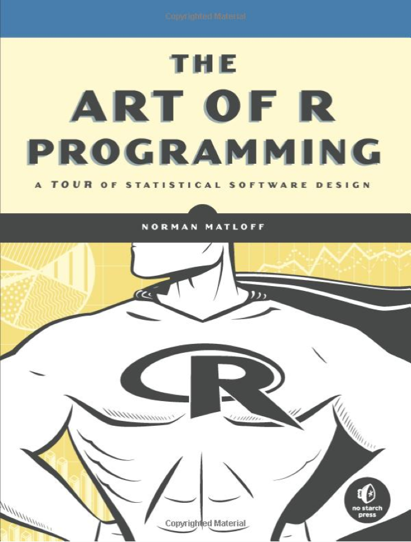
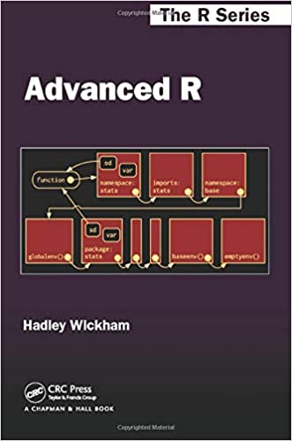
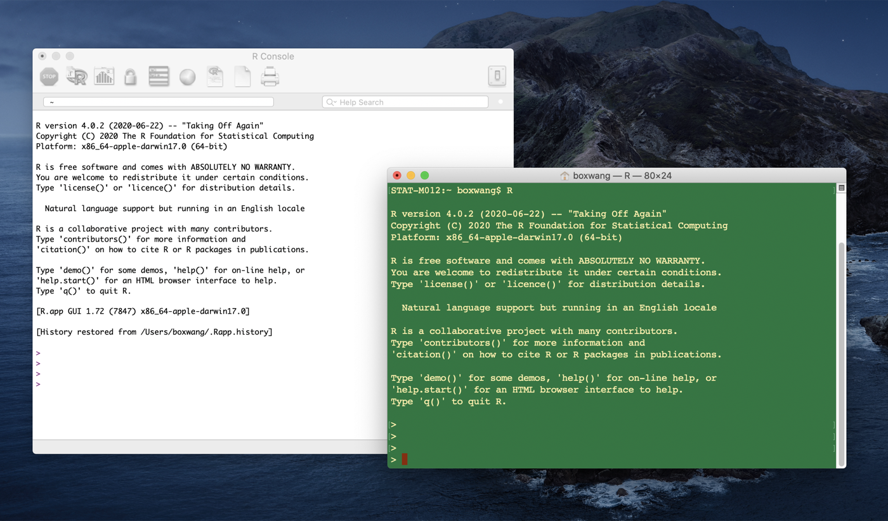



::: {.content-visible when-format="html"}
::: {.page-buttons}
[ PDF](s2p1.pdf){.btn .btn-sm .btn-outline-dark}


<div class="page-codefiles">All code on this page, in one file: </div>
:::

Every code block on this page runs in your browser. Click *Run Code*, change the code,
run it again. The whole page shares one R session, so run the blocks in order.
:::

## A First Look at R

### An implementation of S language

-   S language was developed at AT&T-Bell Labs; first version 1976.
-   S-Plus is a commercial version of S (begin in 1987), sold and supported by [Insightful Corp.]{.more note="Insightful sold S-Plus until 2008, when TIBCO bought the company; S-Plus is no longer actively sold."}

::: {.callout-note collapse="true" title="What S-Plus offered"}
**Bottom line.** S-Plus was the paid product built on S. R is the free implementation that replaced it in practice.

-   GUI.
-   Many formats supported for graphics export and data input/output.
-   Runs on Windows, UNIX, Linux (not Macintosh).
:::

### R

-   International team of statisticians started developing R in early 1990's.
    -   To provide [**free and open source**]{style="color:#b8860b"} alternative to S-Plus.
    -   To provide S implementation on Linux (not supported by S-Plus then); your code can be replicated by users on Windows, Unix, Linux, Mac...
-   Easy to [download](https://www.r-project.org/) and install from web sites.
-   User-contributed [packages]{style="color:#0072B2"} expand capabilities and provide support for cutting edge research.
-   An active [community]{style="color:#0072B2"}.
-   Facilitate [communicating]{style="color:#0072B2"} your results: knitr, r markdown, shiny.
-   Support of calling [high-performance languages]{style="color:#0072B2"}: C, C++, Fortran... some connection with Python and Matlab.
-   On the other hand, R itself is not very fast and efficient in using memory. Users' coding is sometimes not elegant.



### What R is

-   "An integrated suite of software facilities for data manipulation, calculation, and graphics display"

    (*An Introduction to R*, Venables, Ripley, and the R Core team).

-   The goal of STAT 5400 regarding R:
    -   Get familiar with fundamentals of R: data types, operations, object systems.
    -   Have extensive hands-on experiences of doing statistical analysis using R, with some touch on modern features in R.
    -   Use profiling to find computational bottlenecks and improve by writing a more elegant R code or resorting to C and Fortran.

### Reference

The Art of R Programming: A Tour of Statistical Software Design.\
By Norman Matloff.

{width="30%" fig-align="center"}

Advanced R.\
By Hadley Wickham ([COPSS Presidents' Award 2019](https://imstat.org/2019/09/02/copss-presidents-award-hadley-wickham/)).

{width="30%" fig-align="center"}

### Reading in data from external files

-   Download `Cars.dat` from <https://raw.githubusercontent.com/boxiang-wang/stat5400/main/data/Cars.dat>.
-   Use a text editor to look at this file. Note that the separators between columns are tabs (You can tell because the cursor jumps) and that the decimal point in numbers is indicated by periods.
-   We need to read this file into an `object` in R to analyze it. R has several functions that read in data files in different formats.
-   We will use R's built-in help facility to figure out which one to use.

On this page the file is already next to the notes, as `data/Cars.dat`, so the blocks below can read it.

{width="85%" fig-align="center"}

### Basic operation

```{webr}
1 + 1
exp(-2)
sqrt(2 * pi)
```

```{webr}
2 / 0
3 / 2 * 3
```

```{webr}
print("Hello 5400!")
```

[ Run]{.mode} --- say the answer out loud before you run it.

```{webr}
0.1 + 0.2 == 0.3
all.equal(0.1 + 0.2, 0.3)
.Machine$double.eps
```

::: {.callout-note collapse="true" title="Why FALSE?"}
**Bottom line.** `0.1`, `0.2` and `0.3` cannot be written exactly in binary, so the sum is off by about `5.6e-17`. Never compare two computed numbers with `==`. Use `all.equal()`, which allows a tolerance of about `1.5e-8` by default.

`.Machine$double.eps` is the smallest number that still makes a difference when added to 1. On almost every machine it is `2.220446e-16`.
:::

[ Run]{.mode} --- one of these two lines warns you. Predict which, and why.

```{webr}
1:3 + 1:2
1:4 + 1:2
```

::: {.callout-note collapse="true" title="Which one warns?"}
**The first one warns; the second is silent.** Both recycle the shorter vector. R warns only when the longer length is not a multiple of the shorter one: `1:3 + 1:2` gives `2 4 4` with *longer object length is not a multiple of shorter object length*, while `1:4 + 1:2` gives `2 4 4 6` and says nothing.

So the warning is not "you recycled". It is "your recycling did not come out even". The silent case is the one to watch.
:::

Read the data and look at its structure. **Run this block first** — the blocks below use `Cars`.

```{webr}
Cars <- read.delim("data/Cars.dat")
#  <- is assignment operator
str(Cars)
```

```{webr}
# show the first six rows
head(Cars)
```

```{webr}
# show the last six rows
tail(Cars)
```

```{webr}
summary(Cars)
```

```{webr}
plot(Cars)
```

### Data frames

The object `Cars` is a data frame.

```{webr}
class(Cars)
```

Data frame:

-   Special kind of object.
-   Like a table of data.
    -   Row for each observation.
    -   Column for each variable.
-   Variables (columns) can be of different data types:
    -   Numeric, character, factors.

## Data Structures

### A question regarding proficiency test

*Dear Dr. Boxiang,*

*For the second question in the proficiency test, we're asked to create an array containing 10 rows and 6 columns.*

*Is this equivalent to creating a matrix or a data.frame in r?*

Dr. Boxiang's answer: not really.

See the table from Wickham's book:

|             | Homogeneous   | Heterogeneous |
|-------------|---------------|---------------|
| 1-dim       | Atomic vector | List          |
| 2-dim       | Matrix        | Data frame    |
| $n$-dim     | Array         |               |

### Vectors

Atomic vector: same type --- [**integer**]{style="color:#b8860b"}, [**double**]{style="color:#b8860b"}, [**logical**]{style="color:#b8860b"}, [**character**]{style="color:#b8860b"}.

```{webr}
a1 <- c(1, 2, 3)
class(a1)
typeof(a1)
is.integer(a1)
is.atomic(a1)
```

```{webr}
a2 <- c(1L, 2L, 3L)
# same to a2 <- seq(3) or seq.int(3)
class(a2)
typeof(a2)
```

```{webr}
a3 <- c(T, F, TRUE, FALSE) # ALWAYS spell T and F.
class(a3); typeof(a3) # semicolons not recommended.
as.numeric(a3)
```

[ Run]{.mode} --- this is why the comment above says to spell them out.

```{webr}
T <- FALSE
c(T, TRUE)
rm(T)     # put things back
T
```

::: {.callout-note collapse="true" title="What just happened?"}
**`T` is an ordinary variable; `TRUE` is not.** `T` and `F` start out as shortcuts for `TRUE` and `FALSE`, but nothing stops you, a colleague, or a package from assigning to them. `TRUE` and `FALSE` are reserved words and cannot be reassigned.

So `if (x == T)` can silently mean the opposite of what you wrote. `rm(T)` deletes your version and uncovers the original.
:::

```{webr}
a4 <- c("T", "F")
class(a4); typeof(a4)
as.numeric(a4)
```

```{webr}
a5 <- c(T, F, "T", "F")
typeof(a5)
```

::: {.callout-note collapse="true" title="Going further: class, typeof, and mode"}
 **Three questions that sound the same and are not.** `typeof()` gives how the value is stored, `class()` gives what R dispatches methods on, and `mode()` is the older S-era grouping.

```
1     class numeric     typeof double      mode numeric
1L    class integer     typeof integer     mode numeric
TRUE  class logical     typeof logical     mode logical
"a"   class character   typeof character   mode character
```

The line that catches people is the first: a plain `1` is stored as a `double`, but its class is `numeric`. That is why `is.integer(1)` is `FALSE` while `is.integer(1L)` is `TRUE`, and why `1:3` (integer) and `c(1, 2, 3)` (double) are not the same vector.
:::

### Lists

The element of a list can be of different types.

```{webr}
l1 <- list(c(1, 2), c(T, F), c("T", "F"), 1 + 2)
str(l1)
unlist(l1)
```

```{webr}
l2 <- list(list(), list(list()))
str(l2)
```

### Three properties of vectors and lists

-   [**Name**]{style="color:#b8860b"}:

```{webr}
a1 <- c(T, T, F)
l1 <- list(T, T, 2)
names(a1) <- names(l1) <- paste0("name", 1:3)
```

```{webr}
a1
```

```{webr}
l1$name2
l1[2]
```

-   [**Length**]{style="color:#b8860b"}:

```{webr}
length(a1); length(l1)
```

-   [**Attributes**]{style="color:#b8860b"}:

```{webr}
attr(a1, "my_attr") <- "This is my vector."
attributes(a1)
a1
```

### Factors

Important use of attributes --- [**factors**]{style="color:#b8860b"}.

```{webr}
x <- factor(c("S", "T", "A", "T"))
x
```

```{webr}
is.atomic(x)
is.factor(x)
```

```{webr}
attributes(x)
levels(x)
```

In the `Cars` data, `Country` is the natural factor. Since R 4.0, `read.delim` keeps
text as `character`, so make the factor yourself.

```{webr}
is.factor(Cars$Country)
Cars$Country <- factor(Cars$Country)
levels(Cars$Country)
```

```{webr}
boxplot(Cars$MPG ~ Cars$Country)
```

[ Run]{.mode} --- a factor that looks like numbers. Predict the second line before running.

```{webr}
f <- factor(c("10", "9", "8"))
as.numeric(f)
```

::: {.callout-note collapse="true" title="Going further: never call as.numeric on a factor"}
 **You get `1 3 2`, not `10 9 8`.** A factor stores small integer codes plus a table of levels. `as.numeric()` hands back the codes, not the labels.

The levels are sorted as text, so they come out `"10" "8" "9"` --- `"10"` sorts before `"8"` because `"1"` comes before `"8"`. The codes then follow that order.

The safe idiom goes through the labels:

```r
as.numeric(as.character(f))   # 10 9 8
```

Two more worth knowing. `factor(x, levels = ...)` sets the order yourself, which is how you control the order of boxes in the plot above. And after subsetting, unused levels stay behind: `droplevels()` removes them.
:::

### Matrices and arrays

-   Vector $+$ attribute(`dim`) $=$ array.
-   Two-dimensional array = matrix.

```{webr}
a <- matrix(1:6, ncol = 3, nrow = 2)
b <- array(1:12, c(2, 3, 2))
```

```{webr}
b <- 1:12
dim(b) <- c(2, 3, 2)
```

```{webr}
rownames(a) <- c("row1", "row2")
colnames(a) <- paste0("col", 1:3)
dimnames(b) <- list(letters[1:2], LETTERS[1:3],
  c("one", "two"))
```

```{webr}
# a
# b
```

### Data frames

-   Most common way to store data in R.
-   *Behave* like a two-dimensional list.

```{webr}
dat <- data.frame(x1 = 2:4, x2 = letters[1:3])
str(dat)
```

Old R (before 4.0) converted strings to factors when creating data frames; you had to
write `stringsAsFactors = FALSE` to keep them as text. Since R 4.0 that is the default,
so the two blocks now agree.

```{webr}
dat2 <- data.frame(x1 = 2:4, x2 = letters[1:3],
  stringsAsFactors = FALSE)
str(dat2)
```



```{webr}
is.list(Cars)
dim(Cars)
```

```{webr}
is.data.frame(Cars)
str(Cars)
```

::: {.callout-note collapse="true" title="Going further: a data frame is a list"}
 **A data frame is a list of equal-length columns, wearing a two-dimensional coat.** That is why `is.list(Cars)` above is `TRUE`.

It explains several things at once. `length(Cars)` is `8`, the number of columns, not the number of rows. Anything that works on a list works here, so `sapply(Cars, class)` gives the type of every column in one line. And `Cars[1]` returns a one-column data frame while `Cars[[1]]` returns the column itself --- the same `[` versus `[[` rule as any other list.

The only thing the coat adds is the requirement that every column has the same length.
:::

### Summary of data structure

-   Three properties of a vector or a list are [**type**]{style="color:#b8860b"}, [**length**]{style="color:#b8860b"}, and [**attributes**]{style="color:#b8860b"}.
-   The four common types of atomic vectors are [**integer**]{style="color:#b8860b"}, [**double**]{style="color:#b8860b"}, [**logical**]{style="color:#b8860b"}, and [**character**]{style="color:#b8860b"} (strings).
-   The elements of a [**list**]{style="color:#b8860b"} and a [**data frame**]{style="color:#b8860b"} can be of any type. The elements of an [**atomic vector**]{style="color:#b8860b"} and a [**matrix**]{style="color:#b8860b"} must be of the same type.

## Subsetting

### Subsetting a vector



-   [**Positive integers**]{style="color:#b8860b"}:

```{webr}
(x <- 1:4 * 10)
x[c(1, 3)] # assign values: x[c(1, 3)] <- c(1, 2)
```

```{webr}
x[order(x)]
x[c(1, 1)]
x[c(1.2, 2.9)]
```

-   [**Negative integers**]{style="color:#b8860b"}:

```{webr}
x[-c(3, 1)]
x[c(-3, 1)]
```

-   [**Logical vectors**]{style="color:#b8860b"}:

```{webr}
x[x < 25]
which(x < 25)
```

```{webr}
x[c(TRUE, FALSE, TRUE, TRUE)]
x[c(TRUE, FALSE)]
```

```{webr}
x[c(TRUE, FALSE, TRUE, TRUE, TRUE)]
x[c(TRUE, FALSE, NA, TRUE)]
```

-   [**Characters**]{style="color:#b8860b"}:

```{webr}
names(x) <- letters[1:4]
x[c("a", "c")]
```

[ By hand]{.mode} --- a chatbot was asked what `v[c(TRUE, FALSE)]` returns. Its answer is in the comments, and one claim in it is wrong. Run the block and check it against R. Done when you can say how many elements come back, and why. No AI for this block.

```{webr}
# Chatbot: "Logical subsetting keeps the elements marked TRUE. The index
# here has only two values, so R uses them for the first two elements and
# ignores the rest. v[c(TRUE, FALSE)] therefore returns the first element,
# a vector of length 1."
v <- 1:6 * 5
v[c(TRUE, FALSE)]
```

::: {.callout-note collapse="true" title="Solution"}
**Three elements come back, not one: `5 15 25`.** The index is shorter than `v`, so R recycles it to `TRUE FALSE TRUE FALSE TRUE FALSE`. Nothing is "ignored", which is the part the chatbot got wrong.

Recycling does not need the lengths to divide evenly. Change `v` to `1:7 * 5` and the same index returns elements 1, 3, 5, and 7, with no warning.
:::

### Subsetting a list

```{webr}
l1 <- list(a = 1, b = 2, c = 3)
```

```{webr}
l1$a
l1[[1]]
l1[1]
```

::: {.callout-note collapse="true" title="Going further: two corners of `[[`"}
 **`[[` with a vector digs down, it does not pick several.** For a nested list, `l[[c(2, 1)]]` means "element 2, then element 1 inside that" --- one step per number. To pick several elements, use `[`.

**You cannot mix positive and negative indices.** `x[c(-1, 2)]` is an error, *only 0's may be mixed with negative subscripts*, because R cannot tell whether you meant to keep or to drop. Pick one direction.
:::

If a list `x` is a train carrying objects, then `x[1]` is a train of car 1 and `x[[1]]` is the objects in car 1 --- \@RLangTip.

### Words on the `drop` option

-   Factor (drops excluded levels by `drop=TRUE`):

```{webr}
f1 <- factor(c("s", "t", "a", "t"))
f1[1:2]
f1[1:2, drop = TRUE]
```

-   Matrix (drops dimension whose length is one):

```{webr}
a <- matrix(1:8, 2, 4)
colMeans(a[, 1:2])
a[, 1]
```

The next block is meant to fail: `a[, 1]` is no longer a matrix.

```{webr}
colMeans(a[, 1])
```

```{webr}
a[, 1, drop = FALSE]
colMeans(a[, 1, drop = FALSE])
```

## A Simple Statistical Analysis

### Subsetting rows and columns of a data frame

```{webr}
Cars[1:6, ]
```

```{webr}
head(Cars[, c("Country", "MPG", "Weight")])
```

```{webr}
head(Cars[Cars$Country == "U.S.", ])
```

```{webr}
head(Cars[Cars$Country == "Japan", ])
```

```{webr}
table(Cars$Country)
summary(Cars[Cars$Country == "U.S.", "MPG"])
summary(Cars[Cars$Country == "Japan", "MPG"])
```

```{webr}
hist(Cars[Cars$Country == "U.S.", "MPG"])
```

```{webr}
hist(Cars[Cars$Country == "Japan", "MPG"])
```

### One-sample t-test



Try `help(t.test)` first.

```{webr}
t.test(Cars[Cars$Country == "U.S.", "MPG"])
```

```{webr}
UStout <- t.test(Cars[Cars$Country == "U.S.", "MPG"])
names(UStout)
```

```{webr}
UStout$conf.int
UStout$estimate
UStout$statistic
```

```{webr}
t.test(Cars[Cars$Country == "Japan", "MPG"])
```

### Two-sample t-test

```{webr}
t.test(Cars[Cars$Country == "U.S.", "MPG"],
  Cars[Cars$Country == "Japan", "MPG"])
```
