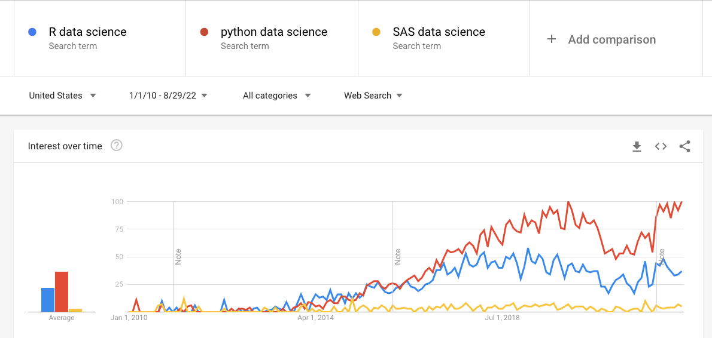
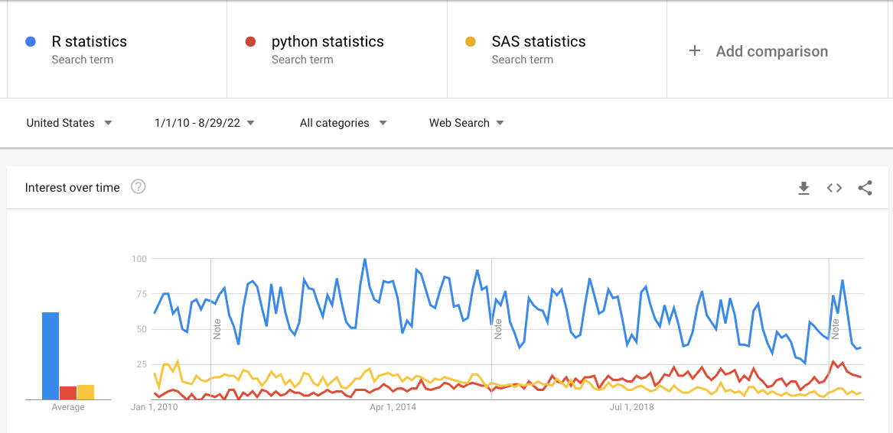
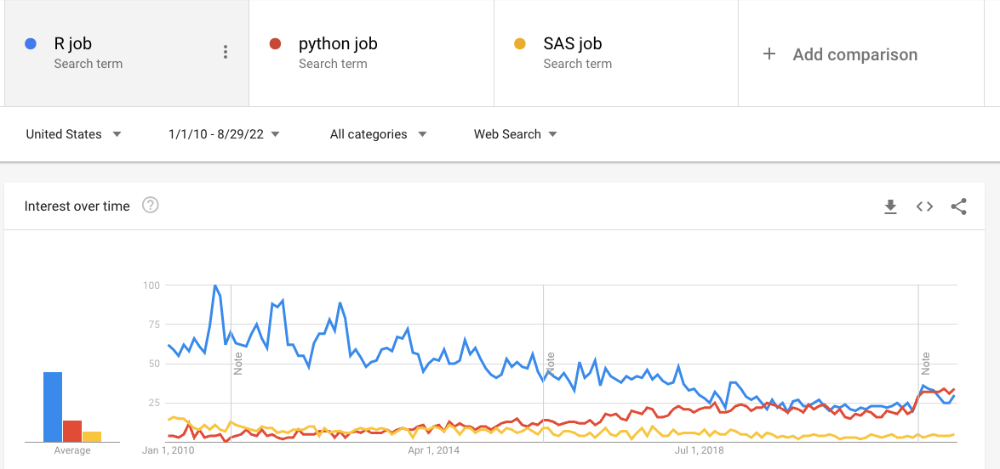



::: {.content-visible when-format="html"}
::: {.page-buttons}
[ PDF](s2p2.pdf){.btn .btn-sm .btn-outline-dark}


<div class="page-codefiles">All code on this page, in one file: </div>
:::

Every code block on this page runs in your browser. Click *Run Code*, change the code,
run it again. R and Python each keep their own session, so run the blocks in order.
:::

## A First Look at Python

### Python

-   Python is a [**general purpose**]{style="color:#b8860b"} programming language.
-   Python has simplified syntax and it is [**easy**]{style="color:#b8860b"} to learn and implement.
-   Python has an active and mature [**supporting community**]{style="color:#b8860b"}.
-   Python has many popular and powerful [**libraries**]{style="color:#b8860b"}, e.g., NumPy, Pandas, etc.
-   Python was written by [Guido van Rossum](https://en.wikipedia.org/wiki/Guido_van_Rossum){.more note="Van Rossum started Python as a holiday project in 1989 and led the project as its Benevolent Dictator For Life until 2018."} and the name was inspired by a comedy series "Monty Python".

{width="80%" fig-align="center"}

### R and Python on Google Trends

{width="80%" fig-align="center"}

{width="80%" fig-align="center"}

{width="80%" fig-align="center"}

### Download Python

Two ways to install Python. Section 1.1 recommends [**uv**]{style="color:#b8860b"}, and that is still the recommendation here.

-   [uv](https://docs.astral.sh/uv/getting-started/installation/) --- one small program that installs Python itself and manages the packages of each project separately. It is fast, and one project cannot break another, because each has its own copy of what it needs.
-   [Anaconda](https://www.anaconda.com/download) --- a large bundle that ships Python together with hundreds of scientific packages and a graphical launcher. Nothing to choose: everything is already installed. It takes several gigabytes of disk and is slower to update.

Use uv if you are comfortable typing commands in a terminal. Use Anaconda if you would rather install everything at once and start from a window. Either works for this course.



Recommended integrated development environment (IDE): (advanced editor that can be used to build and execute code)

-   Jupyter Notebook.
-   Spyder.
-   PyCharm.
-   VS Code.

Nothing to install for this page: the blocks below run Python in your browser, and the
course Codespace already has Python, Jupyter, and VS Code.

### Hello 5400!

```{pyodide}
print('Hello', '5400!')
print('Hello', '5400', end='!\n')
print('Hello' + ' ' + '5400')
```

```{webr}
print(paste("Hello", "5400!"))
```

### Basic operations in R

```{webr}
1 + 1
exp(-2)
sqrt(2 * pi)
```

```{webr}
2 / 0
3 / 2 * 3
```

### Basic operations in Python

In Python, `exp` and `sqrt` are not there until you import them.

```{pyodide}
1 + 1
```

The next block is meant to fail.

```{pyodide}
exp(-2)
```

Let's import some math functions from the [`math` module (library)]{style="color:#0072B2"}.

```{pyodide}
import math
from math import *
```

Or directly import the functions that are needed.

```{pyodide}
from math import exp, sqrt, pi
print(exp(-2))
print(sqrt(2 * pi))
```

Dividing by zero is an error in Python, not `Inf`. This block is meant to fail.

```{pyodide}
2 / 0
```

### Integers and floats

In Python 3, `/` is float division and `//` is integer division.

[ Predict]{.mode} --- one of these three lines prints something different from the other two. Which one?

```{pyodide}
print(3 / 2 * 3)
print(3 // 2 * 3)
print(3.0 / 2 * 3)
```

Python 2 used `/` for integer division, so the same line printed `3` in the old notes.

R converts integers to float values as needed.

```{webr}
3 / 2 * 3
3L / 2L * 3L
```

## Data Analysis

### Reading the data

```{webr}
Cars <- read.delim("data/Cars.dat")
#  <- is assignment operator
str(Cars)
```

### The library `pandas`



Quote from its official website: <https://pandas.pydata.org/>

*`pandas` is a fast, powerful, flexible and easy to use open source data analysis and [manipulation tool]{style="color:#0072B2"}, built on top of the Python programming language.*

`pandas` provide abundant functions to import, index, manipulate, merge, and plot data frame.

**Run this block first** — the Python blocks below use `Cars`.

```{pyodide}
import pandas as pd
Cars = pd.read_csv('data/Cars.dat', sep='\t')
Cars.dtypes
```

### The first rows

```{webr}
# show the first two rows
head(Cars, 2)
```

```{pyodide}
Cars.head(2)
```

### Summaries

```{webr}
summary(Cars[, c("Country", "MPG")])
```

```{pyodide}
Cars[['Country', 'MPG']].describe(include='all')
```

### All pairs

```{webr}
plot(Cars)
```

```{pyodide}
import matplotlib.pyplot as plt
import seaborn as sns
sns.pairplot(Cars, hue='Country')
plt.show()
```

### Data frames

The object `Cars` is a data frame.

```{webr}
class(Cars)
```

```{pyodide}
type(Cars)
```

Data frame:

-   Special kind of object.
-   Like a table of data.
    -   Row for each observation.
    -   Column for each variable.
-   Variables (columns) can be of different data types:
    -   Numeric, character, factors.

### Vectors

Four basic types of variables: integer, double, logical, character.

```{webr}
class(1L)
class(1)
class(TRUE)
class("TRUE")
```

```{webr}
print(!TRUE)
class(complex(1, 1, -1))
```

```{pyodide}
print(type(1))
print(type(1.0))
print(type(True))
print(type('True'))
```

```{pyodide}
print(not True)
print(type(1 - 1j))
```

### Vectors and lists

```{webr}
x = c(5, 4, 0, 0)
x
```

```{webr}
y = c("Hello", "5400")
y
c(y, "!")
```

```{pyodide}
x = [5, 4, 0, 0]
print(x)
```

```{pyodide}
y = ['Hello', '5400']
print(y)
print([y, '!'])
```

```{pyodide}
y.append('!')
print(y)
```

[ By hand]{.mode} --- this difference catches R users more than any other. A chatbot was asked whether `b = a` copies a list. Its answer is in the comments. Run the R block, then the Python block, and check the claim against both. Done when you can say what each one prints, and why they differ. No AI for this block.

```{webr}
# The same two lines in R, for comparison.
a <- c(1, 2, 3)
b <- a
b[4] <- 4
a
```

```{pyodide}
# Chatbot: "b = a makes b a copy of the list, so the two are independent.
# Appending to b leaves a unchanged, and a still prints [1, 2, 3]."
a = [1, 2, 3]
b = a
b.append(4)
print(a)
```

::: {.callout-note collapse="true" title="Solution"}
**R prints `1 2 3`. Python prints `[1, 2, 3, 4]`.**

In R, changing `b` makes a copy first, so `a` is untouched. In Python, `b = a` does not copy the list; it gives the one list a second name, so `a is b` is `True` and appending through either name changes it. Ask for the copy: `b = a.copy()`.

So the chatbot's answer describes R, not Python. That is the trap: it is the right answer to the wrong language.
:::

A list in R and python can contain variables of different types.

```{webr}
z = list("word" = c("Hello", "5400"), "sign" = "!")
z$"word"
z$"sign"
```

```{pyodide}
y = ['Hello', '5400']
z = {'word': y, 'sign': '!'}
print(z)
```

```{pyodide}
print(z['word'])
print(z['sign'])
```

### Matrices and arrays

In R, `byrow=FALSE` is by default when assembling a matrix.

```{webr}
a <- matrix(1:6, ncol = 3, nrow = 2, byrow = FALSE)
a
```

```{webr}
b <- c(1, 2, 3)
a %*% b
```

In Python, we can use `order='F'` to convert a vector to a matrix by column; otherwise, the conversion is by row.

```{pyodide}
import numpy as np
a = np.reshape(list(range(1, 7)), (2, 3), order='F')
a
```

```{pyodide}
b = [1, 2, 3]
np.dot(a, b)
```

The `range` function in Python has arguments: `start`, `stop`, `step`.

### The library `Numpy`

Quote from its official website: <https://numpy.org/> *the fundamental package for scientific computing*.

-   It is mainly devised for processing and operating arrays with general purpose.
-   It provides functions to add, multiply, slice, reshape, broadcast, and index, arrays.

```{webr}
1:4 * 3
```

[ Predict]{.mode} --- the same `* 3`, on a list and on a NumPy array. Do they do the same thing?

```{pyodide}
import numpy as np
print(list(range(1, 5)) * 3)
print(np.array(range(1, 5)) * 3)
```

A Python list repeats when you multiply it; a NumPy array multiplies element by element.
In Python 2, `range(1, 5)` was already a list, which is what the old notes show.

## Subsetting

### Subsetting a vector



```{webr}
x = 1:5 * 3
x[1:2]
```

```{webr}
x[seq(1, 5, 2)]
x[c(1, 3)]
```

```{pyodide}
x = np.array(range(1, 6)) * 3
print(x)             # range [start, stop) -- a half-open interval
```

[ Predict]{.mode} --- how many elements does each line return? Compare with the R block above.

```{pyodide}
print(x[0:1])        # note Python begins with 0
print(x[0:4:2])
print(np.array(x)[[0, 2]])
```

[ By hand]{.mode} --- a chatbot was asked what happens when a logical index is shorter than the vector. Its answer is in the comments. Run the R block, then the Python block. One language does something surprising, the other refuses to guess. Done when you can say what R returns, and what NumPy says instead. No AI for this block.

```{webr}
# Chatbot: "A logical index shorter than the vector is padded with FALSE, so
# only the first element is kept. R and Python both behave this way."
v <- 1:6 * 5
v[c(TRUE, FALSE)]
```

```{pyodide}
import numpy as np
v = np.array(range(1, 7)) * 5
try:
  print(v[np.array([True, False])])
except IndexError as e:
  print("IndexError:", e)
```

::: {.callout-note collapse="true" title="Solution"}
**R returns `5 15 25`. NumPy returns an error.** The chatbot is wrong twice.

R does not pad with `FALSE`. It recycles the index to the length of `v`, giving `TRUE FALSE TRUE FALSE TRUE FALSE`, so three elements come back, not one.

NumPy refuses: `boolean index did not match indexed array along axis 0; size of axis is 6 but size of corresponding boolean axis is 2`. The mask must be the same length as the array.

This is worth remembering in both directions. R guesses what you meant and stays silent, which is convenient until the guess is wrong. NumPy makes you say it exactly. To take every other element in Python, slice instead: `v[::2]`.
:::

[ By hand]{.mode} --- a chatbot was asked whether it is safe to modify a slice of a NumPy array. Its answer is in the comments, and one claim in it is wrong. Run the block. Done when you can say which of the three lines changed `a`, and why that one and not the others. No AI for this block.

```{pyodide}
# Chatbot: "Slicing a NumPy array returns a copy, just as R does. Writing to
# the slice never touches the original, so a prints [1 2 3 4 5] all three
# times below."
import numpy as np

a = np.array([1, 2, 3, 4, 5])
b = a[0:2]
b[0] = 99
print("after a[0:2]   :", a)

a = np.array([1, 2, 3, 4, 5])
c = a[[0, 1]]
c[0] = 99
print("after a[[0,1]] :", a)

a = np.array([1, 2, 3, 4, 5])
m = a[a > 3]
m[0] = 99
print("after a[a > 3] :", a)
```

```{webr}
# The same idea in R, for comparison.
a <- c(1, 2, 3, 4, 5)
b <- a[1:2]
b[1] <- 99
a
```

::: {.callout-note collapse="true" title="Solution"}
**Only the first line changed `a`.** It prints `[99 2 3 4 5]`. The other two leave `a` alone, and so does R.

`a[0:2]` returns a [view]{.more note="A view is a new array object with its own shape and step size, reading the same block of memory as the original. Nothing is copied."}: a second way of reading the same memory. Writing through it writes into `a`.

`a[[0, 1]]` and `a[a > 3]` return copies. Not by choice: a view can only describe positions at a regular step --- a start, then every k-th element. A list of positions, or whatever a mask happens to select, is not regular, so NumPy has to gather those values into new memory.

Slicing is a view because copying is expensive. Taking `big[0:5000000]` as a copy has to move 40 MB; as a view it moves nothing. R never does this: `a[1:2]` always allocates. So the bug cannot happen in R, and an R user has no habit of watching for it.

Two ways to stay safe: write `a[0:2].copy()` when you mean to modify, and check with `np.shares_memory(a, b)` when you are unsure. Note that a plain Python list is not an array --- `lst[0:2]` always copies --- so testing the idea on a list teaches the wrong rule.
:::

### Subsetting a matrix

```{webr}
a = matrix(1:8, 2, 4)
a[1, ]
a[, 1]
```

```{webr}
colMeans(a)
rowMeans(a)
```

```{pyodide}
a = np.array([[1, 3, 5, 7], [2, 4, 6, 8]])
print(a[0, ])
print(a[:, 0])
```

[ Predict]{.mode} --- one of these matches `colMeans` above. Axis 0 or axis 1?

```{pyodide}
print(a.mean(axis=0))
print(a.mean(axis=1))
```

### Strings in Python

```{pyodide}
s = 'Hello 5400'
print(len(s))
print(s[0])
```

```{pyodide}
print(s[0:6:2])
print(s[-1])
print(s[6:-1])
```

```{pyodide}
print(s.lower()) # s.upper()
```

```{pyodide}
a, b = s.split(' ')
print(a)
print(b)
print(a + b)
```

## A Simple Statistical Analysis

### Selecting columns

```{webr}
head(Cars[, c("Country", "MPG", "Weight")])
```

```{pyodide}
Cars[['Country', 'MPG']].head(5)
```

### Selecting rows

```{webr}
US_Cars = Cars[Cars$Country == "U.S.", ]
head(US_Cars[, c("Country", "MPG")], 5)
```

```{pyodide}
US_Cars = Cars.loc[Cars['Country'] == 'U.S.']
US_Cars[['Country', 'MPG']].head(5)
```

```{pyodide}
JPN_Cars = Cars.loc[Cars['Country'] == 'Japan']
JPN_Cars[['Country', 'MPG']].head(5)
```

### Counts and summaries

```{webr}
table(Cars$Country)
summary(Cars[Cars$Country == "U.S.", "MPG"])
summary(Cars[Cars$Country == "Japan", "MPG"])
```

```{pyodide}
from collections import Counter
Counter(Cars['Country'])
```

```{pyodide}
pd.concat([US_Cars['MPG'],
  JPN_Cars['MPG']], axis=1).describe()
```

### Histograms

```{webr}
hist(Cars[Cars$Country == "U.S.", "MPG"])
```

```{pyodide}
import matplotlib.pyplot as plt
plt.hist(US_Cars['MPG'], bins=range(15, 40, 5))
plt.show()
```

### The package `Matplotlib`

Quotes from its official website <https://matplotlib.org/>.

-   *`Matplotlib` is a comprehensive library for creating static, animated, and interactive visualizations in Python.*
-   *`Matplotlib` makes easy things easy and hard things possible.*

Provides functions to produce scatter plots, bar chars, histogram, box plots, pie charts, etc.

```{webr}
hist(Cars[Cars$Country == "Japan", "MPG"])
```

```{pyodide}
import matplotlib.pyplot as plt
plt.hist(JPN_Cars['MPG'], bins=range(15, 40, 5))
plt.show()
```

### One-sample t-test

Test if the mean MPG of the U.S. cars is 20.

```{webr}
t.test(US_Cars[, "MPG"], mu = 20)
```

```{pyodide}
from scipy.stats import ttest_1samp
t1 = ttest_1samp(US_Cars['MPG'], 20)
print(t1)
```

```{pyodide}
print(t1.pvalue)
```

### Two-sample t-test

```{webr}
JPN_Cars = Cars[Cars$Country == "Japan", ]
t.test(US_Cars[, "MPG"], JPN_Cars[, "MPG"])
```

```{pyodide}
from scipy.stats import ttest_ind
t2 = ttest_ind(US_Cars['MPG'], JPN_Cars['MPG'],
  equal_var=False)
print(t2)
```

```{pyodide}
print(t2.pvalue)
```
