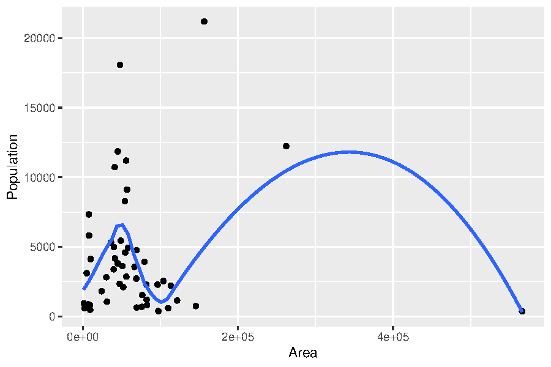
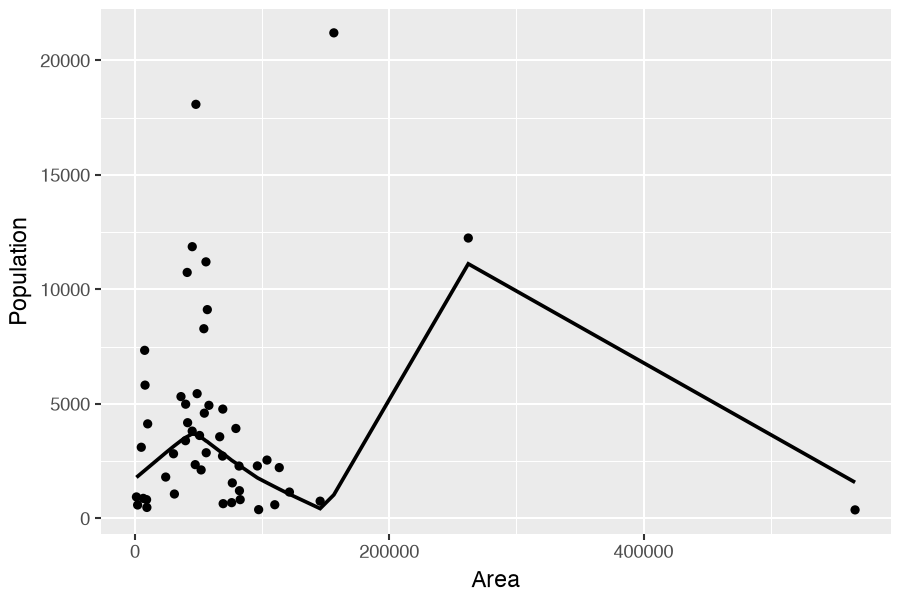



::: {.content-visible when-format="html"}
::: {.page-buttons}
[ PDF](s2p3.pdf){.btn .btn-sm .btn-outline-dark}


<div class="page-codefiles">All code on this page, in one file: </div>
:::

Every code block on this page runs in your browser. Click *Run Code*, change the code,
run it again. From here on the two languages run side by side: the R tab comes first,
the Python tab does the same job. Where an idea belongs to one language only, a one-line
note says so instead of a fake tab.
:::

## Functions

### Write your own functions

-   Structure of a function.

::: {.panel-tabset}

#### R

```{.r}
function (<arguments>) {
  <body of function>
  <object to return>
}
```

-   Three parts of the function: [**formals, body, environment**]{style="color:#b8860b"}.

```{webr}
myfunc <- function(x) sin(x)
myfunc
```

```{webr}
formals(myfunc)
body(myfunc)
environment(myfunc)
```

#### Python

```{.python}
def <name>(<arguments>):
  <body of function>
  return <object to return>
```

-   The same three parts, under different names: [**signature, code, globals**]{style="color:#b8860b"}.

```{pyodide}
import math
def myfunc(x):
  return math.sin(x)
myfunc
```

```{pyodide}
import inspect
print(inspect.signature(myfunc))     # formals
print(myfunc.__code__)               # body, already compiled
print(myfunc.__globals__ is globals())  # environment
```

:::

Typing the name of an R function prints its body, because R keeps the source text with
the function. Python keeps only [compiled bytecode]{.more note="Python translates the body into machine-like instructions when the def line runs, and throws the text away. A function that was read from a file can still be printed with inspect.getsource, because the file is still on disk."}, so the same line prints an address.

### Quadratic equation solver (a bad example)

A question from STAT 5400 proficiency exam:

::: {.panel-tabset}

#### R

```{webr}
quadratic <- function(a, b, c){
  discrim <- b * b - 4 * a * c
  mult <- c(1, -1)
  solve <- (-b + mult * sqrt( discrim ) ) / (2 * a)
   return(solve)
}
```

```{webr}
# usage
quadratic(2, 4, 1)
```

#### Python

```{pyodide}
import math
def quadratic(a, b, c):
  discrim = b * b - 4 * a * c
  solve = [(-b + m * math.sqrt(discrim)) / (2 * a) for m in (1, -1)]
  return solve
```

```{pyodide}
# usage
quadratic(2, 4, 1)
```

:::

On these coefficients it gives the right answer. It is still a bad function: the name
`solve` hides an R function, the argument `c` hides `c()`, and nothing is checked.

What would it return when `a` is zero, or when the discriminant is negative?

### Quadratic equation solver (a better example)

::: {.panel-tabset}

#### R

```{webr}
QuadraticSolver <- function(aval, bval, cval){
  discrim <- bval * bval - 4 * aval * cval
  if (discrim < 0){
    sol <- c(NA, NA)
    errflag <- 1
  } else {
    if (aval != 0) {
      mult <- c(1, -1)
      sol <- (-bval + mult * sqrt(discrim)) / (2 * aval)
      errflag <- 0
    } else {
      sol <- c(NA, NA)
      errflag <- 2
    }
  }
  return(list(solution=sol, errflag=errflag))
}
```

```{webr}
QuadraticSolver(2, 4, 1)
```

#### Python

```{pyodide}
import math
def QuadraticSolver(a, b, c):
  discrim = b * b - 4 * a * c
  if discrim < 0:
    sol = [None, None]
    errflag = 1
  else:
    if a != 0:
      root1 = (-b + math.sqrt(discrim)) / (2 * a)
      root2 = (-b - math.sqrt(discrim)) / (2 * a)
      sol = [root1, root2]
      errflag = 0
    else:
      sol = [None, None]
      errflag = 2
  return sol, errflag
```

```{pyodide}
QuadraticSolver(2, 4, 1)
```

:::

::: {.callout-note collapse="true" title="Why the flags matter more in R than in Python"}
**Without the checks, R answers anyway.**

Take the checks out and give the function `a = 0`. R divides by zero and returns `NaN` and
`-Inf`. Give it a negative discriminant and R returns two `NaN` values with a warning that is
easy to miss. Either way you get something number-shaped, and you can carry it into the next
computation without noticing.

Python stops at the line that is wrong: `ZeroDivisionError` in the first case, and
`ValueError: math domain error` in the second.

So `errflag` is doing more work in R. In Python the interpreter already refuses; in R the only
thing standing between a bad input and a bad number is the code you wrote.
:::

### A bug the flags do not catch

Both versions use the formula from the textbook. Try coefficients that are far apart.

[ Predict]{.mode} --- the two roots of a quadratic must multiply to $c/a$, which
is 1 here. Will they? Done when you can say which of the two roots is wrong.

::: {.panel-tabset}

#### R

```{webr}
r <- QuadraticSolver(1, 1e8, 1)$solution
r
prod(r)   # must be c/a = 1
```

#### Python

```{pyodide}
r = QuadraticSolver(1, 1e8, 1)[0]
print(r)
print(r[0] * r[1])   # must be c/a = 1
```

:::

::: {.callout-note collapse="true" title="Solution"}
**The product is 0.745, not 1, and no error was raised.**

The large root is fine. The small one should be $-1.0 \times 10^{-8}$ and comes back as
$-7.45 \times 10^{-9}$.

The cause is subtraction. With $b$ large, $\sqrt{b^2 - 4ac}$ is almost exactly $b$, so
$-b + \sqrt{b^2-4ac}$ takes the difference of two nearly equal numbers. The digits they share
cancel, and what is left is mostly rounding error. No flag in the function can see this.

The standard fix computes the safe root first, then gets the other one from the product.

```r
q <- -(bval + sign(bval) * sqrt(discrim)) / 2
sol <- c(cval / q, q / aval)
```

That version returns $-1.0 \times 10^{-8}$, and the product becomes 1.
:::

[ Vibe]{.mode} --- give `QuadraticSolver` to Copilot and ask it to make the function
robust, then test the result on `(1, 1e8, 1)`. Starter files:
[`vibe/s2p3_quadratic_robust.R`](https://github.com/boxiang-wang/stat5400/blob/main/notes/section2/vibe/s2p3_quadratic_robust.R)
and [`vibe/s2p3_quadratic_robust.py`](https://github.com/boxiang-wang/stat5400/blob/main/notes/section2/vibe/s2p3_quadratic_robust.py).
Expect type checks, a docstring, and a message for the negative discriminant. Expect the unstable
formula to survive. Models fix the errors that have names, and this one has no name until you give it
one. That division of labor runs through the rest of the course.

### Putting a function in its own file

This program is saved in a file called "quadratic.R" (or "quadratic.py"). Running that file
puts the function in memory.

::: {.panel-tabset}

#### R

```r
source("quadratic.R")
QuadraticSolver(2, 4, 1)
```



#### Python

```python
from quadratic import QuadraticSolver
QuadraticSolver(2, 4, 1)
```



:::

R runs the whole file and keeps everything it created. Python [imports]{.more note="An import runs the file once and gives you a module, then remembers it. Asking for the same file again does not run it a second time, so editing the file and importing again has no effect until you restart the session."} the file as a module, and you name the pieces you want.

You may also call a function with a list of arguments already collected in one object.

::: {.panel-tabset}

#### R

```{webr}
argumts <- list(aval=2, bval=4, cval=1)
do.call(QuadraticSolver, argumts)
```

#### Python

```{pyodide}
argumts = {"a": 2, "b": 4, "c": 1}
QuadraticSolver(**argumts)
```

:::

The two stars in front of a Python dictionary mean "spread these out as named arguments".
One star does the same for a list, filling the arguments in order.

### Local and global variables (name masking)

::: {.panel-tabset}

#### R

```{webr}
y <- -1
```

```{webr}
myfun1 <- function(x=1, y=1) {
  y <- y + 1; return(y)
}
```

```{webr}
myfun2 <- function(x=1) {
  y <- y + 1; return(y)
}
```

```{webr}
myfun3 <- function(x=1) {
  y <<- y + 1; return(y)
}
```

```{webr}
myfun1(1); print(y)
```

```{webr}
myfun2(1); print(y)
```

```{webr}
myfun3(1); print(y)
```

#### Python

```{pyodide}
y = -1
```

```{pyodide}
def myfun1(x=1, y=1):
  y += 1
  return y
```

```{pyodide}
def myfun2(x=1):
  y = y + 1
  return y
```

```{pyodide}
def myfun3(x=1):
  global y
  y += 1
  return y
```

```{pyodide}
print(myfun1(1)); print(y)
```

```{pyodide}
print(myfun2(1)); print(y)
```

```{pyodide}
print(myfun3(1)); print(y)
```

:::

[ Predict]{.mode} --- `myfun2` is the same three lines in both languages, and
`y` is `-1` outside. Say what each version returns before you run it. Done when you can
explain why one of them never returns anything at all.

::: {.callout-note collapse="true" title="Solution"}
**R returns 0. Python raises `UnboundLocalError`.**

R finds no `y` inside the function, so it walks outward to the global `-1`. The result is stored in a
new local `y`, and the global one is untouched.

Python decides before the function runs. The body assigns to `y`, so `y` is local everywhere in it,
including on the line that creates it. Reading it before it exists is the error.

`myfun3` is where the two agree. `<<-` and `global` both mean the outer name, and both set `y` to 0
for good. Avoid them.
:::

### A confusing example (function vs variable)

Think about what the following code outputs?

::: {.panel-tabset}

#### R

```{webr}
c <- 1
c(c = c)
```

-   R is smart; it knows when a function or a variable is needed.
-   However, it may cause confusing code and this is something you should avoid.

#### Python

```{pyodide}
list = [1, 2, 3]
list((4, 5))
```

-   Python is not smart here; one name holds one thing at a time.
-   The name `list` now holds your data, so the function `list` is gone until you `del list`.

```{pyodide}
del list
list((4, 5))
```

:::

Same lesson, opposite behavior. R separates the two lookups and recovers; Python does not,
and shadowing a built-in name is one of the most common bugs in student code.

### Lazy evaluation

-   Use `=` rather than `<-` when assign function arguments.

::: {.panel-tabset}

#### R

```{webr}
x <- 0
myfun4 <- function(x) print(x)
myfun4(x<-1)
x
```

```{webr}
x <- 0
myfun5 <- function(x) print(x)
myfun5(x=1)
x
```

```{webr}
x <- 0
myfun6 <- function(x) print("")
myfun6(x<-1)
x
```

#### Python

Python has no lazy evaluation: an argument is computed before the call starts, whether the
function uses it or not. The walrus operator `:=` assigns inside an expression, which lets
us run the same experiment.

```{pyodide}
x = 0
def myfun4(x): print(x)
myfun4(x := 1)
print(x)
```

```{pyodide}
x = 0
def myfun6(x): print("")
myfun6(x := 1)
print(x)
```

:::

The third R block is the point. `myfun6` never uses `x`, so R never evaluates the argument
and the global `x` stays 0. Python evaluates it first, so `x` becomes 1 either way.

### Infix and prefix functions

Every operation is really a function call in both languages:

::: {.panel-tabset}

#### R

```{webr}
class(`+`)
```

We may use it as a regular function:

```{webr}
`+`(3, 4)
```

Subsetting:

```{webr}
letters[2]
`[`(letters, 2)
```

#### Python

```{pyodide}
import operator
type(operator.add)
```

```{pyodide}
print(operator.add(3, 4))
```

```{pyodide}
letters = [chr(i) for i in range(ord("a"), ord("z") + 1)]
print(letters[1])
print(operator.getitem(letters, 1))
```

:::

R lets you name the operator itself with backticks. Python keeps the plain-function versions
in the `operator` module instead. Note the index: R counts from 1, Python from 0.



### Writing your own infix functions

```{webr}
`%+%` <- function(c1, c2) paste(c1, c2)
```

```{webr}
"Hawkeye" %+% "State"
"STAT" %+% 5400
```

```{webr}
`%**%` <- function(c1, i)
  paste(rep(c1, i), collapse=", ")
"Olay" %**% 3
```

No Python counterpart: you cannot invent a new operator in Python. You can only change what
an existing one does for your own class, by defining a method such as `__add__`.

### Use a clean environment

::: {.panel-tabset}

#### R

```r
rm(list=ls())
```

-   In fact, `ls()` lists the object in the global environment `.GlobalEnv()`.
-   Try `ls.str()` to get a more detailed list.

#### Python

```python
del myfun1, myfun2
```

-   `dir()` lists the names in the current namespace; `globals()` gives the names with their values.
-   Python has no one-line "delete everything"; restarting the kernel is the normal way.

:::

Do not run these on the page: they would erase the objects the blocks above created.

## Loop

### Looping

::: {.panel-tabset}

#### R

```{webr}
for (i in 1:10) print(i)
```

```{webr}
for (i in seq_along(letters[1:10])) print(i)
```

```{webr}
# "for" itself is essentially a function
`for`(i, 1:10, print(i))
```

```{webr}
for (j in c(1, 37, 81)) print( j/2 )
```

```{webr}
# while loop: don't know # of iterates in advance
i = 1
while (1) {
  print(i)
  i <- i + 1
  if (i > 10) break
}
```

#### Python

```{pyodide}
for i in range(1, 11):
  print(i)
```

```{pyodide}
# enumerate is the counterpart of seq_along
for i, ch in enumerate(letters[:10]):
  print(i, ch)
```

```{pyodide}
for j in [1, 37, 81]:
  print(j / 2)
```

```{pyodide}
i = 1
while 1 :
  print(i)
  i += 1
  if i > 10: break
```

:::

The third R block has no Python counterpart: `for` in Python is a statement, not a function
you can call by name.

### Comments on the `range` function in Python

The `range` function in Python manages the list in a memory-efficient way.

::: {.panel-tabset}

#### R

```{webr}
object.size(1:5400)
object.size(seq(5400))
```

#### Python

```{pyodide}
import sys
print(sys.version_info.major)
print(sys.getsizeof(range(5400)))
```

:::

In Python 2 the same call returned 43272 bytes, because `range` built the whole list.
R stores `1:5400` as a compact sequence too, and only writes out all the numbers when you
change one of them.



### The `apply` family of functions in R

-   `apply` lets you apply the same function to each row or column of a matrix, and returns results in a vector.
-   `lapply` applies same function to each member of a list.
-   `sapply` does the same job as `lapply` but returns a vector.
-   `tapply` functions on a group level of a variable.

The `apply` family is an R idea with no single Python counterpart. NumPy does the same jobs
with an `axis` argument, and lists are handled by comprehensions; both appear in the tabs
below.

[ By hand]{.mode} --- a chatbot was asked for the fast way to get the column means of a large matrix. Its answer is in the comments, and two claims in it are wrong. Run the block and let the clock decide. Done when you can name both wrong claims. No AI for this block.

```{webr}
# Chatbot: "Use apply(A, 2, mean). apply is vectorised, so it runs at C
# speed and is much faster than writing the loop yourself. colMeans is
# just a convenience wrapper around apply."
A <- matrix(1:1000000, 1000, 1000)
system.time(apply(A, 2, mean))
system.time(colMeans(A))
```

::: {.callout-note collapse="true" title="Solution"}
**`colMeans` wins.** Both claims are wrong.

`apply` is not vectorised. It is an R loop with the loop written for you, so the per-column work still happens in R. And `colMeans` is not a wrapper around `apply`: it is separate C code that walks the matrix once.

In the browser `colMeans` is usually a few times faster here; on R installed on your own machine the gap is much wider. Read the `elapsed` column only --- the browser has no CPU clock, so `user` and `system` always print as zero.

The lesson is the one behind the whole section. "Vectorised" describes where the loop runs, not whether you can see it.
:::

The apply family is not the most efficient way in practice.

::: {.panel-tabset}

#### R

```{webr}
A <- matrix(1:1000000, 1000, 1000)
```

```{webr}
system.time(apply(A, 2, mean))
```

```{webr}
system.time(for(i in 1:1000) mean(A[,i]))
```

```{webr}
system.time(colMeans(A))
```

#### Python

```{pyodide}
import numpy as np, timeit
setup = "import numpy as np; A = np.arange(1, 1000001).reshape(1000, 1000, order='F')"
```

```{pyodide}
print(timeit.timeit("[A[:, i].mean() for i in range(1000)]",
  setup=setup, number=3))
```

```{pyodide}
print(timeit.timeit("A.mean(axis=0)", setup=setup, number=3))
```

:::

`A.mean(axis=0)` is the NumPy version of `colMeans`, and it wins for the same reason: the
loop over columns happens in compiled code, not in the language you are typing.

### `lapply` and `sapply`

::: {.panel-tabset}

#### R

```{webr}
l1 <- list(a1=1L:3L, a2=letters[1:3], a3="abc")
lapply(l1, length)
lapply(l1, typeof)
```

```{webr}
unlist(lapply(l1, length))
sapply(l1, length)
```

-   Check the source code of `sapply`.
-   Apply `lapply` on a list of functions.

```{webr}
funcs = list(mean, median, max)
lapply(funcs, function(f) f(1:10))
```

#### Python

```{pyodide}
l1 = {"a1": [1, 2, 3], "a2": ["a", "b", "c"], "a3": "abc"}
print({k: len(v) for k, v in l1.items()})
print({k: type(v).__name__ for k, v in l1.items()})
```

```{pyodide}
print([len(v) for v in l1.values()])
print(list(map(len, l1.values())))
```

```{pyodide}
import numpy as np
funcs = [np.mean, np.median, max]
print([f(list(range(1, 11))) for f in funcs])
```

:::

A comprehension keeping the keys is `lapply`; one keeping only the values is `sapply`.
Functions are ordinary objects in both languages, so a list of them is nothing special.

### `Reduce` function in R

We may use `Reduce` to write our own `factorial` function.

::: {.panel-tabset}

#### R

```{webr}
n <- 10
factorial(n)
Reduce('*', seq(n))
```

How can we vectorize our `factorial` function?

```{webr}
factorial(c(5, 8, 10))
```

#### Python

```{pyodide}
import functools, operator, math
n = 10
print(math.factorial(n))
print(functools.reduce(operator.mul, range(1, n + 1)))
```

`math.factorial` takes one number at a time. The vectorized version lives in SciPy.

```{pyodide}
from scipy.special import factorial
print(factorial([5, 8, 10]))
```

:::

R's `factorial` is vectorized already, because almost everything in R is. In Python you have
to pick a function that was written for arrays.

### How big can a factorial get?

[ By hand]{.mode} --- a chatbot was asked for a factorial that works for large
inputs. Its answer is the comment inside the block, and it makes two claims. One of them is true in
Python and false in R. The other is bad advice in both. Run the cells and decide which is which. Done
when you can say what each language returns for 171. No AI for this block.

::: {.panel-tabset}

#### R

```{webr}
# Chatbot: "Write it recursively, it is cleaner. Big inputs are
# no problem: these languages switch to exact big integers."
factorial(170)
factorial(171)
prod(1:171)
```

```{webr}
# how deep R lets calls nest before it stops
getOption("expressions")
```

#### Python

```{pyodide}
# Chatbot: "Write it recursively, it is cleaner. Big inputs are
# no problem: these languages switch to exact big integers."
import math
print(math.factorial(171))
print(len(str(math.factorial(171))), "digits")
```

```{pyodide}
import sys
print(sys.getrecursionlimit())
def fact_rec(n):
  return 1 if n == 0 else n * fact_rec(n - 1)
try:
  fact_rec(2000)
except RecursionError as e:
  print("RecursionError:", e)
```

:::

::: {.callout-note collapse="true" title="Solution"}
**One claim is half true. The other is bad advice everywhere.**

**Big integers: true in Python, false in R.** R stores every number as a double, which stops at about
$1.8 \times 10^{308}$. So `factorial(170)` is finite, `factorial(171)` is `Inf`, and `prod(1:171)` is
`Inf` as well, with no warning. Python integers grow as long as memory allows, so
`math.factorial(171)` is exact and has 310 digits.

**Recursion: bad advice in both.** A recursive factorial calls itself once per step, so
`fact_rec(2000)` stacks two thousand calls before the first one can finish. Both languages cap that
stack, and both let you read the cap: the two cells above print it. On a desktop install
`sys.getrecursionlimit()` is 1000 and this function stops working at a depth of 997, while
`getOption("expressions")` is 5000 and R stops at 4986 with "evaluation nested too deeply". So 2000 is
past Python's cap but inside R's, which is why Python raises `RecursionError` here and R instead gets
deep enough to overflow to `Inf`. A loop or `Reduce` stacks nothing, so it has no depth limit and is
faster than either.

When you need factorials of large numbers, work on the log scale: `lfactorial` in R, `math.lgamma` in
Python. Neither one overflows.
:::

### Timing the three versions

::: {.panel-tabset}

#### R

 --- `microbenchmark` needs a precise clock, which a browser does not have.

```{r}
#| eval: false
MyFactorial1 <- function(nseq) {
  return(sapply(nseq, factorial))
}

MyFactorial2 <- function(nseq) {
  return(sapply(nseq,
    function(x) Reduce('*', seq(x))))
}

microbenchmark(
  factorial(c(5, 8, 10)),
  MyFactorial1(c(5, 8, 10)),
  MyFactorial2(c(5, 8, 10))
)
```



-   In fact, `sapply` and `Reduce` do not really help with efficiency.
-   May also use `Sys.time()` or `system.time()` to time R.

#### Python

```{pyodide}
import functools, operator, math
print(math.factorial(5))
```

```{pyodide}
def MyFactorial1(nseq):
  return [math.factorial(x) for x in nseq]
```

```{pyodide}
def MyFactorial2(nseq):
  return [functools.reduce(operator.mul,
    range(1, x+1)) for x in nseq]
```

```{pyodide}
print(MyFactorial1([5, 10]))
print(MyFactorial2([5, 10]))
```

```{pyodide}
import timeit
mysetup = '''
import functools, operator, math
def MyFactorial1(nseq):
  return [math.factorial(x) for x in nseq]
def MyFactorial2(nseq):
  return [functools.reduce(operator.mul,
    range(1, x+1)) for x in nseq]
'''
```

```{pyodide}
print(timeit.timeit(setup=mysetup,
  stmt='MyFactorial1([5, 10])', number=10000))
```

```{pyodide}
print(timeit.timeit(setup=mysetup,
  stmt='MyFactorial2([5, 10])', number=10000))
```

:::

## Optimizing your code

-   Vectorization.
    -   Simple example: `sum` is faster than a `for` loop.
    -   Matrix algebra is an important example of vectorization.
    -   Don't forget some functions like `diff()`, `cumsum()`.
    -   `rowSums()` is faster than `apply(x, 1, sum)`.
    -   `crossprod(x, y)` is typically faster than `t(x) %*% y`.
    -   In Python the same idea is NumPy: `A.sum(axis=1)`, `np.diff`, `np.cumsum`, `A.T @ B`. A Python `for` loop over an array is the slowest thing on this page.
-   Try to find the computation bottleneck (either by algorithm or by profiling (a later tech-guide topic)).
-   Avoid repeated computation:\
    e.g., `t(a - b) %*% A %*% (a - b)`.
-   Avoid copies.
    -   Use those functions on a minimum level: `c`, `append`, `rbind`, `cbind`. Create an empty vector (matrix) and then write a loop.
    -   Python has the reverse problem. A NumPy slice does not copy, so writing into the slice writes into the original array. The R habit of assuming a copy gives wrong answers here, not slow ones. See Section 2.2.
    -   `np.shares_memory(A, col)` [tells you whether two arrays read the same block of memory]{.more note="True means writing through one of them changes the other, so ask for an explicit copy first. False means the two are independent."}. Write `.copy()` when you mean to modify.
-   High-performance language (a later Tech Guide topic).
-   Parallel computing (a later Tech Guide topic).

## Coding style

### Coding standards --- good coding style

::: {.panel-tabset}

#### R

-   The advanced R. <http://adv-r.had.co.nz/Style.html>
-   The tidyverse style guide. <https://style.tidyverse.org/>
-   R package: `styler`, including an RStudio add-in.
-   R package `FormatR`: <https://yihui.org/formatr/#2-reformat-r-code>.

#### Python

-   PEP 8, the official style guide. <https://peps.python.org/pep-0008/>
-   Google's Python style guide. <https://google.github.io/styleguide/pyguide.html>
-   `black` reformats a file with no options to argue about. <https://black.readthedocs.io/>
-   `ruff` checks style and common mistakes, and is fast. <https://docs.astral.sh/ruff/>

:::

Both communities have converged on the same advice: pick one formatter, run it on save, and
stop discussing spaces.



## Plot

### The `state` data

-   This data sets related to the 50 states of the United States of America.
-   Variables names:
    -   `state.abb`: character vector of 2-letter abbreviations for the state names.
    -   `state.area`: numeric vector of state areas (in square miles).
    -   `state.center`: list with components named 'x' and 'y' giving the approximate geographic center of each state in negative longitude and latitude. Alaska and Hawaii are placed just off the West Coast.
    -   `state.division`: factor giving state divisions (New England, Middle Atlantic, South Atlantic, East South Central, West South Central, East North Central, West North Central, Mountain, and Pacific).
    -   `state.name`: character vector giving the full state names.
    -   `state.region`: factor giving the region (Northeast, South, North Central, West) that each state belongs to.
    -   `state.x77`: matrix with 50 rows and 8 columns giving the following statistics in the respective columns.

```{webr}
help(state, package="datasets")
```

The data ships with R. For the Python tab it was written out once to `data/state.csv`, with
the five columns the slides use.

### Building a data frame

::: {.panel-tabset}

#### R

```{webr}
data(state)
statedf <- data.frame(abb=state.abb,
  div=state.division,
  reg=state.region,
  state.x77[ ,c("Population", "Area")])
```

```{webr}
head(statedf[, c("Population", "Area")])
```

#### Python

```{pyodide}
import pandas as pd
statedf = pd.read_csv("data/state.csv")
```

```{pyodide}
statedf[["Population", "Area"]].head()
```

:::

### Functions operating on factors

::: {.panel-tabset}

#### R

```{webr}
is.factor(statedf[, "div"])
levels(statedf[, "div"])
```

#### Python

A pandas column of strings is just text. To get a factor you build a `Categorical`, and you
have to give the level order yourself; pandas will not know that "New England" comes first.

```{pyodide}
divs = ["New England", "Middle Atlantic", "South Atlantic",
  "East South Central", "West South Central", "East North Central",
  "West North Central", "Mountain", "Pacific"]
regs = ["Northeast", "South", "North Central", "West"]
statedf["div"] = pd.Categorical(statedf["div"], categories=divs)
statedf["reg"] = pd.Categorical(statedf["reg"], categories=regs)
```

```{pyodide}
print(statedf["div"].dtype.name)
print(list(statedf["div"].cat.categories))
```

:::

### Group summaries by a factor

`tapply` was in the list of apply functions but never used. This is its job: one number per level of a
factor.

```{webr}
tapply(statedf[, "Population"], statedf[, "reg"], mean)
```

[ Vibe]{.mode} --- the pandas version is not on this page. Ask a model for it, run it,
and compare with the four numbers above. Starter file:
[`vibe/s2p3_tapply.py`](https://github.com/boxiang-wang/stat5400/blob/main/notes/section2/vibe/s2p3_tapply.py).
Done when the two tables agree to four decimals, in the same order.

The order is the part worth watching. R prints the regions in factor level order. pandas will sort
them alphabetically unless the column is a `Categorical`, so a translation that looks right can still
put the rows in the wrong places.

### Using factors for plotting and model fitting

::: {.panel-tabset}

#### R

```{webr}
boxplot(Population ~ div, data=statedf)
boxplot(Population ~ div, data=statedf,
  pars=list(cex.axis=0.75))
```

#### Python

```{pyodide}
import matplotlib.pyplot as plt
fig, ax = plt.subplots()
statedf.boxplot(column="Population", by="div", ax=ax, rot=90)
plt.show()
```

:::

The tilde in R is a [formula]{.more note="A formula is a small piece of R code that names variables without evaluating them. Functions read it and decide what to do: boxplot reads it as split the left side by the right side, and lm reads the same shape as regress the left side on the right side."}: it says "split `Population` by `div`". Python has no formula
notation in this position, so you name the column and the grouping column separately.

The R function `dev.copy2eps` copies a plot from the screen to a postscript file.

We may also open a graphic device (say a postscript file), produce the plot, and then turn off the graphic device, saving the plot to the postscript file, for instance. A browser has no file system to write to, so run these two on your own machine.

::: {.panel-tabset}

#### R

```r
dev.copy2eps(file="boxplotstatepop.eps", horizontal=T)

setEPS()
postscript(file="boxplotstate", height=4, width=6)
boxplot(Population ~ div, data=statedf)
dev.off()
```

#### Python

```python
fig, ax = plt.subplots(figsize=(6, 4))
statedf.boxplot(column="Population", by="div", ax=ax, rot=90)
fig.savefig("boxplotstate.eps")
```

:::

R thinks of a device you open, draw on, and close. Matplotlib thinks of a figure object you
build and then save; the file type comes from the extension.

### Plotting functions

::: {.panel-tabset}

#### R

-   [**High-level plotting functions**]{style="color:#b8860b"} create a new plot on the graphics device, possibly with axes, labels, titles and so on.
-   [**Low-level plotting functions**]{style="color:#b8860b"} add more information to an existing plot, such as extra points, lines and labels.
-   [**Interactive graphics functions**]{style="color:#b8860b"} allow you interactively add information to, or extract information from, an existing plot, using a pointing device such as a mouse.

#### Python

-   Matplotlib splits the same work in two: `plt.subplots()` creates the [**figure and axes**]{style="color:#b8860b"}, then every method of the axes object adds one more thing to it.
-   There are no separate high-level and low-level functions. `ax.scatter`, `ax.plot`, `ax.text`, and `ax.legend` are all methods of the same object, and you call them in any order.
-   `plt.show()` at the end draws the figure. On this page it is what makes the plot appear under the block.

:::



### Example of high-level function: Plot

`plot` is a generic plotting function whose behavior is determined by the class of the object(s) to which it is applied.

-   Argument is factor: bar graph of counts of each level.

::: {.panel-tabset}

#### R

```{webr}
plot(statedf[,"div"], cex.axis=0.75,
  main="Number of States per Division")
```

#### Python

```{pyodide}
fig, ax = plt.subplots()
statedf["div"].value_counts().reindex(divs).plot.bar(ax=ax)
ax.set_title("Number of States per Division")
plt.show()
```

:::

-   Arguments are two numeric vectors: scatterplot with first vector on x-axis.

::: {.panel-tabset}

#### R

```{webr}
plot( statedf[,"Area"], statedf[,"Population"],
  xlab="Area in Square Miles",
  ylab="Population in thousands")
```

#### Python

```{pyodide}
fig, ax = plt.subplots()
ax.scatter(statedf["Area"], statedf["Population"])
ax.set_xlabel("Area in Square Miles")
ax.set_ylabel("Population in thousands")
plt.show()
```

:::

-   Argument is a data frame: scatterplot matrix.

::: {.panel-tabset}

#### R

```{webr}
plot(statedf)
```

#### Python

```{pyodide}
pd.plotting.scatter_matrix(statedf, figsize=(7, 7))
plt.show()
```

:::

R draws all five columns, factors included. `scatter_matrix` keeps only the numeric ones, so
the Python panel is two by two.

-   Plotting one object against each object in an expression.
    -   Object to left of "$\sim$" will be on y-axis.

::: {.panel-tabset}

#### R

```{webr}
par(mfrow=c(1,2))
plot(Population ~ Area + reg, data=statedf)
```

#### Python

```{pyodide}
fig, axes = plt.subplots(1, 2, figsize=(9, 4))
axes[0].scatter(statedf["Area"], statedf["Population"])
statedf.boxplot(column="Population", by="reg", ax=axes[1], rot=45)
plt.show()
```

:::

One R call produced both panels, because `plot` looked at the class of each right-hand
variable and chose a scatterplot for the numeric one and a boxplot for the factor. In
Python you make that choice yourself, one panel at a time.

### Log scales

::: {.panel-tabset}

#### R

```{webr}
plot(state.x77[,"Area"],
  state.x77[,"Population"], log="x")
```

```{webr}
plot(state.x77[,"Area"],
  state.x77[,"Population"], log="xy")
```

#### Python

```{pyodide}
fig, ax = plt.subplots()
ax.scatter(statedf["Area"], statedf["Population"])
ax.set_xscale("log")
plt.show()
```

```{pyodide}
fig, ax = plt.subplots()
ax.scatter(statedf["Area"], statedf["Population"])
ax.set_xscale("log"); ax.set_yscale("log")
plt.show()
```

:::

### Low-level plotting functions

Add extra information (such as points, lines or text) to the current plot.

-   `points(x,y)`.
-   `lines(x,y)`.
-   `text(x,y,labels,...)`.

::: {.panel-tabset}

#### R

```{webr}
attach(statedf)
plot(Area, Population, type="n")
text(Area, Population, abb)
detach(statedf)
```

#### Python

```{pyodide}
fig, ax = plt.subplots()
ax.scatter(statedf["Area"], statedf["Population"], alpha=0)
for a, p, ab in zip(statedf["Area"], statedf["Population"],
    statedf["abb"]):
  ax.text(a, p, ab, ha="center", va="center", fontsize=7)
plt.show()
```

:::

-   `legend(x, y, legend, ...)`.

We introduce `attach()` here for your information, but we should try to avoid using `attach()` in practice. Python has no counterpart, which is one problem fewer.

::: {.panel-tabset}

#### R

```{webr}
statedf = statedf[order(statedf[,"Area"]), ]
attach(statedf)
plot(Area, Population)
lines(lowess(Population ~ Area))
lines(lowess(Population ~ Area, f=0.25), lty=2)
legend(400000, 15000,
  legend=c("f=2/3","f=1/14"), lty=1:2)
detach(statedf)
```

#### Python

```{pyodide}
import statsmodels.api as sm
d = statedf.sort_values("Area")
fig, ax = plt.subplots()
ax.scatter(d["Area"], d["Population"])
ax.plot(*sm.nonparametric.lowess(d["Population"], d["Area"],
  frac=2/3).T, label="frac=2/3")
ax.plot(*sm.nonparametric.lowess(d["Population"], d["Area"],
  frac=0.25).T, ls="--", label="frac=1/14")
ax.legend()
plt.show()
```

:::

Both `lowess` functions come from the same 1979 Cleveland algorithm, so the two curves
should agree. The smoothing fraction is called `f` in R and `frac` in statsmodels.

### Interactive graphic functions

-   `locator(n, type)`.
    -   Waits for the user to select n locations on the current plot using the left mouse button.
    -   Returns the locations of the points selected as a list with two components x and y.

```r
text(locator(2), "Outlier")
```

The Python counterpart is `plt.ginput(2)`. Neither one runs here: both need a mouse on a real
graphics window, which a web page does not give them.

### `ggplot2` package

::: {.panel-tabset}

#### R

 --- `ggplot2` is not installed in the browser session.

```{r}
#| eval: false
library(ggplot2)
p <- ggplot(statedf, aes(Area, Population)) +
  geom_point()
p + geom_smooth(method="loess", se=FALSE)
```



{width="65%" fig-align="center"}

#### Python

 --- `plotnine` is not installed in the browser session either.

```{python}
#| eval: false
from plotnine import ggplot, aes, geom_point, geom_smooth
p = ggplot(statedf, aes("Area", "Population")) + geom_point()
p + geom_smooth(method="lowess", se=False)
```



{width="65%" fig-align="center"}

:::

`plotnine` is a port of the grammar of graphics to Python: the same `ggplot`, `aes`, and
`geom_` names, with the column names written as strings.
