

::: {.content-visible when-format="html"}
::: {.page-buttons}
[ PDF](s3p1.pdf){.btn .btn-sm .btn-outline-dark}


<div class="page-codefiles">All code on this page, in one file: </div>
:::

Every code block on this page runs in your browser. Click *Run Code*, change the code,
run it again. Where the same idea exists in both languages, the R tab comes first.
The R session on this page loads `mvtnorm`, so the first block you run takes a few
extra seconds.
:::

## Principles of Simulation Studies

### Reading

Art B. Owen. *Monte Carlo theory, methods and examples*.

<https://artowen.su.domains/mc/Ch-nonunifrng.pdf>

### Computer simulation

-   Computer simulations are experiments performed on the computer using [**computer-generated random numbers**]{style="color:#b8860b"}.
-   Simulation is used to
    -   study the behavior of [**complex systems**]{style="color:#b8860b"} such as biological systems, ecosystems, engineering systems, and computer networks, among many others;
    -   compute values of otherwise [**intractable quantities**]{style="color:#b8860b"} such as integrals;
    -   maximize or minimize the value of [**complicated functions**]{style="color:#b8860b"};
    -   study the behavior of statistical procedures;
    -   implement novel methods of statistical inference.

[Source: <https://homepage.divms.uiowa.edu/~luke/classes/STAT7400/modules/mod_sim.pdf>]{.source}

### Simulations in statistics

-   [**Goal:**]{style="color:#b8860b"} Simulation studies are commonly done to evaluate the performance of a frequentist statistical procedure, or to compare the performance of two or more different procedures for the same problem.
-   Simulation studies enable us to see what happens "when many many samples of the same size are drawn from the same population."
-   [**Why we need them:**]{style="color:#b8860b"} properties of statistical methods must be established before the methods can safely be used in practice, but exact analytical derivations are rarely possible.
    -   [**Large sample approximations**]{style="color:#b8860b"} are often available. Whether they are relevant at the (finite) sample sizes met in practice still has to be checked.
    -   Analytical results may require [**assumptions**]{style="color:#b8860b"} such as normality. What happens when these assumptions are violated? Analytical results, even large sample ones, may not be possible.
-   [**Properties of estimators**]{style="color:#b8860b"} that are often evaluated by simulations:
    -   bias; mean squared error; coverage of confidence intervals.
-   [**Properties of hypothesis tests**]{style="color:#b8860b"} also can be evaluated by simulation studies:
    -   size; power.
-   Simulation studies are [experiments]{.more note="A simulation is an experiment whose subjects are random numbers. Sample size, number of replicates, and the settings you vary are all design choices, and they can be chosen badly."}, and the things you know about experimental design and sample size calculation apply.

### What happens when an assumption fails

The one-sample $t$-test is derived under normality. Below is how often a test set at the 5%
level actually rejects a true null hypothesis when the data are exponential instead.

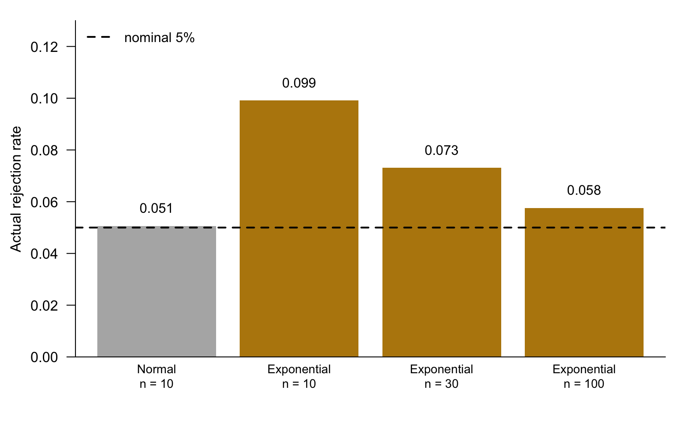{width="80%" fig-align="center"}

-   With normal data the test does what it promises.
-   With exponential data at $n = 10$ it rejects twice as often as it should.
-   The error shrinks as $n$ grows, but it is still there at $n = 100$.
-   These numbers came from a simulation. You will learn how to produce them in this section.

### Components in simulations

Simulations need

-   uniform random numbers;
-   non-uniform random numbers;
-   random vectors, stochastic processes, etc;
-   techniques to design good simulations;
-   methods to analyze simulation results.

## Uniform Random Numbers

### Draw from the uniform distribution

To generate $U \sim \mathrm{Unif}(0, 1)$, we call

```{webr}
(u <- runif(1))
```

-   Note that $U$ is a [**random variable**]{style="color:#b8860b"} which follows a uniform distribution on $(0, 1)$.
-   In the example above, $u$ is a [**realization**]{style="color:#b8860b"} of the random variable $U$.
-   The realized value is obtained after the experiment was conducted.

### Set seed

We need to set the seed to make our number generation [**reproducible**]{style="color:#b8860b"}. This is done with the `set.seed` function.

```{webr}
set.seed(5400)
(u <- runif(1))
```

Run the block twice. The value does not change, because `set.seed` puts the generator back to the same starting state.

::: {.callout-note collapse="true" title="Going further: what a seed actually is"}
R's numbers are not random. They are a long, fixed sequence that looks random, and the seed says where in that sequence to start.

R's default generator is the Mersenne-Twister. Its state is 625 integers, kept in `.Random.seed`. `set.seed(5400)` fills that state from the number 5400, so every later draw is determined. The sequence repeats only after $2^{19937}-1$ numbers, which is why it looks random for any practical purpose.

```r
set.seed(5400)
length(.Random.seed)
head(.Random.seed)
```

This is why a paper that reports a simulation must report its seed. Without the seed, the table cannot be reproduced.
:::

### Generate $U \sim \mathrm{Unif}(1, 5)$

Recall that $U_1 \sim \mathrm{Unif}(0, 1)$ and $U_2 = 1 + 4U_1$ give $U_2 \sim \mathrm{Unif}(1, 5)$.

[ Predict]{.mode} --- two ways to reach the same distribution. Will they give the same number?

```{webr}
set.seed(5400)
(u1 <- runif(1, 1, 5))
```

```{webr}
set.seed(5400)
(u2 <- runif(1) * 4 + 1)
```

```{webr}
help(runif)
```

::: {.callout-note collapse="true" title="Why the two lines agree"}
**They agree exactly.** `runif(1, 1, 5)` draws one number on $(0,1)$ and then applies $1 + 4u$ internally.

This will not always happen. If a function uses a different number of uniform draws, or a different algorithm, the results differ. See `rexp` later on this page.
:::

### A table of random number generators

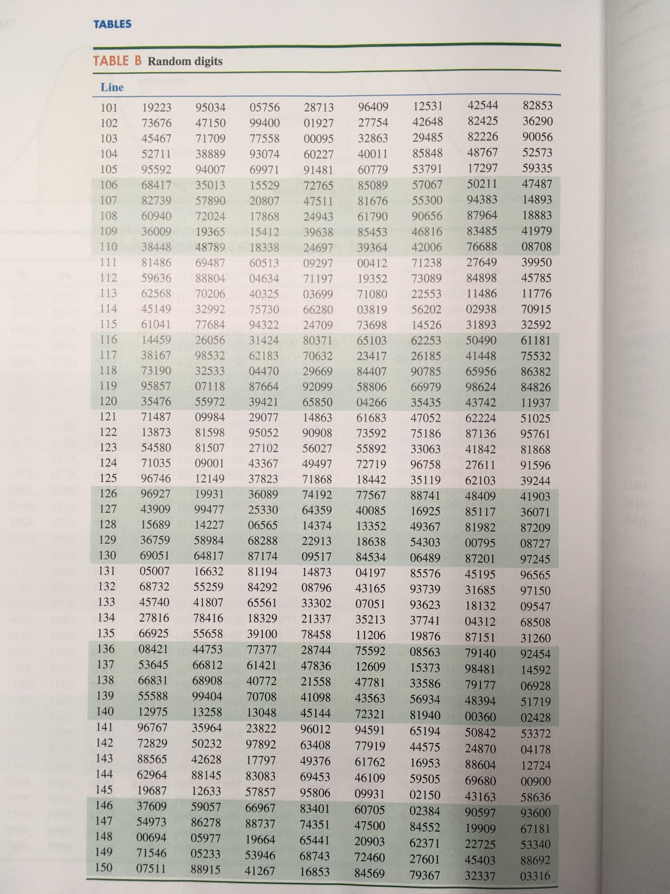{width="60%" fig-align="center"}

[Source: *The Practice of Statistics for Business and Economics*, 3rd ed.]{.source}

Before computers, you looked numbers up in a printed table like this one. Starting at the same row gave the same numbers again, which is what `set.seed` does today.

### Generating many uniforms

How about generating $U_1, \ldots, U_{100} \stackrel{iid}{\sim}\mathrm{Unif}(1, 5)$?

```{webr}
set.seed(5400)
(ulist <- runif(5, 1, 5))
```

The following code yields exactly the same results, but usually much slower.

```{webr}
set.seed(5400)
ulist <- rep(NA, 5)
for (i in seq(5)) {
  ulist[i] <- runif(1, 1, 5)
}
ulist
```

### R and Python do not share a stream

R and Python do not generate the same random numbers even if the same seed is used.

```{pyodide}
import numpy as np

np.random.seed(5400)
print(4 * np.random.uniform(0, 1, 1) + 1)
```

```{pyodide}
np.random.seed(5400)
print(np.random.uniform(1, 5, 5))
```

R and NumPy use different generators, so the same seed gives different numbers.

::: {.callout-note collapse="true" title="Calling R from Python"}
If you need R's exact numbers inside Python, call R.

```python
import rpy2.robjects as robjects
ulist = robjects.r("""
set.seed(5400)
ulist <- runif(5, 1, 5)
""")
print(np.array(ulist))
# [4.86860625 4.40436475 4.62585277 2.63676882 4.37947794]
```

Install the module with `pip install rpy2` (or `conda install rpy2`). It needs a real R on the machine, so it does not run in the browser.
:::

### Mean and variance of uniform distribution

Given $U \sim \mathrm{Unif}(0, a)$, it is known that $\mathrm{E}(U) = a/2$ and $\mathrm{Var}(U) = a^2/12$. What are the [**sample estimates**]{style="color:#b8860b"} of those two [**population parameters**]{style="color:#b8860b"}?

::: {.panel-tabset}

#### R

```{webr}
set.seed(5400)
# generate U1, U2, ..., U100
ulist <- runif(100, 0, 1)
```

```{webr}
# population mean is 1/2
mean(ulist)
```

```{webr}
# population variance is 1/12 = 0.0833
var(ulist)
```

#### Python

```{pyodide}
import numpy as np

np.random.seed(5400)
ulist = np.random.uniform(0, 1, 100)
print(np.mean(ulist))
print(np.var(ulist))
```

```{pyodide}
import scipy.stats

np.random.seed(5400)
ulist = scipy.stats.uniform.rvs(0, 1, 100)
print(ulist.mean())
print(ulist.var())
```

:::

[ Edit]{.mode} --- what happens if the sample size increases? Change 100 to 10000 and run again.

::: {.callout-note collapse="true" title="Going further: two different variances"}
R's `var` divides by $n-1$; NumPy's `np.var` divides by $n$.

R returns the unbiased sample variance $S^2$. NumPy returns the plug-in estimate, which is biased low by a factor $(n-1)/n$. With $n = 100$ the two differ by 1%.

To make NumPy match R, pass `ddof=1`:

```python
np.var(ulist, ddof=1)
```

We meet this same $n$ versus $n-1$ choice again in Section 4.1, where the plug-in estimate is the natural one.
:::

### Estimate the mean and variance

Let $X_1, \ldots, X_n$ be a random sample from a distribution with mean $\mu$ and variance $\sigma^2$. Let

$$
\bar{X} = \frac{1}{n} \sum_{i=1}^n X_i, \qquad
S^2 = \frac{1}{n-1}\sum_{i=1}^n (X_i - \bar{X})^2.
$$

The [**statistics**]{style="color:#b8860b"} $\bar{X}$ and $S^2$ are [**unbiased**]{style="color:#b8860b"} and [**consistent**]{style="color:#b8860b"} estimators of the [**parameters**]{style="color:#b8860b"} $\mu$ and $\sigma^2$, respectively:

$$
\mathrm{E}\bar{X} = \mu, \quad \mathrm{E}S^2 = \sigma^2, \qquad
\bar{X} \stackrel{P}{\rightarrow} \mu, \quad S^2 \stackrel{P}{\rightarrow} \sigma^2.
$$

### Did we really generate from $F_X$?

-   We have generated $U$ from the uniform distribution.
-   Let us think about it broadly: say we claim we have generated $X$ from a distribution with CDF $F_X$.
-   [**Question**]{style="color:#b8860b"}: How can we verify that $X$ is truly from the distribution with CDF $F_X$?

To deal with this question, let us first present an important fact: $Y \sim \mathrm{Unif}(0, 1)$ if $Y = F(X)$.

For simplicity, assume $F$ is continuous and strictly increasing (this can be dropped).

$$
P(Y \le y) = P(F(X) \le y) = P(X \le F^{-1}(y)) = F(F^{-1}(y)) = y.
$$

### The probability integral transform, seen

::: {.panel-tabset}

#### R

```{webr}
par(mfrow = c(1, 2))
X <- runif(1000, 2, 5)
hist(punif(X, 2, 5), main = "Uniform CDF")
X <- rnorm(1000)
hist(pnorm(X), main = "Normal CDF")
```

#### Python

```{pyodide}
import matplotlib.pyplot as plt
import scipy.stats

plt.subplot(1, 2, 1)
X = np.random.uniform(2, 5, 1000)
plt.hist(scipy.stats.uniform.cdf(X, loc=2, scale=3))
plt.title("Uniform CDF")
plt.subplot(1, 2, 2)
X = scipy.stats.norm.rvs(0, 1, 1000)
plt.hist(scipy.stats.norm.cdf(X, loc=0, scale=1))
plt.title("Normal CDF")
plt.show()
```

:::

Both histograms are flat: $F(X)$ is uniform for both distributions.

### Uniform random number generators in Python

Two generators have different arguments: `low`--`high` versus `loc`--`scale`.

```{pyodide}
np.random.seed(5400)
print(np.random.uniform(low=2, high=5, size=3))
```

```{pyodide}
np.random.seed(5400)
print(scipy.stats.uniform.rvs(loc=2, scale=3, size=3))
```

`scale` is the width, not the upper end. To get $\mathrm{Unif}(2, 5)$ you write `scale=3`, because $5 - 2 = 3$. Passing `scale=5` silently gives you $\mathrm{Unif}(2, 7)$.

### Q-Q plot (quantile-quantile plot)

-   Check whether the sample conforms to a specific distribution.
-   CDF: $P(X \le a) = F_X(a)$.
-   A number $a$ is called a [$p$th quantile]{.more note="The value below which a proportion p of the distribution falls. The median is the 0.5 quantile."} of $F_X$ if $F_X(a) = p$.
-   Suppose a sample $X_1, \ldots, X_n$ follows $F_X$ and sort the data into ascending order $X_{(1)}, \ldots, X_{(n)}$.
-   If the sample is large, we would expect

$$
F_X(X_{(i)}) \approx \frac{i-0.5}{n}.
$$

To be consistent with R, we use something equivalent:

$$
X_{(i)} \approx F^{-1}_X \left(\frac{i-0.5}{n} \right).
$$

-   Plot of $X_{(i)}$ against $F^{-1}_X \left(\frac{i-0.5}{n} \right)$ should be an approximately straight line with slope 1 and intercept 0.
-   We make this plot. If it seems linear, that supports the model that the data follow a distribution with CDF $F_X$.

```{webr}
set.seed(5400)
ulist <- runif(1000, 0, 1)
plot(qunif(ppoints(1000)), sort(ulist),
  xlab = "Theoretical Quantiles",
  ylab = "Sample Quantiles", main = "Q-Q plot")
abline(0, 1)
```



## Bernoulli and Binomial Distributions

### Drawing from Bernoulli distribution

-   How to generate $Y \sim \mathrm{Bern}(p)$, whose PMF is $P(Y = 1) = p$ and $P(Y = 0) = 1-p$, with $0 < p < 1$?
-   Generate $U \sim \mathrm{Unif}(0, 1)$. Let $Y = I(U < p)$, thus $Y \sim \mathrm{Bern}(p)$.
-   Algorithm:
    1.  Generate $U \sim \mathrm{Unif}(0, 1)$.
    2.  Compare $U$ and $p$. Let $Y = 1$ if $U < p$ and $Y = 0$ otherwise.

```{webr}
# Generate Bern(0.4)
Y <- as.numeric(runif(1) < 0.4)
Y
```

```{webr}
set.seed(5400)
# Generate Y1, ..., Y100 ~ Bern(0.4)
Ylist <- as.numeric(runif(100) < 0.4)
```

```{webr}
# population mean is 0.4
mean(Ylist)
```

```{webr}
# population variance is 0.4 * 0.6 = 0.24
var(Ylist)
```

### Drawing from Binomial distribution

-   How to generate $X \sim \mathrm{Bin}(n, p)$?
-   Generate $Y_1, \ldots, Y_n \sim \mathrm{Bern}(p)$. Let $X = \sum_{i=1}^n Y_i$.

```{webr}
set.seed(5400)
# Generate X ~ Bin(100, 0.4)
X <- sum(runif(100) < 0.4)
X
```

In R,

```{webr}
rbinom(1, 100, 0.4)
# rbinom(n, size, prob).
# n is the number of observations.
# size is the number of trials.
```

In Python,

```{pyodide}
np.random.seed(5400)
print(np.random.binomial(n=100, p=0.4, size=1))
print(scipy.stats.binom.rvs(n=100, p=0.4, size=1))
```

## Inverse CDF Method

### Inverse CDF method

-   Suppose $F_X$ is a cumulative distribution function. [**Goal: generate $X\sim F_X$.**]{style="color:#b8860b"}
-   Suppose that $F_X$ is continuous and increasing. Let $F^{-1}$ be its inverse function. If $U \sim \mathrm{Unif}(0, 1)$, then $X = F_X^{-1}(U)$ has CDF $F$.
-   Proof:

$$
\begin{aligned}
P(F_X^{-1}(U) \le t) &= P(F_X(F_X^{-1}(U)) \le F_X(t)) \\
&= P(U \le F_X(t)) \\
&= F_X(t),
\end{aligned}
$$

which says the random variable $X = F^{-1}(U)$ has CDF $F$.

-   In fact, **the assumption that $F_X$ is continuous and increasing can be dropped**. The inverse CDF method is always valid based on the fact that $F_X$ is right continuous.

### Drawing from exponential distribution

-   The CDF for the [**unit**]{style="color:#b8860b"} exponential distribution $\exp(1)$ is $F(t) = 1 - \exp(-t)$, $t \ge 0$.
-   The inverse function is $F^{-1}(u) = -\log(1 - u)$.
-   [Given $U \sim \mathrm{Unif}(0, 1)$, $X = -\log(1-U)$ has an exponential distribution.]{style="color:#b8860b"}
-   [Since $1 - U \sim \mathrm{Unif}(0, 1)$, $-\log(U)$ also has a unit exponential distribution.]{style="color:#b8860b"}
-   How to generate $\exp(\lambda)$ where $\lambda$ is the mean?

::: {.panel-tabset}

#### R

```{webr}
set.seed(5400)
# Generate X1, ..., X1000 ~ exp(2)
Ulist <- runif(1000, 0, 1)
Xlist <- -2 * log(Ulist)
Xlist[1:3]
```

```{webr}
mean(Xlist)
var(Xlist)
```

#### Python

```{pyodide}
np.random.seed(5400)
Ulist = np.random.uniform(0, 1, 1000)
Xlist = [-2 * np.log(u) for u in Ulist]
print(Xlist[0:3])
```

```{pyodide}
print(np.mean(Xlist))
print(np.var(Xlist))
```

:::

The mean is near 2 and the variance near 4, which is what $\exp$ with mean 2 should give.

### Histogram against the density

[ By hand]{.mode} --- fill in the density call so the curve matches the histogram. Done when the curve sits on top of the bars. No AI for this block.

```{webr}
par(mfrow = c(1, 2))
hist(Xlist)
xs <- seq(0.001, 12, len = 200)
plot(xs, dexp(xs, rate = 1),        # <- change this line
  type = "l", ylim = c(0, 1),
  xlab = "X", main = "exp(2)", ylab = "f(x)")
```

::: {.callout-note collapse="true" title="Solution"}
**The rate is the reciprocal of the mean.** `Xlist` has mean 2, so the rate is $1/2$:

```r
plot(xs, dexp(xs, rate = 1/2), type = "l", ylim = c(0, 1),
  xlab = "X", main = "exp(2)", ylab = "f(x)")
```

R's `dexp`, `rexp`, `pexp` and `qexp` are all parameterized by **rate**, not mean. Python's `np.random.exponential` is parameterized by **scale**, which is the mean. This is a common mistake when translating between the two languages.
:::

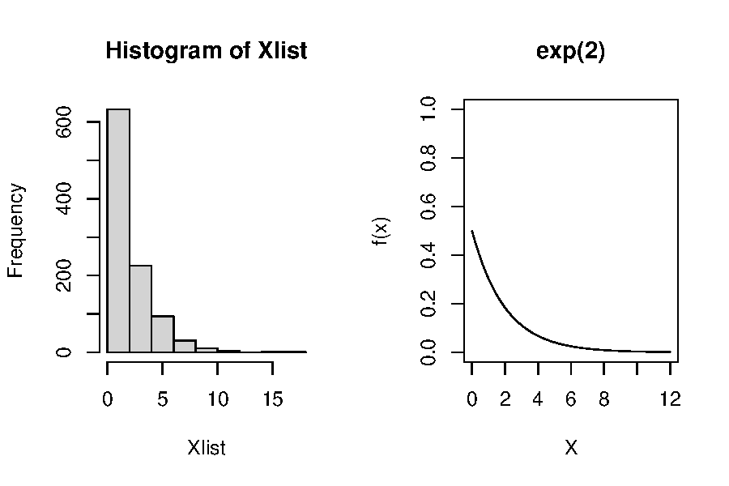{width="70%" fig-align="center"}

### Q-Q plot for the exponential

[ By hand]{.mode} --- fill in the two arguments of `plot` so the points fall on the line. Done when the cloud follows the 45-degree line. No AI for this block.

```{webr}
probs <- ppoints(1000)
plot(probs, probs,                  # <- change this line
  xlab = "Theoretical Quantiles", ylab = "Sample Quantiles",
  main = "Q-Q plot for exponential distribution")
abline(0, 1)
```

::: {.callout-note collapse="true" title="Solution"}
```r
plot(qexp(probs, rate = 0.5), sort(Xlist),
  xlab = "Theoretical Quantiles", ylab = "Sample Quantiles",
  main = "Q-Q plot for exponential distribution")
abline(0, 1)
```

The theoretical quantiles go on the x-axis and the **sorted** sample on the y-axis. Forgetting `sort` is the usual mistake, and it produces a shapeless cloud rather than a line.
:::

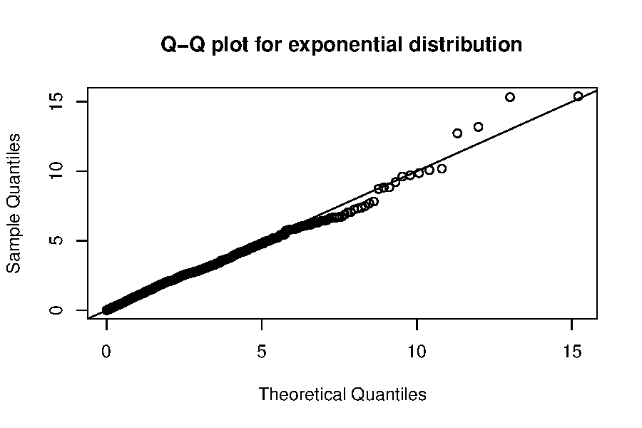{width="70%" fig-align="center"}

### The `rexp` function in R

```{webr}
set.seed(5400)
Xlist <- rexp(1000, rate = 1/2)
Xlist[1:3]
```

```{webr}
mean(Xlist)
var(Xlist)
```

R does not implement `rexp` based on the inverse CDF method. The algorithm was developed in Marsaglia (1961), *Generating exponential random variables*, **Annals of Mathematical Statistics**, 899--902.

Source code: <https://github.com/wch/r-source/blob/trunk/src/nmath/sexp.c>

[ Predict]{.mode} --- the same seed, the same distribution, two algorithms. Do the first three numbers match the inverse-CDF ones above?

```{webr}
set.seed(5400)
head(-2 * log(runif(3)))
set.seed(5400)
head(rexp(3, rate = 1/2))
```

::: {.callout-note collapse="true" title="Why they differ"}
**They do not match.** Both are correct draws from the same distribution, but they consume the uniform stream differently.

The inverse-CDF version uses exactly one uniform per exponential. Marsaglia's algorithm uses a variable number, sometimes one and sometimes several. So after the first value the two streams are at different places in the same sequence.

The seed fixes the sequence of uniforms. It does not fix the result if the algorithm, or the order of the draws, changes.
:::

### Drawing from the standard Cauchy distribution

-   The [**standard Cauchy distribution**]{style="color:#b8860b"} is equivalent to the $t$-distribution with one degree of freedom. Its CDF is

$$
F(x) = \frac{1}{2} + \frac{1}{\pi} \arctan(x).
$$

-   The inverse CDF is $F^{-1}(u) = \tan(\pi(u - 1/2))$. Thus $X = \tan(\pi(U - 0.5))$ has a standard Cauchy distribution.
-   Try the `rcauchy` function in R.

```{webr}
set.seed(5400)
# Generate X1, ..., X1000 ~ Cauchy
Ulist <- runif(1000, 0, 1)
Xlist <- tan(pi * (Ulist - 0.5))
```

```{webr}
par(mfrow = c(1, 2))
hist(Xlist)
xs <- seq(-10, 10, len = 200)
plot(xs, dcauchy(xs), type = "l", ylim = c(0, 1),
  xlab = "X", main = "PDF of Cauchy distribution", ylab = "f(x)")
```

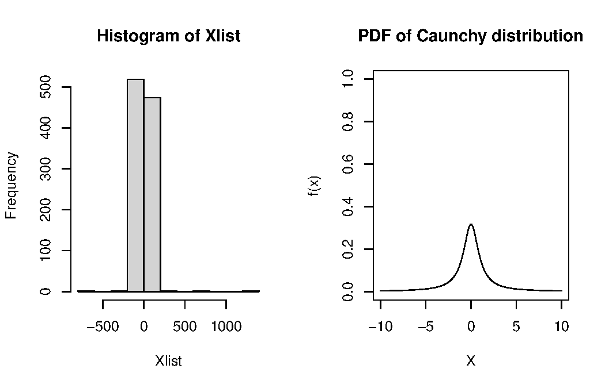{width="70%" fig-align="center"}

[ By hand]{.mode} --- fill in the Q-Q plot for the Cauchy sample. Done when the middle of the cloud is straight. No AI for this block.

```{webr}
probs <- ppoints(1000)
plot(probs, probs,                  # <- change this line
  xlab = "Theoretical Quantiles",
  ylab = "Sample Quantiles",
  main = "Q-Q plot for Cauchy distribution")
abline(0, 1)
```

::: {.callout-note collapse="true" title="Solution"}
```r
plot(tan(pi * (probs - 0.5)), sort(Xlist),
  xlab = "Theoretical Quantiles", ylab = "Sample Quantiles",
  main = "Q-Q plot for Cauchy distribution")
abline(0, 1)
```

You may also write `qcauchy(probs)` in place of `tan(pi * (probs - 0.5))`. They are the same function.

The extreme points are very far from the line. The Cauchy has heavy tails, so a few points are very far out.
:::

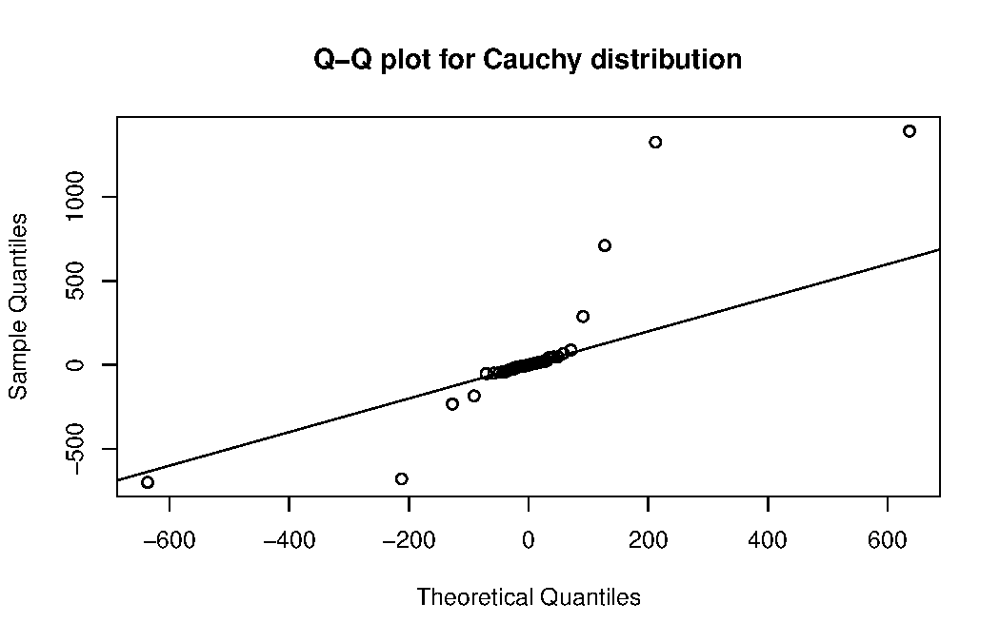{width="70%" fig-align="center"}

### Cauchy and $t$

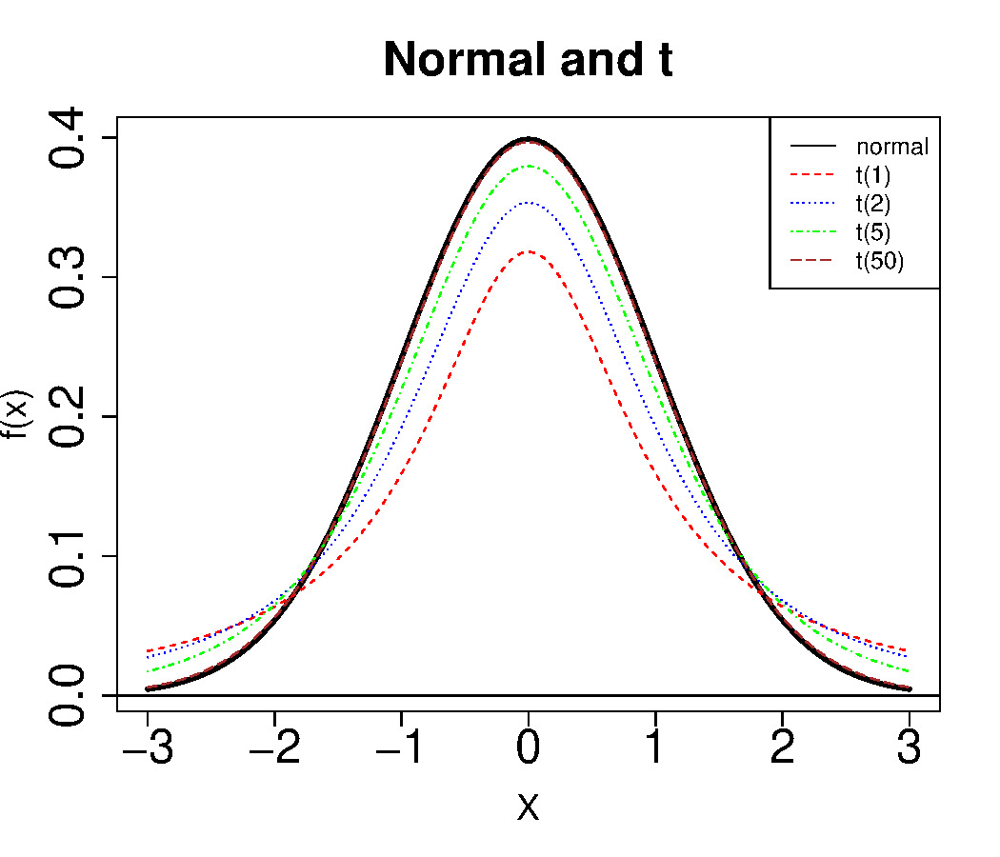{width="60%" fig-align="center"}

-   The Cauchy distribution is a special case of the $t$-distribution with 1 degree of freedom.
-   The Cauchy distribution is widely used to exemplify [**heavy-tailed data**]{style="color:#b8860b"} in simulations.

```{webr}
set.seed(5400)
mean(rcauchy(10000))
mean(rcauchy(10000))
mean(rcauchy(10000))
```

The three means are far apart, although each uses 10,000 draws. The sample mean does not settle down, because the Cauchy has no mean.

### Sampling the next word

A language model draws its next word from a discrete distribution. Take the sentence

> The p-value is 0.03, so at the 5% level we \_\_\_ the null hypothesis.

Suppose the model gives the probabilities below. We draw one word with the inverse CDF method,
now for a discrete distribution: find where one uniform falls in the cumulative sums.

::: {.panel-tabset}

#### R

```{webr}
words <- c("reject", "accept", "retain")
p <- c(0.665, 0.245, 0.090)

set.seed(5400)
u <- runif(1)
words[findInterval(u, cumsum(p)) + 1]   # one uniform, one word
```

```{webr}
# 10,000 draws: the frequencies match p
u <- runif(10000)
table(words[findInterval(u, cumsum(p)) + 1]) / 10000
```

#### Python

```{pyodide}
import numpy as np
words = ["reject", "accept", "retain"]
p = np.array([0.665, 0.245, 0.090])

rng = np.random.default_rng(5400)
u = rng.random()
print(words[np.searchsorted(np.cumsum(p), u, side="right")])   # one uniform, one word
```

```{pyodide}
# 10,000 draws: the frequencies match p
u = rng.random(10000)
idx = np.searchsorted(np.cumsum(p), u, side="right")
print(np.bincount(idx) / 10000)
```

:::

-   The model does not always return the most likely word. This is why the same question asked
    twice can give two different answers.
-   Temperature and top-p change the vector `p` before the draw. See
    [Section 2.4, Sampling controls](../section2/s2p4.qmd#sampling-controls).

## Accept-Reject Sampling

### Accept/reject sampling

-   How to generate $(V_1, V_2)$ that is uniformly distributed in [a unit square]{style="color:#b8860b"}, i.e., $-1 \le V_1, V_2 \le 1$?
-   Independently generate $V_1, V_2 \sim \mathrm{Unif}(-1 ,1)$, with `runif(2, -1, 1)`.
-   How to generate $(V_1, V_2)$ that is uniformly distributed in [a unit disk]{style="color:#b8860b"}, i.e., $V_1^2 + V_2^2 \le 1$?
-   **Algorithm**:
    -   repeat
        -   independently generate $V_1, V_2 \sim \mathrm{Unif}(-1 ,1)$
    -   until $V_1^2 + V_2^2 \le 1$
    -   return $(V_1, V_2)$

### Accept/reject sampling (cont'd)

-   This independently generates pairs $(V_1, V_2)$ uniformly on the square $(-1, 1) \times (-1, 1)$ until the result is inside the unit disk.
-   The resulting pair is uniformly distributed on the unit disk.
-   Probability of acceptance is

$$
\frac{\text{area of disk}}{\text{area of square}} = \frac{\pi}{4}.
$$

-   This approach is the [**accept-reject sampling**]{style="color:#b8860b"} method. More details and applications will be discussed in STAT 7400. <https://homepage.divms.uiowa.edu/~luke/classes/STAT7400/notes.pdf>
-   What is the distribution of $V_1/V_2$?

::: {.panel-tabset}

#### R

```{webr}
set.seed(5400)
n <- 2000    # total samples
# Each row is a pair of V1 and V2. n rows in total.
dat <- matrix(runif(n * 2, -1, 1), n, 2)
# Accept if V_1^2 + V_2^2 <= 1.
accept <- (dat[, 1]^2 + dat[, 2]^2) <= 1
```

```{webr}
mean(accept)   # which is about pi/4
pi / 4
```

```{webr}
# Accepted pairs of V1 and V2
V <- dat[accept, ]
# Rejected pairs of V1 and V2
V_out <- dat[!accept, ]
```

```{webr}
# draw a circle
theta <- seq(0, 2 * pi, len = 1000)
plot(cbind(sin(theta), cos(theta)),
  type = "l", xlab = "x", ylab = "y")
points(V, pch = 2, col = "blue")      # Accepted pairs
points(V_out, pch = 1, col = "red")   # Rejected pairs
```

#### Python

```{pyodide}
np.random.seed(5400)
n = 500  # total samples
# Each row is a pair of V1 and V2. n rows in total.
dat = [np.random.uniform(-1, 1, 2) for i in range(n)]
# Accept if V_1^2 + V_2^2 <= 1.
accept = [(dat[i][0]**2 + dat[i][1]**2) <= 1 for i in range(n)]
print(np.mean([int(x) for x in accept]), np.pi / 4)
```

```{pyodide}
# Accepted pairs of V1 and V2
V = [dat[i] for i in range(n) if accept[i]]
# Rejected pairs of V1 and V2
V_out = [dat[i] for i in range(n) if not accept[i]]
```

```{pyodide}
import matplotlib.pyplot as plt

v = np.arange(-np.pi, np.pi, 0.1)
plt.plot(np.sin(v), np.cos(v), linewidth=0.5)
plt.scatter([row[0] for row in V], [row[1] for row in V],
  color="blue", marker="^", s=8)
plt.scatter([row[0] for row in V_out], [row[1] for row in V_out],
  color="red", marker="o", s=8)
plt.axis('equal')
plt.show()
```

:::

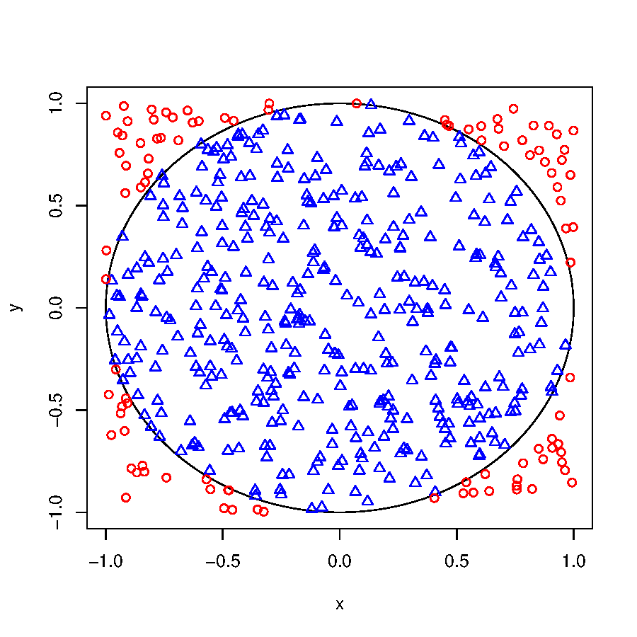{width="55%" fig-align="center"}

Since the acceptance rate estimates $\pi/4$, `4 * mean(accept)` estimates $\pi$. This is Monte Carlo integration. Its error decreases like $1/\sqrt{n}$.

::: {.callout-note collapse="true" title="Going further: the general accept-reject method"}
The disk inside the square is one case of a general recipe. Sample from an easy
density that sits above the hard one, then keep each draw with probability equal to the ratio of
the two.

-   You want to sample from $f$, the [**target**]{style="color:#b8860b"} density. You can already sample from $g$, the [**envelope**]{style="color:#b8860b"} density.
-   Find a constant $c$ with $f(x) \le c\, g(x)$ for every $x$.
-   **Algorithm:**
    -   repeat
        -   draw $Y \sim g$ and $U \sim \mathrm{Unif}(0,1)$
    -   until $U \le f(Y) / (c\, g(Y))$
    -   return $Y$
-   The accepted $Y$ has density $f$ exactly, not approximately.
-   Each trial is accepted with probability $1/c$, so the expected number of trials is $c$. So we want $c$ as small as possible.
-   The disk is this recipe with $f$ uniform on the disk, $g$ uniform on the square, and $c = 4/\pi = 1.27$.

A worked case: draw standard normals using a Cauchy envelope. The Cauchy has heavier tails than
the normal, so a single constant does bound the ratio. Here $c = 1.52$, and about two thirds of
the draws survive. The shaded gap between the two curves in the plot below is the part that
is rejected. A better envelope makes it smaller.

::: {.panel-tabset}

#### R

```{webr}
c_bound <- optimize(function(x) dnorm(x) / dcauchy(x),
                    c(-3, 3), maximum = TRUE)$objective
c_bound
```

```{webr}
xs <- seq(-6, 6, length = 400)
plot(xs, c_bound * dcauchy(xs), type = "n",
  xlab = "x", ylab = "density", ylim = c(0, 0.52))
polygon(c(xs, rev(xs)),
  c(c_bound * dcauchy(xs), rev(dnorm(xs))),
  col = "gray90", border = NA)          # rejected
lines(xs, c_bound * dcauchy(xs), lwd = 2, col = "#b8860b")
lines(xs, dnorm(xs), lwd = 2)
legend("topright", bty = "n", lwd = 2,
  col = c("#b8860b", "black"),
  legend = c("c g(x), Cauchy envelope", "f(x), standard normal"))
```

```{webr}
set.seed(5400)
n <- 1e4
Y <- rcauchy(n)
U <- runif(n)
keep <- U <= dnorm(Y) / (c_bound * dcauchy(Y))

mean(keep)      # close to 1 / c_bound
1 / c_bound
```

```{webr}
X <- Y[keep]
hist(X, breaks = 40, freq = FALSE, main = "", xlab = "x")
curve(dnorm(x), add = TRUE, lwd = 2)
```

#### Python

```{pyodide}
from scipy import stats, optimize
c_bound = -optimize.minimize_scalar(
  lambda x: -stats.norm.pdf(x) / stats.cauchy.pdf(x),
  bounds=(-3, 3), method="bounded").fun
print(c_bound)
```

```{pyodide}
xs = np.linspace(-6, 6, 400)
env = c_bound * stats.cauchy.pdf(xs)
tgt = stats.norm.pdf(xs)
plt.fill_between(xs, tgt, env, color="0.9")      # rejected
plt.plot(xs, env, lw=2, color="#b8860b", label="c g(x), Cauchy envelope")
plt.plot(xs, tgt, lw=2, color="black", label="f(x), standard normal")
plt.xlabel("x"); plt.ylabel("density"); plt.legend()
plt.show()
```

```{pyodide}
rng = np.random.default_rng(5400)
n = 10000
Y = rng.standard_cauchy(n)
U = rng.random(n)
keep = U <= stats.norm.pdf(Y) / (c_bound * stats.cauchy.pdf(Y))
print(keep.mean(), 1 / c_bound)
```

```{pyodide}
X = Y[keep]
plt.hist(X, bins=40, density=True)
xs = np.linspace(-4, 4, 200)
plt.plot(xs, stats.norm.pdf(xs), lw=2)
plt.show()
```

:::

Squeezing, the discrete case, the ratio-of-uniforms method, and adaptive rejection sampling all
build on this same picture. They are covered in STAT 7400.

[Source: the treatment follows Luke Tierney, *Simulation*, STAT:7400 course module, pages 37 to 54. <https://homepage.divms.uiowa.edu/~luke/classes/STAT7400/modules/mod_sim.pdf>]{.source}
:::

## Multivariate Transformations

### Box-Muller method for the standard normal

If $U_1$ and $U_2$ are independent and uniform on $[0, 1]$, then

$$
\begin{aligned}
X_1 &= \sqrt{-2\log U_1}\cos(2\pi U_2),\\
X_2 &= \sqrt{-2\log U_1}\sin(2\pi U_2),
\end{aligned}
$$

then $X_1$ and $X_2$ are independent standard normals.

-   How about the univariate normal distribution $Z \sim \mathrm{N}(0, 1)$?
-   How about $\mathrm{N}(\mu, \sigma^2)$?
-   Try the `rnorm` function in R.

### Polar method for the standard normal

-   The polar method (by Marsaglia and Bray) is an alternative algorithm to generate the standard normal, and it avoids the slow computation caused by the trigonometric functions.
-   Generate $(V_1, V_2)$ which is uniform on the unit disk. Let $R^2 = V_1^2 + V_2^2$. Then

$$
\begin{aligned}
X_1 &= V_1 \sqrt{-(2\log R^2)/R^2},\\
X_2 &= V_2 \sqrt{-(2\log R^2)/R^2},
\end{aligned}
$$

are independent standard normals.

::: {.panel-tabset}

#### R

```{webr}
# an OK code
Rsq <- V[, 1]^2 + V[, 2]^2
m <- sqrt(-(2 * log(Rsq)) / (Rsq))
X <- m * V
```

```{webr}
# a better code
Rsq <- V[, 1]^2 + V[, 2]^2
Rsq <- Rsq + .Machine$double.xmin
m <- sqrt(-(2 * log(Rsq)) / (Rsq))
X <- m * V
```

#### Python

```{pyodide}
import sys

Rsq = [row[0]**2 + row[1]**2 for row in V]
Rsq = np.array(Rsq) + sys.float_info.min
m = [np.sqrt(-(2 * np.log(x)) / x) for x in Rsq]
x = [m[i] * V[i] for i in range(len(V))]
```

:::

[ Predict]{.mode} --- why is the second version better? What does `.Machine$double.xmin` protect against?

::: {.callout-note collapse="true" title="What the tiny number is for"}
**It stops $\log(0)$.** If an accepted pair is exactly $(0, 0)$, `Rsq` is 0, `log(0)` is `-Inf`, and the result is `NaN`.

Adding `.Machine$double.xmin`, the smallest positive double (about `2.2e-308`), moves it off zero by an amount too small to change any other value. In general, check where a formula divides by zero or takes the log of zero, and protect that step.

This almost never happens in one run, so tests rarely catch it. In a long simulation it can happen.
:::

### Checking the normals

```{webr}
par(mfrow = c(2, 2))
# histograms
hist(X[, 1], main = "Histogram of X1")
hist(X[, 2], main = "Histogram of X2")
# Q-Q plots
probs <- ppoints(NROW(X))
plot(qnorm(probs), sort(X[, 1]),
  xlab = "Theoretical Quantiles",
  ylab = "Sample Quantiles", main = "Q-Q plot for X1")
abline(0, 1)
plot(qnorm(probs), sort(X[, 2]),
  xlab = "Theoretical Quantiles",
  ylab = "Sample Quantiles", main = "Q-Q plot for X2")
abline(0, 1)
```

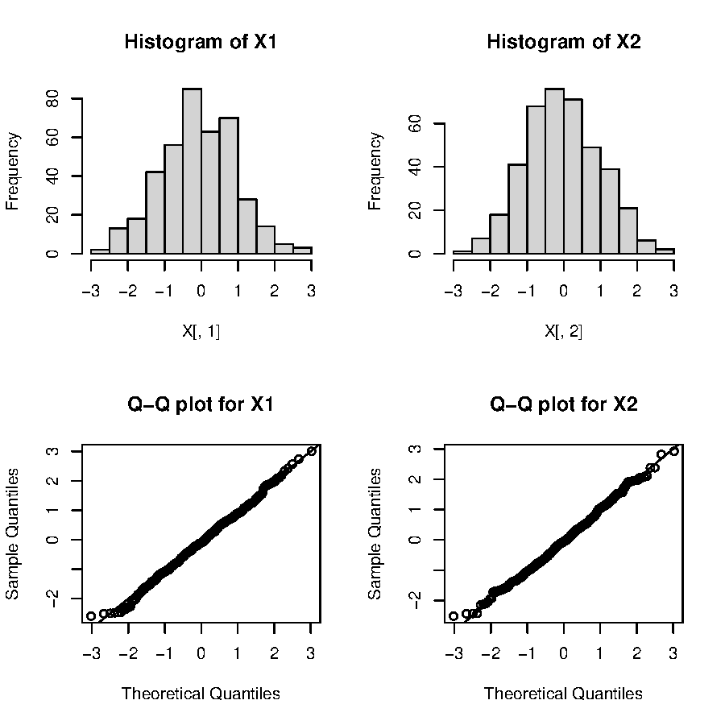{width="60%" fig-align="center"}

### Q-Q plot for $\mathrm{N}(\mu, \sigma^2)$

How to generate $X \sim \mathrm{N}(\mu, \sigma^2)$?

-   Generate $Z \sim \mathrm{N}(0, 1)$.
-   Compute $X = \mu + \sigma Z$.

How about the Q-Q plot?

-   Plot of $X_{(i)}$ against `qnorm`$\left(\frac{i-0.5}{n} \right)$ should be an approximately straight line with slope $\sigma$ and intercept $\mu$.

```{webr}
newX <- X[, 1] * 2 + 4
dat_quant <- sort(newX)
thr_quant <- qnorm(ppoints(length(newX)))
plot(thr_quant, dat_quant,
  xlab = "Theoretical Quantiles",
  ylab = "Sample Quantiles",
  main = "Q-Q plot for X ~ N(4, 2)")
abline(a = 4, b = 2) # a = intercept; b = slope
```

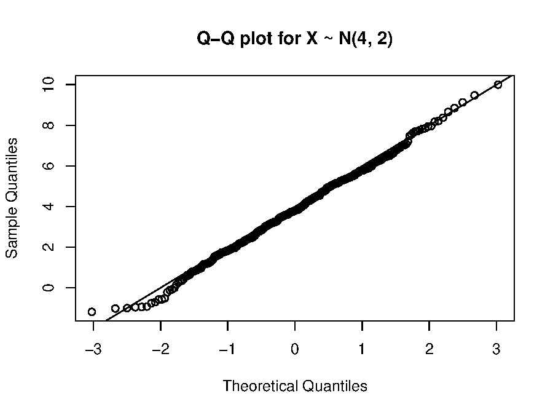{width="60%" fig-align="center"}

### `qqnorm` and `qqline`

-   In practice, we want to check the normality.
-   In such a case, how can we get the slope and intercept?
-   Check out the R functions `qqnorm` and `qqline`.

::: {.panel-tabset}

#### R

```{webr}
qqnorm(newX)
qqline(newX)
```

#### Python

```{pyodide}
import scipy.stats
import matplotlib.pyplot as plt

newx = np.array(x)[:, 1] * 2 + 4
fig, ax = plt.subplots(1, 1)
scipy.stats.probplot(newx, plot=plt)
plt.show()
```

:::

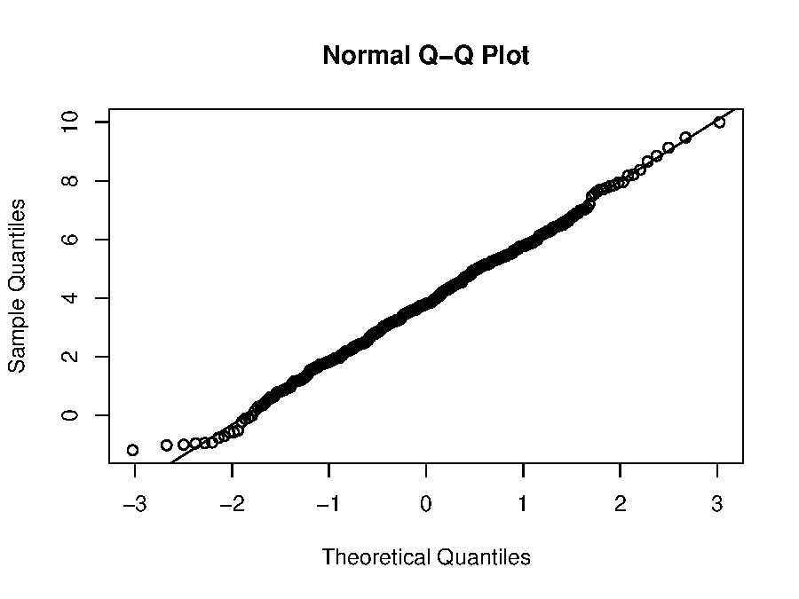{width="60%" fig-align="center"}

`qqline` does not use the mean and standard deviation. It draws the line through the first and third sample quartiles, which is more resistant to a few outliers than a fitted least-squares line would be.

### What R actually uses

-   Neither Box-Muller nor the polar method is the most efficient. They are useful when a pair of normal variables is generated.
-   The default method in R to generate normal distributions is through the inverse CDF method (AS 241 algorithm): Wichura, M. J. (1988) *Algorithm AS 241: The percentage points of the normal distribution*, **Applied Statistics**, 37, 477--484.

```{webr}
set.seed(5400)
qnorm(runif(1))
```

```{webr}
set.seed(5400)
rnorm(1)
```

The two agree to about 7 digits. R uses inversion, but it combines two uniforms for each normal to get more precision, so the numbers are not exactly equal.

### Standard Cauchy, again

-   If $X_1$ and $X_2$ are independent standard normals, then $Y = X_1/X_2$ follows a standard Cauchy distribution.
-   Let us continue the previous example. Since

$$
X_1 = V_1 \sqrt{-(2\log R^2)/R^2}, \qquad
X_2 = V_2 \sqrt{-(2\log R^2)/R^2},
$$

then

$$
Y = \frac{X_1}{X_2} = \frac{V_1}{V_2}
$$

follows the standard Cauchy distribution. The messy square root cancels, so the ratio of the two accepted uniforms is already Cauchy.

```{webr}
Y <- V[, 1] / V[, 2]
summary(Y)
```

### $\chi_v^2$ distribution

Suppose $Z_1, \ldots, Z_v$ are independent standard normals. Then

$$
Y = \sum_{i=1}^v Z_i^2
$$

has a $\chi_v^2$ distribution.

```{webr}
set.seed(5400)
Zlist <- rnorm(10)
Y <- sum(Zlist^2)
Y
```

-   Note this is not an efficient way to generate $\chi^2_v$.
-   A better way is to generate a gamma distribution, since $\chi^2_v$ is a Gamma$(v/2, 2)$ distribution.
-   A gamma distribution can be generated through accept-reject sampling.

### Student's $t$ distribution

Suppose

-   $Z$ has a standard normal distribution,
-   $Y$ has a $\chi_v^2$ distribution,
-   $Z$ and $Y$ are independent.

Then

$$
X = \frac{Z}{\sqrt{Y/v}}
$$

has a $t$ distribution with $v$ degrees of freedom.

```{webr}
curve(dnorm(x, 0, 1), xlim = c(-3, 3),
  main = "Normal and t",
  xlab = "X", ylab = "f(x)", lwd = 3, lty = 1)
curve(dt(x, 1), xlim = c(-3, 3), add = TRUE, lty = 2, col = "red")
curve(dt(x, 2), xlim = c(-3, 3), add = TRUE, lty = 3, col = "blue")
curve(dt(x, 5), xlim = c(-3, 3), add = TRUE, lty = 4, col = "green")
abline(h = 0)
legend("topright",
  c("normal", "t(1)", "t(2)", "t(5)"),
  lty = 1:4,
  col = c("black", "red", "blue", "green"))
```

### $F$ distribution

Suppose $a > 0$, $b > 0$, and

-   $U \sim \chi_a^2$,
-   $V \sim \chi_b^2$,
-   $U$ and $V$ are independent.

Then

$$
X = \frac{U/a}{V/b}
$$

has an $F$ distribution with $a$ and $b$ degrees of freedom.

## Multivariate Normal Distributions

### Goal

Generate $X \sim \mathrm{N}_p(\boldsymbol{\mu}, \boldsymbol{\Sigma})$, where $\mathrm{N}_{p}(\boldsymbol{\mu},\boldsymbol{\Sigma})$ denotes the $p$-dimensional normal distribution with

-   mean vector $\boldsymbol{\mu} = (\mu_1, \ldots, \mu_p)'$,
-   variance-covariance matrix (symmetric and non-negative definite)

$$
\boldsymbol{\Sigma} = \left(\begin{array}{cccc}
\sigma_{1}^2 & \sigma_{12} & \ldots & \sigma_{1p}\\
\sigma_{12} & \sigma_{2}^2 & \ldots & \sigma_{2p}\\
\vdots & \vdots & \vdots & \vdots \\
\sigma_{1p} & \sigma_{2p} & \ldots & \sigma_{p}^2\\
\end{array}
\right).
$$

Here we use $X$, $Y$, $Z$ to denote vectors, and $\mathbf{X}$, $\mathbf{Y}$, $\mathbf{Z}$ to denote matrices.

### Review of random matrices

-   Let $\mathbf{Y}$ denote an $n\times p$ random matrix. Let $\mathbf{B}\in \mathbb{R}^{m\times n}$, $\mathbf{C}\in \mathbb{R}^{p\times q}$, and $\mathbf{D}\in \mathbb{R}^{m\times q}$ be non-random. Then

$$
\mathrm{E}(\mathbf{B}\mathbf{Y}\mathbf{C} + \mathbf{D}) = \mathbf{B}\,\mathrm{E}(\mathbf{Y})\,\mathbf{C} + \mathbf{D}.
$$

-   Let $X$ denote a $p$-dimensional random vector and define $Y = \mathbf{B}X + b$, where $\mathbf{B} \in \mathbb{R}^{q \times p}$ and $b \in \mathbb{R}^q$ are non-random. Then

$$
\mathrm{E}(Y) = \mathbf{B}\,\mathrm{E}(X) + b, \qquad
\mathrm{Var}(Y) = \mathbf{B}\,\mathrm{Var}(X)\,\mathbf{B}'.
$$

-   Suppose that $W\sim \mathrm{N}_{p}(\mu,\boldsymbol{\Sigma})$, $\mathbf{B}\in\mathbb{R}^{k\times p}$ is non-random, and $b\in\mathbb{R}^{k}$ is non-random. Then

$$
Y=\mathbf{B}W+b\sim \mathrm{N}_{k}(\mathbf{B}\mu+b,\ \mathbf{B}\boldsymbol{\Sigma}\mathbf{B}').
$$

### Eigen-decomposition

-   For a $p \times p$ symmetric matrix $\mathbf{A}$ we can write $\mathbf{A}=\mathbf{V}\boldsymbol{\Lambda}\mathbf{V}'$, where $\mathbf{V}\in \mathbb{R}^{p\times p}$ is an orthogonal matrix (hence $\mathbf{V}'\mathbf{V}=\mathbf{I}_{p}$) and $\boldsymbol{\Lambda}\in \mathbb{R}^{p\times p}$ is diagonal.
-   The columns of $\mathbf{V}$ are called the [**eigenvectors**]{style="color:#b8860b"} of $\mathbf{A}$ and the diagonal elements of $\boldsymbol{\Lambda}$ are called the [**eigenvalues**]{style="color:#b8860b"} of $\mathbf{A}$, ordered $\lambda_{1}\geq\lambda_{2}\geq\cdots\geq\lambda_{p}$.
-   The matrix $\mathbf{A}$ is [**positive semi-definite**]{style="color:#b8860b"} if and only if $\lambda_p \ge 0$. It is [**positive definite**]{style="color:#b8860b"} if and only if $\lambda_p > 0$.

The eigen-decomposition allows for much easier computation of power series of matrices. Suppose $\mathbf{A}=\mathbf{V}\boldsymbol{\Lambda}\mathbf{V}'$ with $\lambda_1, \ldots, \lambda_p \geq 0$. We have

$$
\mathbf{A}^{x}=\mathbf{V}\mathrm{diag}(\lambda_1^x, \ldots, \lambda_p^x)\mathbf{V}'=\mathbf{V}\boldsymbol{\Lambda}^{x}\mathbf{V}',
$$

where $x$ is any real number. For example,

$$
\mathbf{A}^{1/2}=\mathbf{V}\mathrm{diag}(\lambda_1^{1/2}, \ldots, \lambda_p^{1/2})\mathbf{V}'=\mathbf{V}\boldsymbol{\Lambda}^{1/2}\mathbf{V}',
$$

because

$$
\begin{aligned}
\mathbf{A}^{1/2}\mathbf{A}^{1/2} & = \mathbf{V}\boldsymbol{\Lambda}^{1/2}\mathbf{V}'\mathbf{V}\boldsymbol{\Lambda}^{1/2}\mathbf{V}'\\
& = \mathbf{V}\boldsymbol{\Lambda}^{1/2}\boldsymbol{\Lambda}^{1/2}\mathbf{V}'\\
& = \mathbf{V}\boldsymbol{\Lambda}\mathbf{V}' = \mathbf{A}.
\end{aligned}
$$

If matrix $\mathbf{A}$ can be eigen-decomposed and none of its eigenvalues are zero, then $\mathbf{A}$ is non-singular and its inverse is $\mathbf{A}^{-1}=\mathbf{V}\boldsymbol{\Lambda}^{-1}\mathbf{V}'$.

### Generate one copy from $\mathrm{N}_p(\boldsymbol{\mu}, \boldsymbol{\Sigma})$

[**Goal**]{style="color:#b8860b"}: generate $X \sim \mathrm{N}_p(\boldsymbol{\mu}, \boldsymbol{\Sigma})$.

-   **Algorithm**:
    1.  Generate a $p$-dimensional vector $Z = (z_1, \ldots, z_p)$ where each $z_j \sim \mathrm{N}(0, 1)$ independently (say, using the polar method).
    2.  Let [$X = \mu + \boldsymbol{\Sigma}^{1/2}Z$]{style="color:#b8860b"}.
-   This is because $\mathrm{E}(X)=\mu+\boldsymbol{\Sigma}^{1/2}\mathrm{E}(Z)=\mu$ and $\mathrm{Var}(X)=\boldsymbol{\Sigma}^{1/2}\mathrm{Var}(Z)\boldsymbol{\Sigma}^{1/2}=\boldsymbol{\Sigma}^{1/2}\mathbf{I}_{p}\boldsymbol{\Sigma}^{1/2}=\boldsymbol{\Sigma}$.

```{webr}
set.seed(5400)
# sample size and dimension
n <- 1000
p <- 5
# var-covariance matrix
Sigma <- matrix(0.5, p, p)
diag(Sigma) <- 1
mu <- seq(p)   # mean vector
```

```{webr}
# eigen-decomposition
eig <- eigen(Sigma)
Sigma.sqrt <- eig$vectors %*%
  tcrossprod(diag(sqrt(eig$values)), eig$vectors)
```

```{webr}
Z <- rnorm(p)
X <- mu + Sigma.sqrt %*% Z
X
```

### Generate multiple copies from $\mathrm{N}_p(\boldsymbol{\mu}, \boldsymbol{\Sigma})$

[**Goal**]{style="color:#b8860b"}: generate $X_1, \ldots, X_n \stackrel{\text{i.i.d.}}{\sim} \mathrm{N}_p(\boldsymbol{\mu}, \boldsymbol{\Sigma})$.

-   **Algorithm**:
    1.  Generate an $n\times p$ random matrix $\mathbf{Z}$ whose entries are i.i.d. $\mathrm{N}(0,1)$.
    2.  Let $\mathbf{X}=1_{n}\boldsymbol{\mu}'+\mathbf{Z}\boldsymbol{\Sigma}^{1/2}$. Then $\mathbf{X}$ is an $n \times p$ matrix whose rows are i.i.d. $\mathrm{N}_{p}(\boldsymbol{\mu},\boldsymbol{\Sigma})$.
-   You may either generate those random variables one by one, or use a more efficient "vectorized" way. Think about how $\mathbf{Z}\boldsymbol{\Sigma}^{1/2}$ works.

::: {.panel-tabset}

#### R

```{webr}
set.seed(5400)
# each row of Z is from N(0, 1)
Z <- matrix(rnorm(n * p), n, p)
# each row of X is from N(mu, Sigma)
X <- tcrossprod(rep(1, n), mu) + Z %*% Sigma.sqrt
```

```{webr}
(Xbar <- colMeans(X))
```

```{webr}
(S <- cov(X))
```

#### Python

```{pyodide}
import numpy as np

np.random.seed(5400)
n = 1000
p = 5
mean = [x + 1 for x in range(p)]
sigma = [[0.5 for i in range(p)] for j in range(p)]
for i in range(p):
    sigma[i][i] = 1
```

```{pyodide}
v, w = np.linalg.eigh(sigma)
sigma_sqrt = w @ np.diag([v[i]**0.5 for i in range(p)]) @ w.T
Z = np.random.normal(0, 1, n * p).reshape(n, p)
mean_v = np.tile(mean, (n, 1))
X = mean_v + Z @ sigma_sqrt
```

```{pyodide}
print(np.mean(X, 0))
print(np.cov(X.T))
```

:::

Note the order: $\mathbf{Z}\boldsymbol{\Sigma}^{1/2}$ with the matrix on the *right*, because each row of $\mathbf{Z}$ is one observation. Writing $\boldsymbol{\Sigma}^{1/2}\mathbf{Z}$ gives a dimension error, because $\mathbf{Z}$ is $n \times p$.

### R library `mvtnorm`

```{webr}
set.seed(5400)
Z <- rnorm(p)
X <- mu + Sigma.sqrt %*% Z
X[1:2]
```

```{webr}
set.seed(5400)
library(mvtnorm)
X <- rmvnorm(n = 1, mean = mu, sigma = Sigma)
X[1:2]
```

### Python function `multivariate_normal`

```{pyodide}
np.random.seed(5400)
Z = np.random.normal(0, 1, p)
X = mean + Z @ sigma_sqrt
print(X[0:2])
```

```{pyodide}
from scipy.stats import multivariate_normal

np.random.seed(5400)
d = multivariate_normal(mean=mean, cov=sigma)
X = d.rvs(1)
print(X[0:2])
```

The two Python results disagree, because $\boldsymbol{\Sigma}^{1/2}$ is not unique. The symmetric root and the Cholesky factor both give the right distribution, but different numbers.
