

::: {.content-visible when-format="html"}
::: {.page-buttons}
[ PDF](s3p2.pdf){.btn .btn-sm .btn-outline-dark}


<div class="page-codefiles">All code on this page, in one file: </div>
:::

Most code blocks on this page run in your browser. Click *Run Code*, change the code,
and run it again. The few blocks that need a Codespace have a Codespace button. The R
session loads `binom` for the last section, so the first block you run takes a few extra
seconds.
:::

## Sampling distribution

### Framework of statistical inference

-   Data: random **sample** $X_1, \ldots, X_n$.
-   Model: underlying distribution $\mathrm{N}(\mu, \sigma^2)$.
-   Assumption: parametric models with unknown [**parameters**]{.term}.
-   Goal: estimate **population** parameters $\mu$, $\sigma^2$.
-   [**Statistic**]{.term}: $\hat{\mu}$, e.g. the sample mean $\bar{X} = (X_1 + \ldots + X_n)/n$, which is a function of the data.

### A random sample of 10 observations from a population

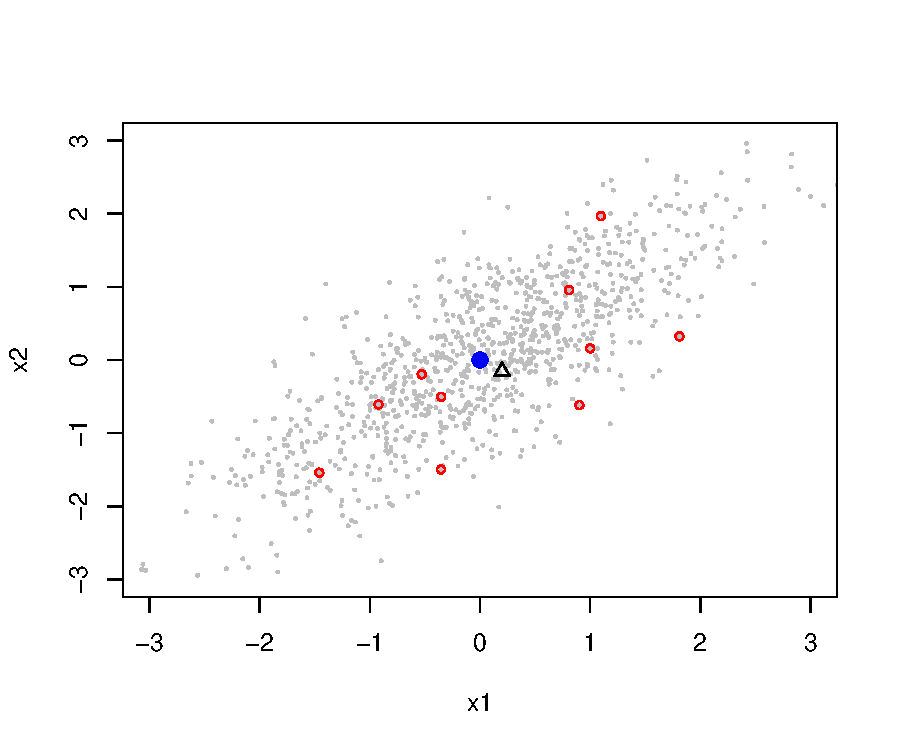{width="62%" fig-align="center"}

Population: $\mathbf{x} \sim \mathrm{N}_2(\mathbf{0}, \boldsymbol{\Sigma})$, where

$$
\boldsymbol{\Sigma} = \left[\begin{array}{cc}
1 & 0.25 \\
0.25 & 1 \\
\end{array}\right].
$$

The grey points are the population, and the red points are one sample of 10. The black triangle is the mean of this sample, and the blue dot is the true mean.

### Twenty samples, and the cloud of their means

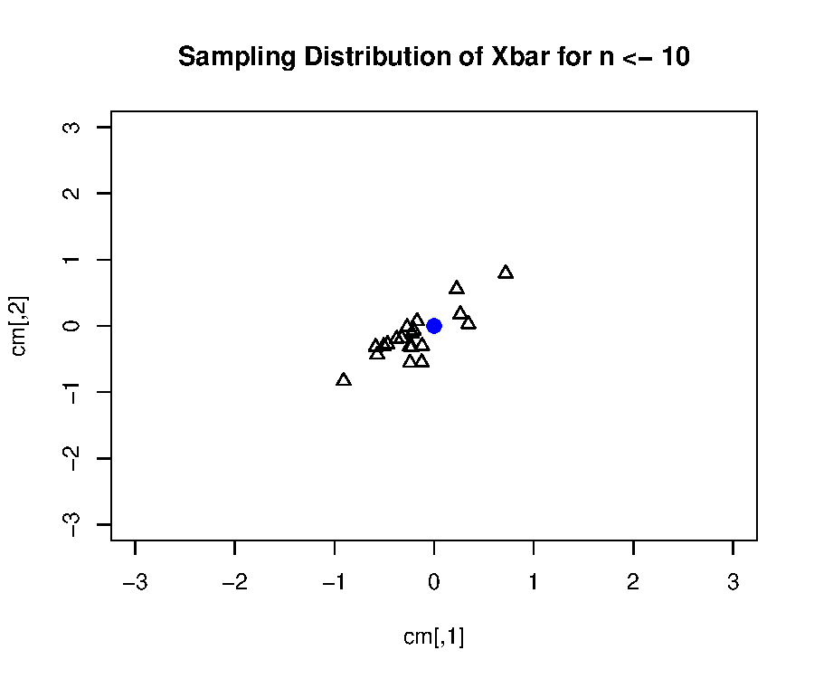{width="55%" fig-align="center"}

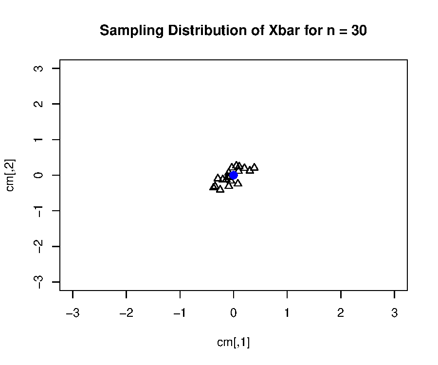{width="55%" fig-align="center"}

Each triangle is one sample mean. With $n = 30$, the sample means are less spread out around the population mean than with $n = 10$. The spread of these triangles shows the sampling distribution of the mean.

### One dimension, four sample sizes

::: {.panel-tabset}

#### R

: `ggplot2` is not installed in the browser session.

```{r}
#| eval: false
library(ggplot2)

set.seed(5400)
n <- rep(c(10, 25, 40, 100), each = 100)
y <- sapply(n, function(n) mean(rnorm(n)))

ggplot() + geom_point(aes(y, factor(n)),
  position = position_jitter(height = 0.15)) +
  labs(x = "sample mean", y = "sample size")
```



#### Python

```{pyodide}
import numpy as np
import matplotlib.pyplot as plt

np.random.seed(5400)
n = np.repeat([10, 25, 40, 100], 100)
y = np.array([np.mean(np.random.normal(size=k)) for k in n])

# same picture with matplotlib: jitter the rows by hand
jitter = np.random.uniform(-0.15, 0.15, len(n))
level = np.searchsorted([10, 25, 40, 100], n)    # 0, 1, 2, 3
plt.scatter(y, level + jitter, s=8, color="black")
plt.yticks(range(4), ["10", "25", "40", "100"])
plt.xlabel("sample mean"); plt.ylabel("sample size")
plt.show()
```

:::

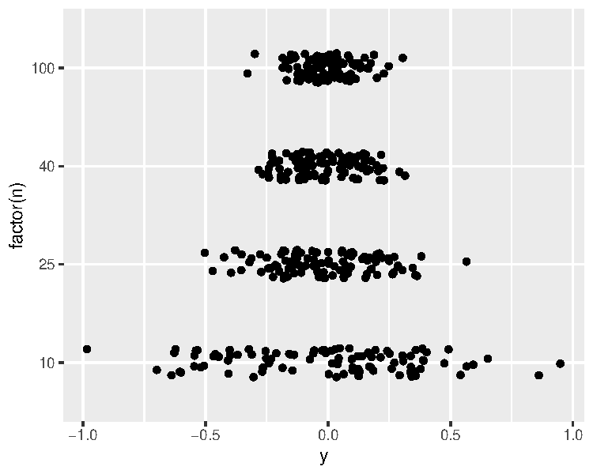{width="55%" fig-align="center"}

### Distribution of the sample mean for normal populations

Let $X_1, \ldots, X_n$ be a random sample from $\mathrm{N}(\mu, \sigma^2)$. Let $\bar{X} = n^{-1} \sum_{i=1}^n X_i$. Then

$$
\begin{aligned}
\mathrm{E}(\bar{X}) &= \mathrm{E}\left(\frac{X_1 + \ldots + X_n}{n}\right) = \frac{1}{n}\left(\mathrm{E}X_1 + \ldots + \mathrm{E}X_n\right) = \mu,\\
\mathrm{Var}(\bar{X}) &= \frac{1}{n^2}\mathrm{Var}\left(X_1 + \ldots + X_n\right) \\
&= \frac{1}{n^2}\left(\mathrm{Var}(X_1) + \ldots + \mathrm{Var}(X_n)\right) \qquad \text{due to independence}\\
&= \sigma^2/n.
\end{aligned}
$$

Since a linear combination of normal random variables is also normally distributed,

$$
\bar{X} \sim \mathrm{N}(\mu, \sigma^2/n).
$$

### Simulating the sampling distribution

::: {.panel-tabset}

#### R

```{webr}
set.seed(5400)
n <- 30          # sample size
mu <- 1          # population mean
sig.sq <- 4      # population variance

# generating 1000 random samples,
#   each of which is of size 30.
# record the 1000 sample means.
Xbarlist <- rep(NA, 1000)
for (i in seq(1000)) {
  Xlist <- rnorm(n, mu, sqrt(sig.sq))
  Xbarlist[i] <- mean(Xlist)
}
```

#### Python

```{pyodide}
import numpy as np
import matplotlib.pyplot as plt

np.random.seed(5400)
n = 30           # sample size
mu = 1           # population mean
sig_sq = 4       # population variance

# generating 1000 random samples,
#   each of which is of size 30.
# record the 1000 sample means.
Xbarlist = np.full(1000, np.nan)
for i in range(1000):
    Xlist = np.random.normal(mu, np.sqrt(sig_sq), n)
    Xbarlist[i] = np.mean(Xlist)
```

:::

We used a `for` loop to generate the samples. A faster way is to create a matrix and then compute the row means:

::: {.panel-tabset}

#### R

```{webr}
# a faster way
set.seed(5400)
n <- 30          # sample size
mu <- 1          # population mean
sig.sq <- 4      # population variance

Xlist <- matrix(rnorm(1000 * n, mu, sqrt(sig.sq)), 1000, n)
Xbarlist <- rowMeans(Xlist)
# may also use apply(Xlist, 1, mean), but slower.
```

#### Python

```{pyodide}
# a faster way
np.random.seed(5400)
n = 30           # sample size
mu = 1           # population mean
sig_sq = 4       # population variance

Xlist = np.random.normal(mu, np.sqrt(sig_sq), (1000, n))
Xbarlist = Xlist.mean(axis=1)     # row means
```

:::

::: {.panel-tabset}

#### R

```{webr}
hist(Xbarlist)
```

#### Python

```{pyodide}
plt.hist(Xbarlist)
plt.show()
```

:::

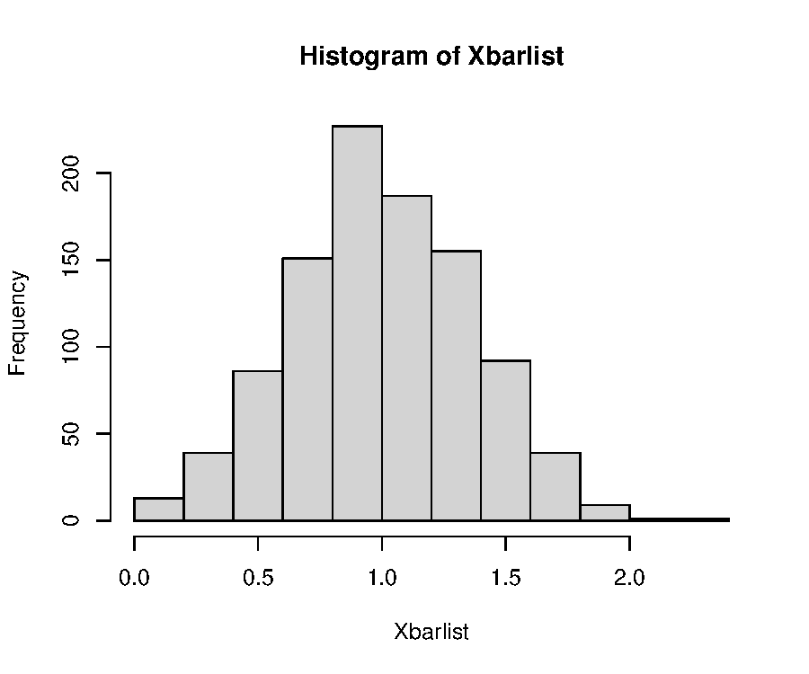{width="52%" fig-align="center"}

### Functions `qqnorm` and `qqline` in R

::: {.panel-tabset}

#### R

```{webr}
par(mfrow = c(1, 2))
# Q-Q plot by R
qqnorm(Xbarlist, main = "Q-Q plot by R")
qqline(Xbarlist)
# Q-Q plot by hand
probs <- ppoints(1000)
dat_quant <- sort(Xbarlist)
thr_quant <- qnorm(probs)
plot(thr_quant, dat_quant,
  xlab = "Theoretical Quantiles",
  ylab = "Sample Quantiles",
  main = "Q-Q plot by hand")
abline(mean(Xbarlist), sd(Xbarlist))
```

#### Python

```{pyodide}
import scipy.stats

scipy.stats.probplot(Xbarlist, plot=plt)
plt.show()
```

:::

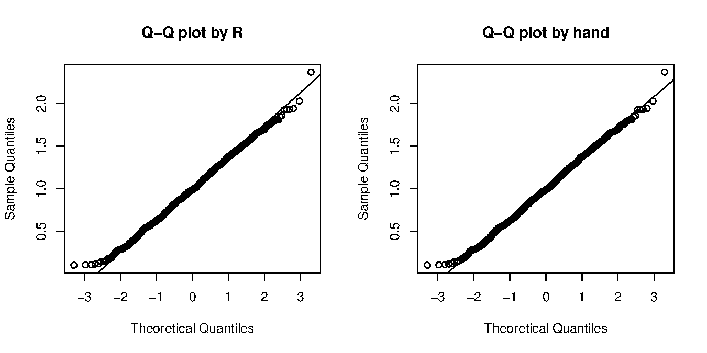{width="80%" fig-align="center"}

In Python, the function `statsmodels.api.qqplot` also makes this plot.

### Sampling distribution

-   [**Sampling distribution**]{.term} is the probability distribution of a statistic (a random variable).
-   In practice, only one sample is observed. We can investigate the sampling distribution from the theory.

For the sample mean of a random sample of size $n$ from $\mathrm{N}(\mu, \sigma^2)$,

$$
\bar{X} \sim \mathrm{N}(\mu, \sigma^2/n).
$$

The variance of $\bar{X}$ decreases as the sample size $n$ increases.

### Four sample sizes

::: {.panel-tabset}

#### R

```{webr}
set.seed(5400)
mu <- 1          # population mean
sig.sq <- 4      # population variance

par(mfrow = c(2, 2))
for (nlist in c(10, 25, 50, 100)) {
  Xlist <- matrix(rnorm(1000 * nlist,
    mu, sqrt(sig.sq)), 1000, nlist)
  Xbarlist <- rowMeans(Xlist)
  hist(Xbarlist, xlim = c(-1, 3),
    main = paste("Histogram of sample mean: n =", nlist))
}
```

#### Python

```{pyodide}
np.random.seed(5400)
Xbar1 = [np.mean(np.random.normal(mu, sig_sq**0.5, 10)) for i in range(1000)]
Xbar2 = [np.mean(np.random.normal(mu, sig_sq**0.5, 25)) for i in range(1000)]
Xbar3 = [np.mean(np.random.normal(mu, sig_sq**0.5, 50)) for i in range(1000)]
Xbar4 = [np.mean(np.random.normal(mu, sig_sq**0.5, 100)) for i in range(1000)]
```

```{pyodide}
fig, axs = plt.subplots(2, 2)
fig.suptitle('Histogram of sample mean of normal dist')
axs[0, 0].hist(Xbar1); axs[0, 0].set_title('n = 10')
axs[0, 1].hist(Xbar2); axs[0, 1].set_title('n = 25')
axs[1, 0].hist(Xbar3); axs[1, 0].set_title('n = 50')
axs[1, 1].hist(Xbar4); axs[1, 1].set_title('n = 100')
for ax in axs.flat:
    ax.set(xlabel='Xbarlist', ylabel='Frequency')
for ax in axs.flat:
    ax.label_outer()
plt.show()
```

:::

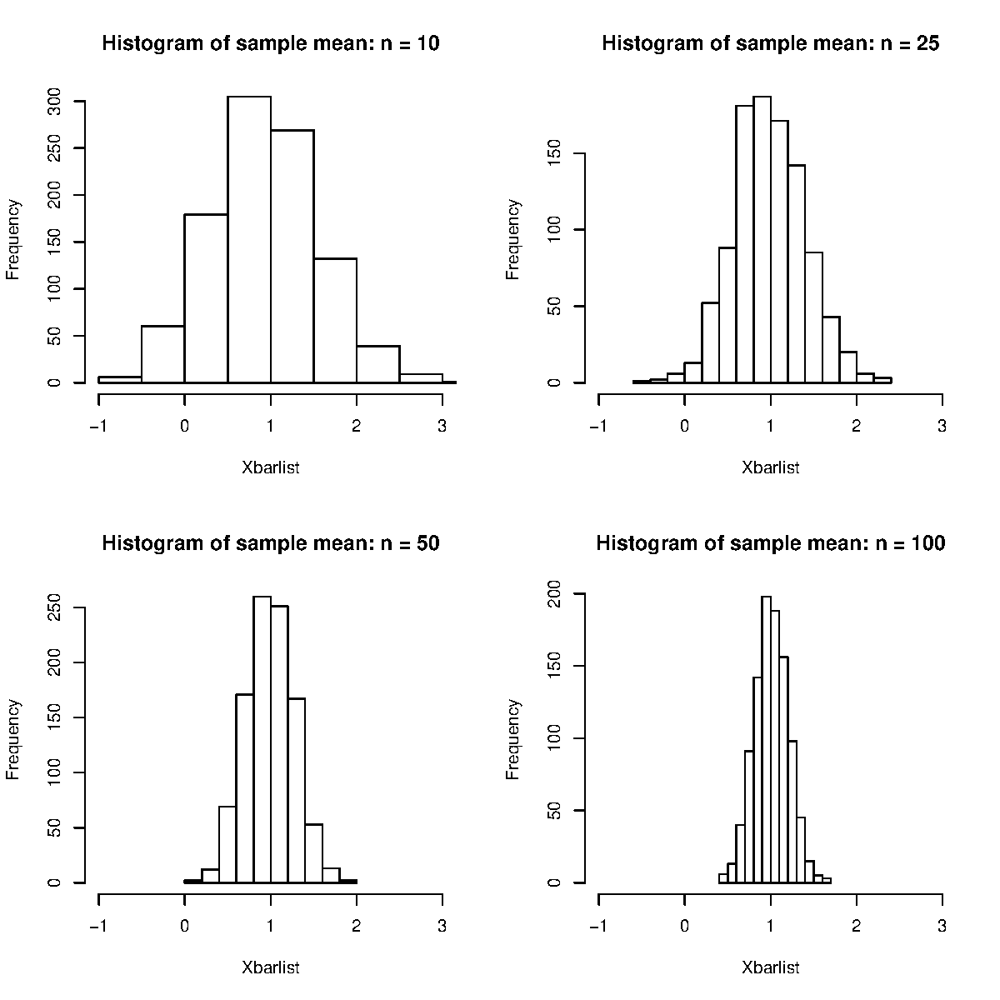{width="60%" fig-align="center"}

## Central limit theorem

### Classical review of the central limit theorem

Let $X_1, \ldots, X_n$ be a random sample drawn from [a distribution]{.term} with mean $\mathrm{E}X = \mu$ and variance $\mathrm{Var}(X) = \sigma^2 < \infty$. Let $\bar{X} = n^{-1} \sum_{i=1}^n X_i$.

The classical [**central limit theorem**]{.term} states that

$$
\frac{\sqrt{n}(\bar{X} - \mu)}{\sigma} \stackrel{\mathcal{D}}{\rightarrow} \mathrm{N}(0, 1),
$$

which is equivalent to saying

$$
\bar{X} \text{ approximately follows } \mathrm{N}(\mu, \sigma^2/n),
$$

if the sample size $n$ is sufficiently large.

The population no longer has to be normal. The next two examples use a uniform and an exponential population.

### CLT for random samples drawn from the uniform

::: {.panel-tabset}

#### R

```{webr}
set.seed(5400)
par(mfrow = c(2, 2))
for (nlist in c(5, 10, 20, 30)) {
  Xlist <- matrix(runif(1000 * nlist), 1000, nlist)
  Xbarlist <- rowMeans(Xlist)
  hist(Xbarlist, xlim = c(0, 1),
    main = paste("Histogram of sample mean: n =", nlist))
}
```

#### Python

```{pyodide}
np.random.seed(5400)
fig, axs = plt.subplots(2, 2)
for ax, nlist in zip(axs.flat, [5, 10, 20, 30]):
    Xlist = np.random.uniform(size=(1000, nlist))
    Xbarlist = Xlist.mean(axis=1)
    ax.hist(Xbarlist)
    ax.set_xlim(0, 1)
    ax.set_title(f"Histogram of sample mean: n = {nlist}", fontsize=8)
fig.tight_layout()
plt.show()
```

:::

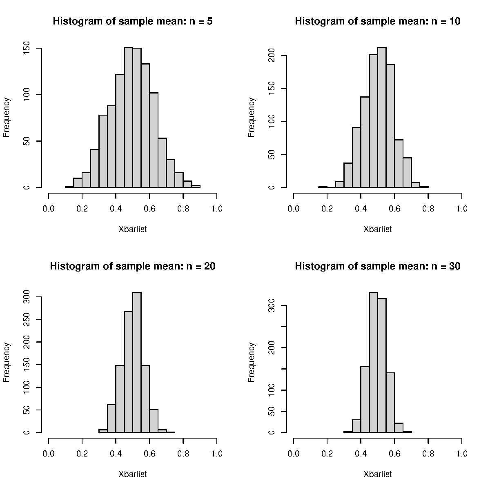{width="58%" fig-align="center"}

::: {.panel-tabset}

#### R

```{webr}
set.seed(5400)
par(mfrow = c(2, 2))
for (nlist in c(5, 10, 20, 30)) {
  Xlist <- matrix(runif(1000 * nlist), 1000, nlist)
  Xbarlist <- rowMeans(Xlist)
  qqnorm(Xbarlist,
    main = paste("Q-Q plot of sample mean: n =", nlist))
  qqline(Xbarlist)
}
```

#### Python

```{pyodide}
np.random.seed(5400)
fig, axs = plt.subplots(2, 2)
for ax, nlist in zip(axs.flat, [5, 10, 20, 30]):
    Xlist = np.random.uniform(size=(1000, nlist))
    Xbarlist = Xlist.mean(axis=1)
    scipy.stats.probplot(Xbarlist, plot=ax)
    ax.set_title(f"Q-Q plot of sample mean: n = {nlist}", fontsize=8)
fig.tight_layout()
plt.show()
```

:::

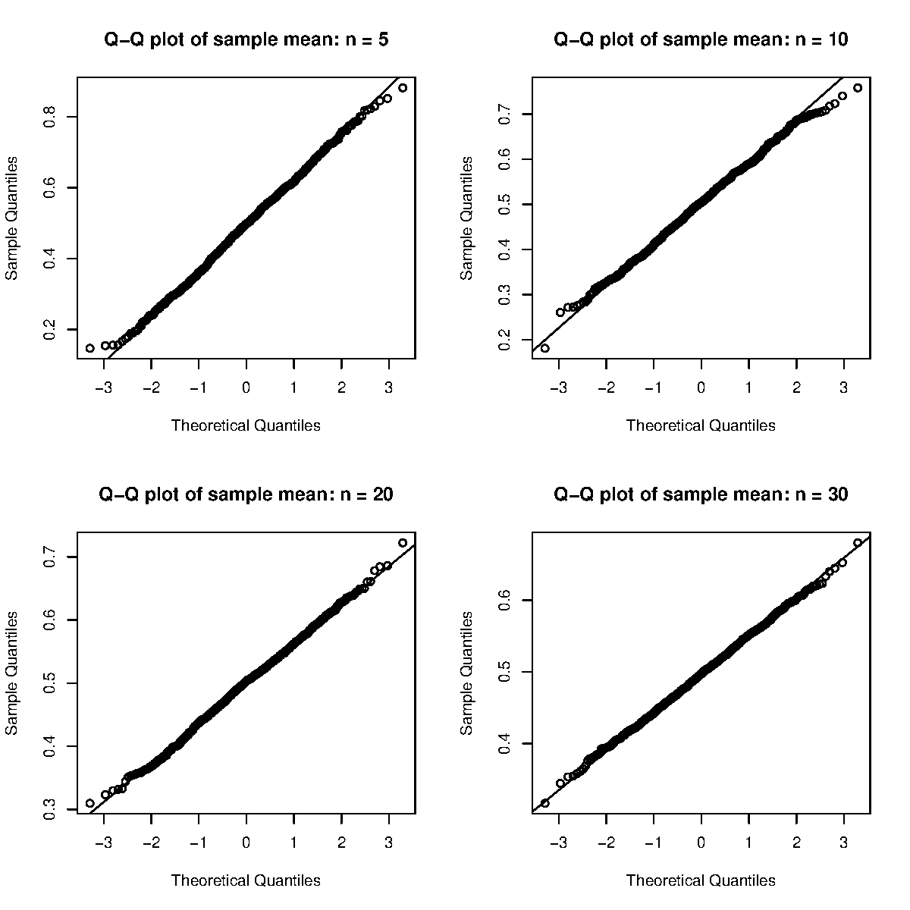{width="58%" fig-align="center"}

### CLT for random samples drawn from the exponential

::: {.panel-tabset}

#### R

```{webr}
set.seed(5400)
par(mfrow = c(2, 2))
for (nlist in c(5, 10, 20, 50)) {
  Xlist <- matrix(rexp(1000 * nlist), 1000, nlist)
  Xbarlist <- rowMeans(Xlist)
  hist(Xbarlist, xlim = c(0, 3),
    main = paste("Histogram of sample mean: n =", nlist))
}
```

#### Python

```{pyodide}
np.random.seed(5400)
fig, axs = plt.subplots(2, 2)
for ax, nlist in zip(axs.flat, [5, 10, 20, 50]):
    Xlist = np.random.exponential(1, (1000, nlist))
    Xbarlist = Xlist.mean(axis=1)
    ax.hist(Xbarlist)
    ax.set_xlim(0, 3)
    ax.set_title(f"Histogram of sample mean: n = {nlist}", fontsize=8)
fig.tight_layout()
plt.show()
```

:::

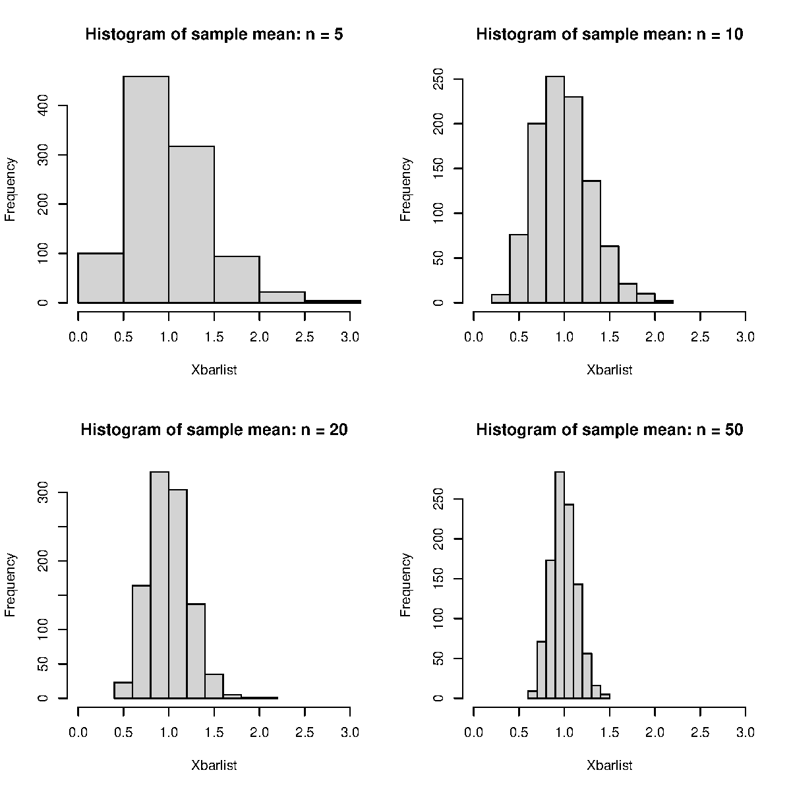{width="58%" fig-align="center"}

::: {.panel-tabset}

#### R

```{webr}
set.seed(5400)
par(mfrow = c(2, 2))
for (nlist in c(5, 10, 20, 50)) {
  Xlist <- matrix(rexp(1000 * nlist), 1000, nlist)
  Xbarlist <- rowMeans(Xlist)
  qqnorm(Xbarlist,
    main = paste("Q-Q plot of sample mean: n =", nlist))
  qqline(Xbarlist)
}
```

#### Python

```{pyodide}
np.random.seed(5400)
fig, axs = plt.subplots(2, 2)
for ax, nlist in zip(axs.flat, [5, 10, 20, 50]):
    Xlist = np.random.exponential(1, (1000, nlist))
    Xbarlist = Xlist.mean(axis=1)
    scipy.stats.probplot(Xbarlist, plot=ax)
    ax.set_title(f"Q-Q plot of sample mean: n = {nlist}", fontsize=8)
fig.tight_layout()
plt.show()
```

:::

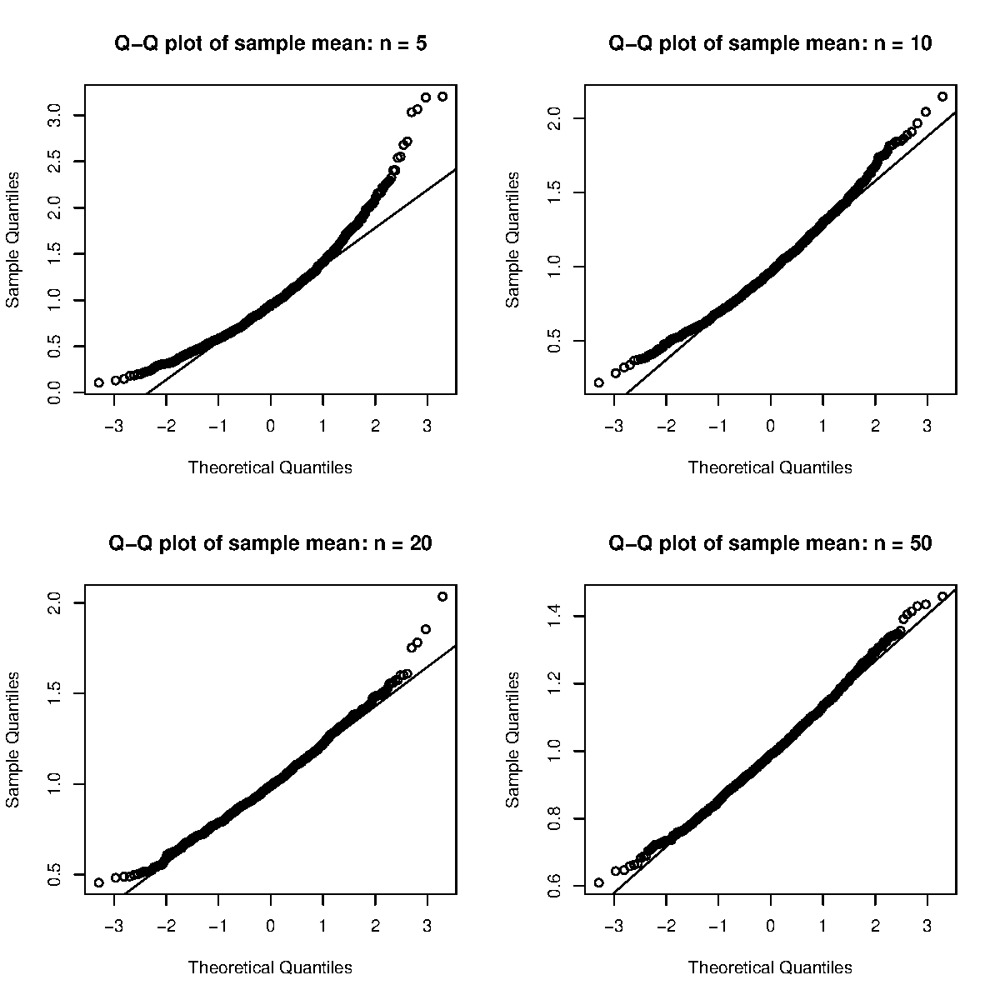{width="58%" fig-align="center"}

[ Predict]{.mode}: the uniform is symmetric and the exponential is not. Which one needs a bigger $n$ before its Q-Q plot looks like a straight line?

::: {.callout-note collapse="true" title="Answer"}
**The exponential needs a much bigger $n$.** The uniform sample mean already looks close to normal at $n = 5$. For the exponential, the Q-Q plot still bends at $n = 20$, because of the right skew.

The main reason is skewness. By the Edgeworth expansion, the leading error term of the normal approximation is proportional to $\gamma / \sqrt{n}$, where $\gamma$ is the population skewness. The uniform has $\gamma = 0$, so this term vanishes and the error is of order $1/n$. The exponential has $\gamma = 2$.

So "$n > 30$ is enough" is a rule of thumb, not a theorem. How large $n$ must be depends on the population.
:::



### Application: a model's accuracy is a sample mean

-   A [**benchmark**]{.term} is a fixed set of test questions with known answers. A model's [**accuracy**]{.term} on it is the fraction of questions it answers correctly.
-   Score question $i$ as $X_i = 1$ if the answer is right and $X_i = 0$ if not. The accuracy on $n$ questions is then $\bar{X}$.
-   We treat the questions as independent draws from a large population of similar questions, with the model and its settings fixed. Let $\theta$ be the probability that the model answers a randomly drawn question correctly. Then $X_1, \ldots, X_n$ are i.i.d. $\mathrm{Bern}(\theta)$, and by the CLT, $\bar{X}$ approximately follows $\mathrm{N}(\theta, \theta(1-\theta)/n)$.
-   Below, a model with $\theta = 0.88$ answers 10,000 test sets of $n$ questions, for $n$ = 25, 100, and 1000.

::: {.panel-tabset}

#### R

```{webr}
set.seed(5400)
theta <- 0.88
par(mfrow = c(1, 3))
for (n in c(25, 100, 1000)) {
  acc <- rbinom(10000, n, theta) / n     # accuracy on 10,000 test sets
  hist(acc, xlim = c(0.7, 1), main = paste("n =", n), xlab = "Accuracy")
}
```

#### Python

```{pyodide}
import matplotlib.pyplot as plt
np.random.seed(5400)
theta = 0.88
fig, axes = plt.subplots(1, 3, figsize=(10, 3))
for ax, n in zip(axes, [25, 100, 1000]):
    acc = np.random.binomial(n, theta, 10000) / n     # accuracy on 10,000 test sets
    ax.hist(acc, bins=20)
    ax.set_xlim(0.7, 1); ax.set_title(f"n = {n}"); ax.set_xlabel("Accuracy")
plt.show()
```

:::

The spread of each histogram is about $\sqrt{\theta(1-\theta)/n}$, so it shrinks as $n$ grows. The margin of error $z_{0.025}\sqrt{\theta(1-\theta)/n}$ for common benchmark sizes is:

::: {.panel-tabset}

#### R

```{webr}
n <- c(100, 500, 1000, 5000)
round(qnorm(0.975) * sqrt(theta * (1 - theta) / n), 3)
```

#### Python

```{pyodide}
n = np.array([100, 500, 1000, 5000])
print(np.round(scipy.stats.norm.ppf(0.975) * np.sqrt(theta * (1 - theta) / n), 3))
```

:::

[ Predict]{.mode}: two models score 88% and 89% on a benchmark of 500 questions. Is the gap larger than the margin of error of one model's accuracy?

::: {.callout-note collapse="true" title="Answer"}
**No.** With 500 questions the margin of error is about 0.028, almost 3 percentage points. A gap of 1 point is well inside it.

For a margin of error of 0.01, solve $z_{0.025}\sqrt{\theta(1-\theta)/n} \le 0.01$ for $n$:

```r
ceiling((qnorm(0.975) * sqrt(0.88 * 0.12) / 0.01)^2)   # 4057 questions
```

In Python:

```python
np.ceil((scipy.stats.norm.ppf(0.975) * np.sqrt(0.88 * 0.12) / 0.01)**2)   # 4057 questions
```

This is only a rough check. To test the gap, you need the standard error of the difference. The answers of two models on the same questions are not independent samples, so Section 3.3 uses a paired test.
:::

References:

-   Miller (2024) [*Adding Error Bars to Evals: A Statistical Approach to Language Model Evaluations*](https://arxiv.org/abs/2411.00640). arXiv preprint.
-   Card, Henderson, Khandelwal, Jia, Mahowald, and Jurafsky (2020) [*With Little Power Comes Great Responsibility*](https://doi.org/10.18653/v1/2020.emnlp-main.745). **EMNLP 2020**. 9263--9274.
-   Madaan et al. (2024) [*Quantifying Variance in Evaluation Benchmarks*](https://arxiv.org/abs/2406.10229). arXiv preprint.

## Confidence interval

### Case I: known variance, normality

-   Under [**normality**]{.term}, the distribution of the sample mean $\bar{X}$ is $\bar{X} \sim \mathrm{N}(\mu, \sigma^2/n)$.
-   Due to the normality of $\bar{X}$, we can standardize:

$$
Z = \frac{\bar{X} - \mu}{\sigma/\sqrt{n}} \sim \mathrm{N}(0, 1).
$$

-   Thus

$$
\begin{aligned}
1 - \alpha &= P(z_{1 - \alpha/2} < Z < z_{\alpha/2})\\
&= P\left(z_{1 - \alpha/2} < \frac{\bar{X} - \mu}{\sigma/\sqrt{n}} < z_{\alpha/2} \right)\\
&= P(\bar{X} - z_{\alpha/2} \sigma/{\sqrt{n}} < \mu < \bar{X} + z_{\alpha/2} \sigma/{\sqrt{n}}).
\end{aligned}
$$

### Getting the quantile

Denote by $z_{u}$ the upper $u$ quantile of the standard normal distribution: $P(Z > z_u) = u$, so $z_u$ is the $100(1-u)$th percentile and $z_u = -z_{1-u}$. For example, $z_{0.025} \approx 1.96$. We use the same notation for $t$ quantiles. To compute $z_{0.025}$ in R and Python:

::: {.panel-tabset}

#### R

```{webr}
qnorm(0.025, lower = FALSE) # default: lower tail
-qnorm(0.025)               # same result
pnorm(1.96)                 # cdf
```

#### Python

```{pyodide}
import scipy.stats

print(-scipy.stats.norm.ppf(0.025))
print(scipy.stats.norm.cdf(1.96))
```

:::

The R function `qnorm` and the Python function `scipy.stats.norm.ppf` compute the same quantile. Python has no `lower=FALSE` option, so we take the negative, or use `scipy.stats.norm.isf`.

::: {.panel-tabset}

#### R

```{webr}
curve(dnorm(x, 0, 1), xlim = c(-3, 3),
  main = "Probability Density Function of N(0,1)",
  xlab = "X", ylab = "f(x)", lwd = 3)
cord.x <- c(qnorm(0.975), seq(qnorm(0.975), 3, 0.01), 3)
cord.y <- c(0, dnorm(seq(qnorm(0.975), 3, 0.01)), 0)
polygon(cord.x, cord.y, col = "skyblue")
mtext(expression(paste(z[alpha/2])), at = 2, line = 3, side = 1)
arrows(2.7, 0.08, 2.5, 0.01, angle = 15, length = 0.15)
text(2.75, 0.09, expression(alpha/2))
abline(h = 0)
```

#### Python

```{pyodide}
x = np.linspace(-3, 3, 301)
plt.plot(x, scipy.stats.norm.pdf(x), color="black", lw=3)
plt.title("Probability Density Function of N(0,1)")
plt.xlabel("X"); plt.ylabel("f(x)")
cord_x = np.arange(scipy.stats.norm.ppf(0.975), 3, 0.01)
plt.fill_between(cord_x, scipy.stats.norm.pdf(cord_x), color="skyblue")
plt.annotate(r"$\alpha/2$", xy=(2.5, 0.01), xytext=(2.7, 0.09),
             arrowprops=dict(arrowstyle="->"))
plt.xticks([-3, -2, -1, 0, 1, scipy.stats.norm.ppf(0.975), 3],
           ["-3", "-2", "-1", "0", "1", r"$z_{\alpha/2}$", "3"])
plt.axhline(0, color="black")
plt.show()
```

:::

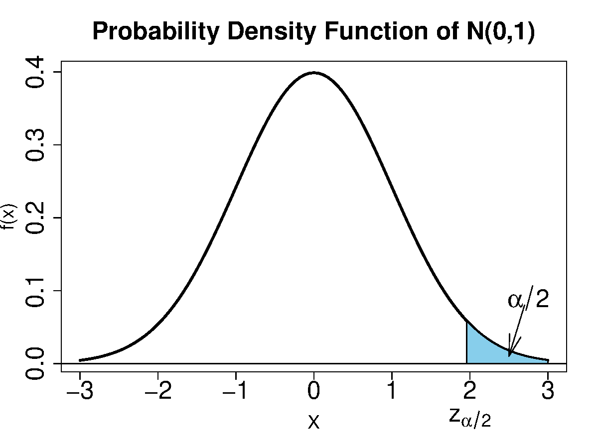{width="60%" fig-align="center"}

### Standard error versus standard deviation

When $\sigma$ is known, the confidence interval of the mean is $\bar{X} \pm z_{\alpha/2} \sigma/{\sqrt{n}}$:

-   We call $\sigma/\sqrt{n}$ the [**standard error**]{.term} of $\bar{X}$, which is the [standard deviation of the sampling distribution]{.term} of $\bar{X}$.
-   Note that $\sigma$ is the [**standard deviation**]{.term} of $X$.

When $\sigma$ is unknown, we use the sample standard deviation $S$ to estimate $\sigma$. The confidence interval $\bar{X} \pm z_{\alpha/2} S/{\sqrt{n}}$ is then a large-sample approximation. Under normality, the exact interval uses a $t$ quantile (Case II below).

-   The [**standard error**]{.term} $S/\sqrt{n}$ is the [estimate of the standard deviation of the sampling distribution]{.term} of $\bar{X}$.

### Coverage probability of a random confidence interval

-   For simplicity, we assume the variance $\sigma^2$ is known.
-   In practice, we observe only one sample, and give a confidence interval $\bar{X} \pm z_{\alpha/2} \sigma/{\sqrt{n}}$. We are [$100 (1-\alpha)\%$ confident]{.term} that this interval contains the true parameter $\mu$.
-   [The confidence means the coverage probability]{.term}, which is the probability of the interval containing the true parameter under the [**sampling distribution**]{.term}.
-   Now we use a simulation study to simulate the sampling distribution and assess the coverage probability.

::: {.panel-tabset}

#### R

```{webr}
# case I true dist: N(0.5, 1)
set.seed(5400)
n <- 20
alp <- 0.05
sig.sq <- 1
mu <- 0.5
Xlist <- matrix(rnorm(10000 * n, mu, sqrt(sig.sq)), 10000, n)
Xbarlist <- rowMeans(Xlist)
```

```{webr}
moe <- qnorm(1 - alp/2) * sqrt(sig.sq / n)
CI <- cbind(Xbarlist - moe, Xbarlist + moe)
is_cover <- apply(CI, 1, function(x) mu > x[1] & mu < x[2])
mean(is_cover)
```

#### Python

```{pyodide}
np.random.seed(5400)
n = 20
alp = 0.05
sig_sq = 1
mu = 0.5
Xlist = [np.random.normal(mu, sig_sq**0.5, n) for i in range(10000)]
Xbarlist = np.mean(Xlist, 1)
```

```{pyodide}
cri = scipy.stats.norm.ppf(1 - alp/2)
moe = cri * (sig_sq / n)**0.5
print(np.mean([(mu > Xbarlist[i] - moe and mu < Xbarlist[i] + moe)
  for i in range(10000)]))
```

:::

The estimated coverage is close to 0.95. Next we look at what happens when the variance is unknown and when the population is not normal.

### Case II: unknown variance, normality

The normality of $X$ gives

$$
\frac{\bar{X}-\mu}{\sigma/\sqrt{n}} \sim \mathrm{N}(0, 1).
$$

By replacing $\sigma$ by its estimator $S$ we have

$$
\frac{\bar{X}-\mu}{S/\sqrt{n}} \sim t_{n-1},
$$

where $S^2 = \frac{1}{n-1}\sum_{i=1}^n (X_i - \bar{X})^2$ is the sample variance.

Question: Why does $T = (\bar{X} - \mu)/ (S / \sqrt{n})$ follow $t_{n-1}$?

Answer: Student's theorem. If $X_1, \ldots, X_n \stackrel{\mathrm{iid}}{\sim} \mathrm{N}(\mu, \sigma^2)$, then

1.  $(\bar{X} - \mu)/(\sigma/\sqrt{n}) \sim \mathrm{N}(0, 1)$;
2.  $(n-1)S^2/\sigma^2 \sim \chi^2_{n-1}$;
3.  $\bar{X}$ and $S^2$ are independent.

Recall the $t$-distribution: $Z/\sqrt{X/v}\sim t_{v}$, where $Z\sim \mathrm{N}(0,1)$, $X\sim \chi^2_v$, and $Z, X$ are independent. We have

$$
T = \frac{\bar{X} - \mu}{S/\sqrt{n}} = \frac{\dfrac{\bar{X} - \mu}{\sigma/\sqrt{n}}}{\sqrt{\dfrac{(n-1)S^2}{\sigma^2}\Big/(n-1)}} \sim t_{n-1}.
$$

-   The $t$-distribution with [**degrees of freedom**]{.term} $n-1$ has heavier tails than $\mathrm{N}(0, 1)$.
-   Thus we still have

$$
\begin{aligned}
1 - \alpha &= P\left(t_{1 - \alpha/2, n-1} < \frac{\bar{X} - \mu}{S/\sqrt{n}} < t_{\alpha/2, n-1} \right)\\
&= P(\bar{X} - t_{\alpha/2, n-1} S/{\sqrt{n}} < \mu < \bar{X} + t_{\alpha/2, n-1} S/{\sqrt{n}}).
\end{aligned}
$$

-   The distribution $t_n$ converges to $\mathrm{N}(0, 1)$ as $n \to \infty$.

::: {.panel-tabset}

#### R

```{webr}
curve(dnorm(x, 0, 1), xlim = c(-3, 3), xlab = "X",
  ylab = "f(x)", lwd = 3, lty = 1, main = "Normal and t")
xl <- c(-3, 3)
curve(dt(x, 1), xlim = xl, add = TRUE, lty = 2, col = "red")
curve(dt(x, 2), xlim = xl, add = TRUE, lty = 3, col = "blue")
curve(dt(x, 5), xlim = xl, add = TRUE, lty = 4, col = "green")
curve(dt(x, 50), xlim = xl, add = TRUE, lty = 5, col = "brown")
abline(h = 0)
legend("topright",
  c("normal", "t(1)", "t(2)", "t(5)", "t(50)"),
  lty = 1:5,
  col = c("black", "red", "blue", "green", "brown"))
```

#### Python

```{pyodide}
x = np.linspace(-3, 3, 301)
plt.plot(x, scipy.stats.norm.pdf(x), color="black", lw=3, label="normal")
plt.plot(x, scipy.stats.t.pdf(x, 1), "--", color="red", label="t(1)")
plt.plot(x, scipy.stats.t.pdf(x, 2), ":", color="blue", label="t(2)")
plt.plot(x, scipy.stats.t.pdf(x, 5), "-.", color="green", label="t(5)")
plt.plot(x, scipy.stats.t.pdf(x, 50), linestyle=(0, (5, 5)), color="brown", label="t(50)")
plt.axhline(0, color="black")
plt.title("Normal and t"); plt.xlabel("X"); plt.ylabel("f(x)")
plt.legend(loc="upper right")
plt.show()
```

:::

[ By hand]{.mode}: fill in the margin of error so this interval uses the $t$ quantile and the *estimated* standard deviation. Done when the printed coverage is near 0.95. No AI for this block.

::: {.panel-tabset}

#### R

```{webr}
# case II true dist: N(0.5, 1)
set.seed(5400)
n <- 20; alp <- 0.05; mu <- 0.5; sig.sq <- 1
Xlist <- matrix(rnorm(10000 * n, mu, sqrt(sig.sq)), 10000, n)
Xbarlist <- rowMeans(Xlist)
sdlist <- apply(Xlist, 1, sd)

se <- 0                       # <- change this line

CI <- cbind(Xbarlist - se, Xbarlist + se)
is_cover <- apply(CI, 1, function(x) mu > x[1] & mu < x[2])
mean(is_cover)
```

#### Python

```{pyodide}
# case II true dist: N(0.5, 1)
np.random.seed(5400)
n = 20; alp = 0.05; mu = 0.5; sig_sq = 1
Xlist = np.random.normal(mu, np.sqrt(sig_sq), (10000, n))
Xbarlist = Xlist.mean(axis=1)
sdlist = Xlist.std(axis=1, ddof=1)

se = 0                        # <- change this line

CI = np.c_[Xbarlist - se, Xbarlist + se]
is_cover = (mu > CI[:, 0]) & (mu < CI[:, 1])
print(np.mean(is_cover))
```

:::

::: {.callout-note collapse="true" title="Solution"}
**Use the $t$ quantile and each sample's own $S$.**

```r
se <- qt(1 - alp/2, n - 1) * sdlist / sqrt(n)
```

In Python:

```python
se = scipy.stats.t.ppf(1 - alp/2, n - 1) * sdlist / np.sqrt(n)
```

This gives about 0.9504. Two things changed from case I. First, the quantile comes from `qt` with $n-1$ degrees of freedom, not from `qnorm`. Second, the width now varies from row to row, because each simulated sample has its own $S$.

If you use `qnorm` here instead, coverage drops to roughly 0.93. The $t$ quantile is larger than the normal quantile, and the extra width accounts for the uncertainty in estimating $\sigma$.
:::

### Case III: non-normality, large sample

-   For an i.i.d. sample with finite variance, by the CLT the sample mean $\bar{X}$ approximately follows $\mathrm{N}(\mu, \sigma^2/n)$ when $n$ is large. A common rule of thumb is $n > 30$ or $n > 50$, but how large is large enough depends on the population (see the lognormal example below).
-   Thus we still have, approximately,

$$
\begin{aligned}
Z &= \frac{\bar{X} - \mu}{\sigma/\sqrt{n}} \sim \mathrm{N}(0, 1),\\
1 - \alpha &= P(\bar{X} - z_{\alpha/2} \sigma/{\sqrt{n}} < \mu < \bar{X} + z_{\alpha/2} \sigma/{\sqrt{n}}).
\end{aligned}
$$

-   If the variance is unknown, we use $S$, which is a consistent estimator of $\sigma$ as $n \to \infty$. With Slutsky's theorem, we get the large-sample approximation

$$
\begin{aligned}
Z &= \frac{\bar{X} - \mu}{S/\sqrt{n}} \sim \mathrm{N}(0, 1),\\
1 - \alpha &= P(\bar{X} - z_{\alpha/2} S/{\sqrt{n}} < \mu < \bar{X} + z_{\alpha/2} S/{\sqrt{n}}).
\end{aligned}
$$

-   We will investigate how large $n$ should be in Section 3.3.

[ By hand]{.mode}: fill in the margin of error for case III. The population is now exponential, not normal. Done when the printed coverage is clearly below 0.95. No AI for this block.

::: {.panel-tabset}

#### R

```{webr}
# case III true dist: exp with mean 2
set.seed(5400)
n <- 20; alp <- 0.05; mu <- 2
Xlist <- matrix(rexp(10000 * n, rate = 1/mu), 10000, n)
Xbarlist <- rowMeans(Xlist)
sdlist <- apply(Xlist, 1, sd)

moe <- 0                      # <- change this line

CI <- cbind(Xbarlist - moe, Xbarlist + moe)
is_cover <- apply(CI, 1, function(x) mu > x[1] & mu < x[2])
mean(is_cover)
```

#### Python

```{pyodide}
# case III true dist: exp with mean 2
np.random.seed(5400)
n = 20; alp = 0.05; mu = 2
Xlist = np.random.exponential(mu, (10000, n))    # scale = mean
Xbarlist = Xlist.mean(axis=1)
sdlist = Xlist.std(axis=1, ddof=1)

moe = 0                       # <- change this line

CI = np.c_[Xbarlist - moe, Xbarlist + moe]
is_cover = (mu > CI[:, 0]) & (mu < CI[:, 1])
print(np.mean(is_cover))
```

:::

::: {.callout-note collapse="true" title="Solution"}
**Use the normal quantile with the estimated standard error.**

```r
moe <- qnorm(1 - alp/2) * sdlist / sqrt(n)
```

In Python:

```python
moe = scipy.stats.norm.ppf(1 - alp/2) * sdlist / np.sqrt(n)
```

The coverage is about 0.90, not 0.95. The code is correct. At $n = 20$, the normal approximation with an estimated standard error is not accurate enough for this skewed population. About one interval in ten misses the true mean, instead of one in twenty.
:::

### How large is large enough?

::: {.panel-tabset}

#### R

```{webr}
CovProb <- function(n, mu = 2, alp = 0.05) {
  Xlist <- matrix(rexp(10000 * n, rate = 1/mu), 10000, n)
  Xbarlist <- rowMeans(Xlist)
  sdlist <- apply(Xlist, 1, sd)
  moe <- qnorm(1 - alp/2) * sdlist / sqrt(n)
  CI <- cbind(Xbarlist - moe, Xbarlist + moe)
  is_cover <- apply(CI, 1, function(x) mu > x[1] & mu < x[2])
  mean(is_cover)
}
```

```{webr}
set.seed(5400)
CovProb(10)
CovProb(30)
CovProb(50)
CovProb(200)
```

#### Python

```{pyodide}
def CovProb(n, mu=2, alp=0.05):
    Xlist = [np.random.exponential(mu, n) for i in range(10000)]
    Xbarlist = np.mean(Xlist, 1)
    Slist = np.std(Xlist, 1, ddof=1)
    moe = scipy.stats.norm.ppf(1 - alp/2) * Slist / n**0.5
    return np.mean([(mu > Xbarlist[i] - moe[i] and
                     mu < Xbarlist[i] + moe[i])
                    for i in range(10000)])
```

```{pyodide}
np.random.seed(5400)
print(CovProb(10))
print(CovProb(30))
print(CovProb(50))
print(CovProb(200))
```

:::

Even at $n = 200$, the coverage has not quite reached 0.95. The coverage moves slowly toward 0.95 as $n$ grows.

### Application: how long an AI model takes to answer

-   The [**latency**]{.term} of an AI model is the time from sending a question to receiving the full answer.
-   Latency is positive and often right-skewed. Most answers come quickly, and a few [long answers]{.more note="A model writes its answer one token (a word or a piece of a word) at a time, so a long answer takes longer. The lengths of the answers are also right-skewed: a few answers are much longer than the rest."} take many times longer.
-   A common model for such data is the [**lognormal**]{.term} distribution. A positive random variable $X$ follows a lognormal distribution if $\log X$ follows a normal distribution, $\log X \sim \mathrm{N}(\mu_{\log}, \sigma_{\log}^2)$.
-   In this example, $X$ is the latency in seconds, with $\mu_{\log} = 0$ and $\sigma_{\log} = 1.2$. Then the median is $e^0 = 1$ second and the mean is $e^{0 + 1.2^2/2} \approx 2.05$ seconds.
-   We repeat `CovProb` above with lognormal latencies in place of exponential ones.

::: {.panel-tabset}

#### R

```{webr}
CovProbLN <- function(n, meanlog = 0, sdlog = 1.2, alp = 0.05) {
  mu <- exp(meanlog + sdlog^2 / 2)          # true mean latency
  Xlist <- matrix(rlnorm(10000 * n, meanlog, sdlog), 10000, n)
  Xbarlist <- rowMeans(Xlist)
  sdlist <- apply(Xlist, 1, sd)
  moe <- qnorm(1 - alp/2) * sdlist / sqrt(n)
  mean(Xbarlist - moe < mu & mu < Xbarlist + moe)
}
```

```{webr}
set.seed(5400)
sapply(c(10, 30, 100, 200), CovProbLN)
```

#### Python

```{pyodide}
def CovProbLN(n, meanlog=0, sdlog=1.2, alp=0.05):
    mu = np.exp(meanlog + sdlog**2 / 2)       # true mean latency
    Xlist = np.random.lognormal(meanlog, sdlog, (10000, n))
    Xbarlist = Xlist.mean(axis=1)
    Slist = Xlist.std(axis=1, ddof=1)
    moe = scipy.stats.norm.ppf(1 - alp/2) * Slist / n**0.5
    return np.mean((Xbarlist - moe < mu) & (mu < Xbarlist + moe))
```

```{pyodide}
np.random.seed(5400)
print([CovProbLN(n) for n in [10, 30, 100, 200]])
```

:::

[ Predict]{.mode}: at $n = 30$, will the coverage be closer to 0.95 than in the exponential case above?

::: {.callout-note collapse="true" title="Answer"}
**No, it is further away.** The coverage is about 0.76 at $n = 10$, 0.84 at $n = 30$, and 0.92 at $n = 200$.

The skewness of this lognormal is $(e^{\sigma_{\log}^2} + 2)\sqrt{e^{\sigma_{\log}^2} - 1} \approx 11$, compared with 2 for the exponential, and the coverage approaches 0.95 more slowly. Reports on model speed often give the median and a high percentile, such as the 99th, and not only the mean. The mean is hard to estimate well when the data are this skewed, and users care about the slow answers.
:::

References:

-   Dean and Barroso (2013) [*The Tail at Scale*](https://doi.org/10.1145/2408776.2408794). **Communications of the ACM**. 56(2). 74--80.
-   Limpert, Stahel, and Abbt (2001) [*Log-normal Distributions across the Sciences: Keys and Clues*](https://doi.org/10.1641/0006-3568(2001)051[0341:LNDATS]2.0.CO;2). **BioScience**. 51(5). 341--352.
-   Yang, Xu, and Jiao (2024) [*A Queueing Theoretic Perspective on Low-Latency LLM Inference with Variable Token Length*](https://arxiv.org/abs/2407.05347). arXiv preprint.

### Violation of the independence assumption

-   The confidence intervals that we have computed assume that $X_1, \ldots, X_n$ are independent. Dependence changes the variance of $\bar{X}$, and then the coverage.
-   We assume $(X_1, \ldots, X_n)$ is jointly normal, each $X_i$ follows $\mathrm{N}(0, 1)$, but

$$
\mathbf{Cov}(X_1, \ldots, X_n) = \boldsymbol{\Sigma} = \left(
\begin{array}{ccccc}
1 & \rho & \ldots & \rho\\
\rho & 1 & \ldots & \rho\\
\vdots &\vdots &\vdots &\vdots \\
\rho & \rho & \ldots & 1\\
\end{array}\right),
$$

where $\Sigma_{ij} = \mathrm{Cov}(X_i, X_j)$.

-   Assume $\sigma = 1$ is known. We compute confidence intervals as $\bar{X} \pm z_{\alpha/2} \sigma/{\sqrt{n}}$. We investigate the coverage probability of $\mu = 0$ as $\rho$ varies.

### Generating dependent samples

First, we compute $\boldsymbol{\Sigma}^{1/2}$ such that $\boldsymbol{\Sigma}^{1/2} \boldsymbol{\Sigma}^{1/2} = \boldsymbol{\Sigma}$.

::: {.panel-tabset}

#### R

```{webr}
rho <- 0.1; n <- 5
Sigma <- matrix(rho, n, n)
diag(Sigma) <- 1
eig <- eigen(Sigma)
Sigma.sq <- eig$vectors %*%
  tcrossprod(diag(sqrt(eig$values)), eig$vectors)
```

#### Python

```{pyodide}
rho = 0.1; n = 5
Sigma = np.full((n, n), rho)
np.fill_diagonal(Sigma, 1)
values, vectors = np.linalg.eigh(Sigma)    # eigh: for symmetric matrices
Sigma_sq = vectors @ np.diag(np.sqrt(values)) @ vectors.T
```

:::

::: {.panel-tabset}

#### R

```{webr}
Sigma.sq %*% Sigma.sq
```

#### Python

```{pyodide}
print(Sigma_sq @ Sigma_sq)
```

:::

We generate a dependent sample $X_1, \ldots, X_5$ such that $\mathrm{Cov}(X_i, X_j) = 0.1$ for $i \neq j$.

::: {.panel-tabset}

#### R

```{webr}
set.seed(5400)
X <- rnorm(n) %*% Sigma.sq
X
```

#### Python

```{pyodide}
np.random.seed(5400)
X = np.random.normal(size=n) @ Sigma_sq
print(X)
```

:::

The same code was used in Section 3.1 to generate an i.i.d. five-dimensional multivariate normal. However, the two tasks are different in concept. There, five numbers were one observation of a vector. Here, five numbers are five correlated observations of a scalar.

How about many samples at once?

::: {.panel-tabset}

#### R

```{webr}
set.seed(5400)
bigN <- 1e4   # 1e4 keeps this quick in the browser; try 1e5 on your own computer
Xlist <- matrix(rnorm(bigN * n, 0, 1), bigN, n) %*% Sigma.sq
round(var(Xlist), 3)
```

#### Python

```{pyodide}
np.random.seed(5400)
bigN = 10**4  # 1e4 keeps this quick in the browser; try 1e5 on your own computer
Xlist = np.random.normal(0, 1, (bigN, n)) @ Sigma_sq
print(np.round(np.cov(Xlist, rowvar=False), 3))    # rowvar=False: columns are variables
```

:::

The off-diagonal entries are close to 0.1, as we want.

### Coverage as $\rho$ varies

::: {.panel-tabset}

#### R

```{webr}
# bigN = 1e4 keeps the 20-point curve quick in the browser; try 1e5 on your own computer
CovProb2 <- function(rho, n = 30, mu = 0, bigN = 1e4, alp = 0.05) {
  Sigma <- matrix(rho, n, n)
  diag(Sigma) <- 1
  eig <- eigen(Sigma)
  Sigma.sq <- eig$vectors %*%
    tcrossprod(diag(sqrt(eig$values)), eig$vectors)
  # generate dependent samples
  Xlist <- mu + matrix(rnorm(bigN * n), bigN, n) %*% Sigma.sq
  Xbarlist <- rowMeans(Xlist)
  moe <- qnorm(1 - alp/2) * 1 / sqrt(n)
  CI <- cbind(Xbarlist - moe, Xbarlist + moe)
  is_cover <- apply(CI, 1, function(x) mu > x[1] & mu < x[2])
  mean(is_cover)
}
```

#### Python

```{pyodide}
# bigN = 1e4 keeps the 20-point curve quick in the browser; try 1e5 on your own computer
def CovProb2(rho, n=30, mu=0, bigN=10**4, alp=0.05):
    Sigma = np.full((n, n), rho)
    np.fill_diagonal(Sigma, 1)
    values, vectors = np.linalg.eigh(Sigma)
    Sigma_sq = vectors @ np.diag(np.sqrt(values)) @ vectors.T
    # generate dependent samples
    Xlist = mu + np.random.normal(size=(bigN, n)) @ Sigma_sq
    Xbarlist = Xlist.mean(axis=1)
    moe = scipy.stats.norm.ppf(1 - alp/2) * 1 / np.sqrt(n)
    CI = np.c_[Xbarlist - moe, Xbarlist + moe]
    is_cover = (mu > CI[:, 0]) & (mu < CI[:, 1])
    return np.mean(is_cover)
```

:::

[ Predict]{.mode}: $\rho = 0.1$ is a small correlation. Before you run the next block, guess the coverage of the nominal 95% interval at $\rho = 0.1$.

::: {.panel-tabset}

#### R

```{webr}
set.seed(5400)
rhos <- seq(0, 0.1, len = 20)
covprobs <- rep(NA, 20)
for (i in seq(20)) {
  # call the function above
  covprobs[i] <- CovProb2(rhos[i])
}

plot(rhos, covprobs, type = "b",
  xlab = expression(rho),
  ylab = "Coverage Probabilities")
```

#### Python

```{pyodide}
np.random.seed(5400)
rhos = np.linspace(0, 0.1, 20)
covprobs = np.full(20, np.nan)
for i in range(20):
    # call the function above
    covprobs[i] = CovProb2(rhos[i])

plt.plot(rhos, covprobs, "o-")
plt.xlabel(r"$\rho$"); plt.ylabel("Coverage Probabilities")
plt.show()
```

:::

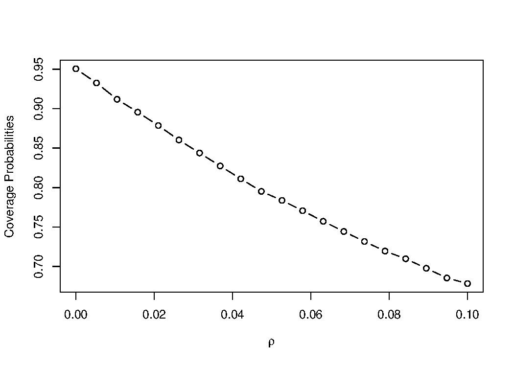{width="62%" fig-align="center"}

::: {.callout-note collapse="true" title="Answer"}
**With $n = 30$, coverage falls from 0.95 to about 0.68 at $\rho = 0.1$.**

The reason is that the variance of the mean under equicorrelation (every pair has correlation $\rho$) is

$$
\mathrm{Var}(\bar{X}) = \frac{\sigma^2}{n}\left[1 + (n-1)\rho\right].
$$

With $n = 30$ and $\rho = 0.1$ the bracket is $1 + 29(0.1) = 3.9$. The true standard error is almost twice what the formula assumes, so the interval is about half as wide as it should be.

The exact coverage is $2\Phi\big(z_{0.025}/\sqrt{3.9}\big) - 1 \approx 0.68$.

Notice the $n$ in the bracket. For a fixed $\rho > 0$, the factor $1 + (n-1)\rho$ grows with $n$, so the usual standard error $\sigma/\sqrt{n}$ understates the true one more and more. The true variance still decreases, but toward $\sigma^2\rho$, not zero. For this reason, cluster-randomized trials report a design effect.
:::

The code appears better (but not faster) with the `sapply` function:

::: {.panel-tabset}

#### R

```{webr}
set.seed(5400)
covprobs <- sapply(rhos, CovProb2)
head(covprobs)
```

#### Python

Python has no `sapply`. A list comprehension does the same job.

```{pyodide}
np.random.seed(5400)
covprobs = [CovProb2(r) for r in rhos]
print(np.round(covprobs[:6], 4))
```

:::

as compared with

::: {.panel-tabset}

#### R

```r
covprobs <- rep(NA, 20)
for (i in seq(20)) {
  covprobs[i] <- CovProb2(rhos[i])
}
```

#### Python

```python
covprobs = np.full(20, np.nan)
for i in range(20):
    covprobs[i] = CovProb2(rhos[i])
```

:::

### Application: benchmark questions that come in groups

-   Many reading tests for AI models give a short passage, and then ask several questions about it.
-   For example:
    -   Passage: "A study compares two diets, with 20 people in each group. The mean weight loss is 3 kg for diet A and 1 kg for diet B, with p = 0.03."
    -   Questions:
        -   Which diet did better?
        -   Is the difference significant at the 5% level?
        -   How many people were in the study?
    -   If the model misreads p = 0.03 as 0.3, it may get several of these questions wrong together.
-   If a model misreads a passage, it often misses several of its questions. So the answers about the same passage are correlated.
-   The usual standard error assumes that all answers are independent, so it is too small. This is the same problem as the dependent samples above.
-   A simple fix: average the answers within each passage, and use the passage averages as the sample.

In the simulation below, there are 40 passages with 5 questions each. Each passage is either easy or hard, with probability 1/2. The model answers a question correctly with probability 0.9 for an easy passage and 0.5 for a hard one, so the true accuracy is 0.7.

::: {.panel-tabset}

#### R

```{webr}
CovClust <- function(K = 40, m = 5, B = 2000) {
  naive <- passage <- logical(B)
  for (r in 1:B) {
    pk <- sample(c(0.9, 0.5), K, replace = TRUE)      # each passage is easy (0.9) or hard (0.5)
    Y <- matrix(rbinom(K * m, 1, rep(pk, m)), K, m)   # row = passage, column = question
    se_naive   <- sd(as.vector(Y)) / sqrt(K * m)      # treats all answers as independent
    se_passage <- sd(rowMeans(Y)) / sqrt(K)           # uses the K passage means
    naive[r]   <- abs(mean(Y) - 0.7) < 1.96 * se_naive
    passage[r] <- abs(mean(Y) - 0.7) < 1.96 * se_passage
  }
  c(naive = mean(naive), passage = mean(passage))
}
```

```{webr}
set.seed(5400)
CovClust()
```

#### Python

```{pyodide}
def CovClust(K=40, m=5, B=2000):
    naive = np.zeros(B, bool); passage = np.zeros(B, bool)
    for r in range(B):
        pk = np.random.choice([0.9, 0.5], K)                           # each passage is easy or hard
        Y = np.random.binomial(1, np.repeat(pk[:, None], m, axis=1))   # row = passage
        se_naive = Y.std(ddof=1) / np.sqrt(K * m)                      # treats all answers as independent
        se_passage = Y.mean(axis=1).std(ddof=1) / np.sqrt(K)           # uses the K passage means
        naive[r] = abs(Y.mean() - 0.7) < 1.96 * se_naive
        passage[r] = abs(Y.mean() - 0.7) < 1.96 * se_passage
    return naive.mean(), passage.mean()
```

```{pyodide}
np.random.seed(5400)
print(CovClust())
```

:::

[ Predict]{.mode}: which of the two intervals covers close to 0.95?

::: {.callout-note collapse="true" title="Answer"}
**The interval based on passage averages.** In R it covers about 0.94 of the time, and the naive interval covers only about 0.84.

Two answers about the same passage have correlation $\rho \approx 0.19$ here. As for the dependent samples above, the variance of the accuracy is larger by the [**design effect**]{.term} $1 + (m-1)\rho = 1 + 4(0.19) \approx 1.76$. So the naive standard error is too small by the factor $\sqrt{1.76} \approx 1.33$. Miller (2024, Section 2.2) makes the same point for AI benchmarks.
:::

References:

-   Miller (2024) [*Adding Error Bars to Evals: A Statistical Approach to Language Model Evaluations*](https://arxiv.org/abs/2411.00640). arXiv preprint. Section 2.2.
-   Moulton (1990) [*An Illustration of a Pitfall in Estimating the Effects of Aggregate Variables on Micro Units*](https://doi.org/10.2307/2109724). **Review of Economics and Statistics**. 72(2). 334--338.
-   Kish (1965) *Survey Sampling*. New York: Wiley.

## Confidence interval for a proportion

### Normal approximation of Bernoulli

-   Suppose $X_1, \ldots, X_n$ are i.i.d. $\mathrm{Bern}(\theta)$, with $0 < \theta < 1$.
-   If $n$ is sufficiently large, from the classical CLT, $\bar{X}$ approximately follows $\mathrm{N}(\theta, \theta(1-\theta)/n)$.
-   Some textbooks suggest $\min\{n\theta, n(1-\theta)\} \ge 15$ makes such an approximation good enough.
-   Equivalently,

$$
\frac{\overline{X}-\theta}{\sqrt{\theta(1-\theta)/n}} \sim \mathrm{N}(0,1), \text{ approximately.}
$$

-   For $\alpha \in (0, 1)$,

$$
\begin{aligned}
1 - \alpha &\approx P\left(-z_{\alpha/2} < \frac{\bar{X}-\theta}{\sqrt{\theta(1-\theta)/n}}< z_{\alpha/2} \right)\\
&= P\left(\bar{X} - z_{\alpha/2} \sqrt{\tfrac{\theta(1-\theta)}{n}} < \theta < \bar{X} + z_{\alpha/2} \sqrt{\tfrac{\theta(1-\theta)}{n}} \right).
\end{aligned}
$$

### Six intervals for a proportion

-   The [**Wald**]{.term} $100(1-\alpha)\%$ confidence interval:

$$
\bar{X} \pm z_{\alpha / 2} \sqrt{\frac{\bar{X}(1-\bar{X})}{n}}.
$$

-   The [**simple conservative**]{.term} $100(1-\alpha)\%$ confidence interval:

$$
\bar{X} \pm z_{\alpha / 2} \frac{0.5}{\sqrt{n}}.
$$

-   The [**Wilson**]{.term} (score) $100(1-\alpha)\%$ confidence interval:

$$
\frac{n \bar{X}+0.5 z_{\alpha / 2}^{2}}{n+z_{\alpha / 2}^{2}} \pm \frac{z_{\alpha / 2} \sqrt{n \bar{X}(1-\bar{X})+0.25 z_{\alpha / 2}^{2}}}{n+z_{\alpha / 2}^{2}}.
$$

This interval can be obtained in R or Python with:

::: {.panel-tabset}

#### R

```{.r}
prop.test(x = n * xbar, n = n, conf.level = 1 - alp, correct = FALSE)$conf.int
```

#### Python

```{.python}
from statsmodels.stats.proportion import proportion_confint
proportion_confint(n * xbar, n, alpha=alp, method="wilson")
```

:::

-   The [**Clopper-Pearson**]{.term} $100(1-\alpha)\%$ interval has left endpoint

$$
\left(1+\frac{n-n \bar{X}+1}{n \bar{X} F_{1-\alpha / 2, \ 2 n \bar{X}, \ 2(n-n \bar{X}+1)}}\right)^{-1},
$$

and right endpoint

$$
\left(1+\frac{n-n \bar{X}}{(n \bar{X}+1) F_{\alpha / 2, \ 2(n \bar{X}+1), \ 2(n-n \bar{X})}}\right)^{-1}.
$$

Here $F_{u, v_1, v_2}$ is the $100(1-u)$th percentile of the $F$-distribution with degrees of freedom $v_1$ and $v_2$. In R it is `qf(u, v1, v2, lower.tail = FALSE)`. When $n\bar{X} = 0$ the left endpoint is 0, and when $n\bar{X} = n$ the right endpoint is 1. The interval is obtained with:

::: {.panel-tabset}

#### R

```{.r}
binom.test(x = n * xbar, n = n, conf.level = 1 - alp)$conf.int
```

#### Python

```{.python}
from statsmodels.stats.proportion import proportion_confint
proportion_confint(n * xbar, n, alpha=alp, method="beta")
```

:::

-   The [**Agresti-Coull**]{.term} $100(1-\alpha)\%$ confidence interval:

$$
\hat{p} \pm z_{\alpha / 2} \sqrt{\frac{1}{n + z_{\alpha / 2}^2}\hat{p}(1-\hat{p})},
\qquad
\hat{p} = \frac{n\bar{X} + z_{\alpha / 2}^2/2}{n+z_{\alpha / 2}^2}.
$$

::: {.panel-tabset}

#### R

```{.r}
library(binom)
binom.confint(x = n * xbar, n = n, conf.level = 1 - alp, methods = "ac")
```

#### Python

```{.python}
from statsmodels.stats.proportion import proportion_confint
proportion_confint(n * xbar, n, alpha=alp, method="agresti_coull")
```

:::

-   The [**Jeffreys**]{.term} $100(1-\alpha)\%$ confidence interval: the $100(1-\alpha)\%$ Bayesian credible interval using Jeffreys' prior on the binomial proportion.

::: {.panel-tabset}

#### R

```{.r}
library(binom)
binom.bayes(x = n * xbar, n = n, type = "central", conf.level = 1 - alp)
```

#### Python

```{.python}
from statsmodels.stats.proportion import proportion_confint
proportion_confint(n * xbar, n, alpha=alp, method="jeffreys")
```

:::

### Comparing the six

Our goal is to compare the differences among the six confidence intervals in terms of coverage probability and expected width. We use the same generated data for all six methods.

-   **Tip 1**: Always report the [**standard error**]{.term} of entries in the table so a reader can gauge the accuracy.
-   **Tip 2**: Since humans cannot understand more than two digits very easily, [**round**]{.term} your results to two or three digits.

References:

-   Brown, Cai, and DasGupta (2001) [*Interval Estimation for a Binomial Proportion*](https://doi.org/10.1214/ss/1009213286). **Statistical Science**. 16(2). 101--133.
-   [Wikipedia: Binomial proportion confidence interval](https://en.wikipedia.org/wiki/Binomial_proportion_confidence_interval)
-   [`binom` package manual](https://cran.r-project.org/web/packages/binom/binom.pdf)

::: {.panel-tabset}

#### R

```{webr}
set.seed(5400)
theta <- 0.6
n <- 40
B <- 1000        # 1000 keeps this quick in the browser; try B = 10000 on your own computer
alp <- 0.05
# generate data
Xbarlist <- rbinom(B, size = n, prob = theta) / n
```

```{webr}
## Wald interval
moe_Wald <- qnorm(1 - alp/2) * sqrt(Xbarlist * (1 - Xbarlist)/n)
CI_Wald <- cbind(Xbarlist - moe_Wald, Xbarlist + moe_Wald)
## simple conservative interval
moe_simple <- qnorm(1 - alp/2) * sqrt(0.5 * (1 - 0.5)/n)
CI_simple <- cbind(Xbarlist - moe_simple, Xbarlist + moe_simple)
```

```{webr}
library(binom)
## score, CP, AC, and the Jeffreys Bayesian CIs
CI_score <- CI_CP <- CI_AC <- CI_Bayes <- matrix(NA, B, 2)
for (i in seq(B)) {
  CI_score[i, ] <- prop.test(x = (n * Xbarlist[i]), n = n,
    correct = FALSE, conf.level = (1 - alp))$conf.int
  CI_CP[i, ] <- binom.test(x = (n * Xbarlist[i]), n = n,
    conf.level = (1 - alp))$conf.int
  ret <- binom.confint(x = (n * Xbarlist[i]), n = n,
    conf.level = (1 - alp), methods = "ac")
  CI_AC[i, ] <- c(ret$lower, ret$upper)
  ret2 <- binom.bayes(x = (n * Xbarlist[i]), n = n,
    type = "central", conf.level = (1 - alp))
  CI_Bayes[i, ] <- c(ret2$lower, ret2$upper)
}
```

```{webr}
## get mean and se of width and coverage probability
WidthCov <- function(CI) {
  # get coverage probability
  is_cov <- function(x) theta > x[1] & theta < x[2]
  # get standard error
  se <- function(x) sd(x) / sqrt(nrow(CI))
  allwidth <- CI[, 2] - CI[, 1]     # width
  allcov <- apply(CI, 1, is_cov)    # coverage
  c(mean(allwidth), se(allwidth), mean(allcov), se(allcov))
}
```

```{webr}
## display results
col.nm <- paste0("CI_", c("simple", "Wald", "score", "CP", "AC", "Bayes"))
res <- sapply(lapply(col.nm, get), WidthCov)
colnames(res) <- col.nm
rownames(res) <- c("exp.width", "se", "cov.prob", "se")
round(res, 3)
```

#### Python

```{pyodide}
np.random.seed(5400)
theta = 0.6
n = 40
B = 1000        # 1000 keeps this quick in the browser; try B = 10000 on your own computer
alp = 0.05
# generate data
Xbarlist = np.random.binomial(n, theta, B) / n
```

```{pyodide}
## Wald interval
moe_Wald = scipy.stats.norm.ppf(1 - alp/2) * np.sqrt(Xbarlist * (1 - Xbarlist) / n)
CI_Wald = np.c_[Xbarlist - moe_Wald, Xbarlist + moe_Wald]
## simple conservative interval
moe_simple = scipy.stats.norm.ppf(1 - alp/2) * np.sqrt(0.5 * (1 - 0.5) / n)
CI_simple = np.c_[Xbarlist - moe_simple, Xbarlist + moe_simple]
```

```{pyodide}
## score, CP, AC, and the Jeffreys Bayesian CIs
# no loop: each interval is computed for all B samples at once from its formula
z = scipy.stats.norm.ppf(1 - alp/2)
x = np.round(n * Xbarlist)                       # number of successes
## score (Wilson)
ctr = (x + 0.5 * z**2) / (n + z**2)
moe_score = z * np.sqrt(x * (1 - x/n) + 0.25 * z**2) / (n + z**2)
CI_score = np.c_[ctr - moe_score, ctr + moe_score]
## Clopper-Pearson, written with beta quantiles (same as the F form)
CI_CP = np.c_[scipy.stats.beta.ppf(alp/2, x, n - x + 1),
              scipy.stats.beta.ppf(1 - alp/2, x + 1, n - x)]
CI_CP[x == 0, 0] = 0; CI_CP[x == n, 1] = 1
## Agresti-Coull
p_hat = (x + z**2 / 2) / (n + z**2)
moe_AC = z * np.sqrt(p_hat * (1 - p_hat) / (n + z**2))
CI_AC = np.c_[p_hat - moe_AC, p_hat + moe_AC]
## Jeffreys: quantiles of the Beta(x + 1/2, n - x + 1/2) posterior
CI_Bayes = np.c_[scipy.stats.beta.ppf(alp/2, x + 0.5, n - x + 0.5),
                 scipy.stats.beta.ppf(1 - alp/2, x + 0.5, n - x + 0.5)]
```

```{pyodide}
## get mean and se of width and coverage probability
def width_cov(CI):
    w = CI[:, 1] - CI[:, 0]                             # width
    cov = (theta > CI[:, 0]) & (theta < CI[:, 1])       # coverage
    return [w.mean(), w.std(ddof=1) / np.sqrt(len(w)),
            cov.mean(), cov.std(ddof=1) / np.sqrt(len(cov))]
```

```{pyodide}
## display results
col_nm = ["CI_simple", "CI_Wald", "CI_score", "CI_CP", "CI_AC", "CI_Bayes"]
res = np.column_stack([width_cov(CI) for CI in
                       [CI_simple, CI_Wald, CI_score, CI_CP, CI_AC, CI_Bayes]])
print(col_nm)
for name, row in zip(["exp.width", "se", "cov.prob", "se"], np.round(res, 3)):
    print(name, row)
```

Python has no single package that matches `binom` for all six methods. `statsmodels.stats.proportion.proportion_confint` covers five of them: Wald, Wilson, Agresti-Coull, Clopper-Pearson (`method="beta"`), and Jeffreys (`method="jeffreys"`). The simple conservative interval is easy to compute directly.

:::

Based on the current simulation result, which method is favorable?

: the same comparison with $B = 10000$, which is too slow for the browser.



::: {.callout-note collapse="true" title="Reading the table"}
**At this one setting, Wald looks fine.** The exact coverages at $\theta = 0.6$, $n = 40$ are 0.946 for Wald and for Jeffreys, and 0.966 for the other four. The expected widths are close: 0.287 for Wilson, 0.300 for Wald, and 0.314 for Clopper-Pearson.

However, the coverage of a binomial interval is a function of $\theta$, and for Wald this function drops far below 0.95 when $\theta$ is near 0 or 1:

| $\theta$ | 0.02 | 0.05 | 0.10 | 0.20 | 0.50 | 0.60 |
|---|---|---|---|---|---|---|
| Wald | 0.553 | 0.868 | 0.914 | 0.905 | 0.919 | 0.946 |
| Wilson | 0.954 | 0.952 | 0.943 | 0.928 | 0.962 | 0.966 |

Over a fine grid of $\theta \in (0.01, 0.99)$, Wald averages about 0.90 coverage and Wilson about 0.95. Wilson can also fall below 0.90 for some $\theta$ very close to 0 or 1, but much less often and by much less. This is why Brown, Cai, and DasGupta recommend against Wald, even though it looks fine at $\theta = 0.6$.

Change `theta` to 0.05 and run the blocks again. Then look at the `se` rows: with $B = 1000$, the standard error of a coverage estimate near 0.95 is about 0.007. To judge a difference between two methods, use the standard error of the difference. All six methods use the same samples, so it is `sd(cover1 - cover2) / sqrt(B)`, which can be much smaller than 0.007.
:::

### Application: asking a model the same question 50 times

-   A language model samples each word (token) of its answer (Section 3.1, *Sampling the next word*). The same question can therefore get different answers.
-   We asked `llama3.2:1b` the question below 50 times (Sep 26, 2026). It is the small open-weight model from Section 2.4: its parameters are public, so you can run it on your own computer. We used the default temperature, the setting that controls how random the sampling is.

> Which is larger, 9.9 or 9.11? Answer with the number only.

-   The answers were `9.9` 22 times, `10` 17 times, `9.11` 8 times, and `9.99` 3 times. The raw answers are in [`data/s3p2_llama_answers.csv`](data/s3p2_llama_answers.csv).
-   Let $\theta$ be the probability that this model answers correctly, with the model and its settings fixed. We treat the 50 runs as independent $\mathrm{Bern}(\theta)$ trials. Each run starts a new conversation, so no run sees the answers of the others. Still, independence is an assumption that we make. Under this assumption, the intervals of this section apply.

::: {.panel-tabset}

#### R

```{webr}
x <- 22; n <- 50                 # 22 correct answers in 50 runs
binom.confint(x, n, methods = c("asymptotic", "wilson", "exact"))
```

#### Python

```{pyodide}
res = scipy.stats.binomtest(22, 50)     # 22 correct answers in 50 runs
print(res.proportion_ci(method="wilson"))
print(res.proportion_ci(method="exact"))
```

:::

: the model runs in the Codespace or on IDAS, not in the browser.

::: {.panel-tabset}

#### R

```{r}
#| eval: false
library(ellmer)

q <- "Which is larger, 9.9 or 9.11? Answer with the number only."
answers <- character(50)
for (i in 1:50) {
  answers[i] <- trimws(chat_ollama(model = "llama3.2:1b")$chat(q, echo = "none"))   # a new chat each time
}
table(answers)
```



#### Python

```python
import json, urllib.request
from collections import Counter

q = "Which is larger, 9.9 or 9.11? Answer with the number only."
answers = [""] * 50
for i in range(50):                                            # a new chat each time
    req = urllib.request.Request("http://localhost:11434/api/chat",
        data=json.dumps({"model": "llama3.2:1b", "stream": False,
                         "messages": [{"role": "user", "content": q}]}).encode(),
        headers={"Content-Type": "application/json"})
    answers[i] = json.load(urllib.request.urlopen(req))["message"]["content"].strip()
print(Counter(answers))
```



:::

[ Predict]{.mode}: does this model answer correctly more often than a coin flip would?

::: {.callout-note collapse="true" title="Answer"}
**We cannot tell.** The estimate is $22/50 = 0.44$. The Wilson interval is about $(0.31, 0.58)$ and the Clopper-Pearson interval about $(0.30, 0.59)$. Both contain 0.5.

To measure a model's success rate on one question, we ask it many times and count the correct answers. Chen et al. (2021) do this for code. They draw $n = 200$ answers for each programming problem. From the count of correct answers, they estimate pass@$k$, the chance that at least one of $k$ answers is correct. Wang et al. (2023) use repeated answers in another way: they sample many answers to one question and keep the answer that appears most often.

Run the file above on IDAS or in the Codespace. With the same model and settings, your 50 answers will differ from ours, but your interval will very likely overlap ours.
:::

References:

-   Chen et al. (2021) [*Evaluating Large Language Models Trained on Code*](https://arxiv.org/abs/2107.03374). arXiv preprint.
-   Wang, Wei, Schuurmans, Le, Chi, Narang, Chowdhery, and Zhou (2023) [*Self-Consistency Improves Chain of Thought Reasoning in Language Models*](https://arxiv.org/abs/2203.11171). **ICLR 2023**.
